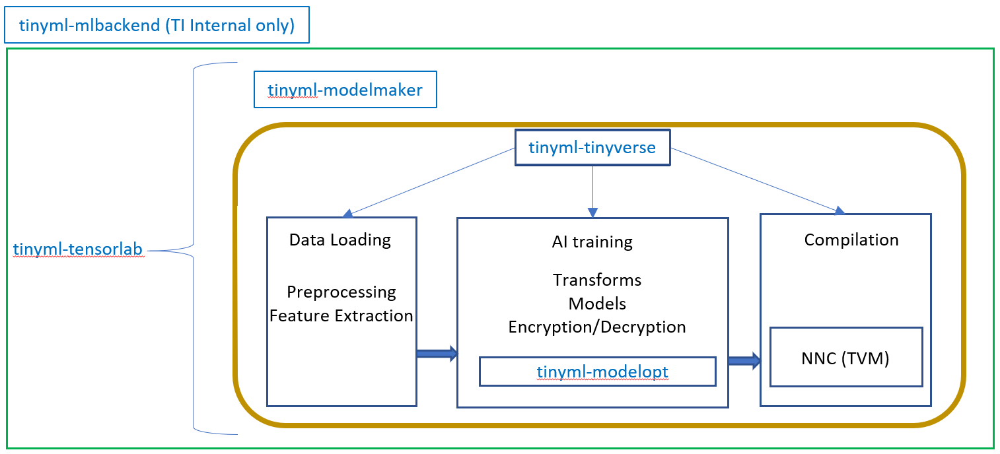

# tinyml-tensorlab - TI's MCU AI Toolchain

<hr>

##### Table of Contents

- [Introduction](#introduction)
- [Which Repo do I need to fiddle with?](#which-repo-do-i-need-to-fiddle-with)
- [Using this repository](#using-this-repository)
    - [I'm a user](#im-a-user)
    - [I'm a developer](#im-a-developer)
- [Productized Applications](#productized-applications)
- [Release History](#what-is-new)

<hr>

## Introduction

The Tiny ML Tensorlab repository is meant to be as a starting point to install and explore TI's AI offering for MCUs.
It helps to install all the required repositories to get started. Currently, it can handle Time series Classification, Regression and Anomaly Detection tasks. 


Once you clone this repository, you will find the following repositories present within the `tinyml-tensorlab` directory:
* `tinyml-tensorlab`: This repo, serves as a blank wrapper for customers to clone all the tinyml repos at one shot. 


The other repositories are here for a purpose:
* `tinyml-modelmaker`: Based on user configuration (yaml files), stitches a flow with relevant scripts to call from tinyverse. This stitches the scripts into a flow of data loading/training/compilation
  * **_This is your home repo. Most of your work will be taking place from this directory._**
* `tinyml-tinyverse` : Individual scripts to load data, do preprocessing, AI training, compilation(using NNC/TVM)
* `tinyml-modeloptimization`: Model optimization toolkit that is necessary for quantization for 2bit/4bit/8bit weights in QAT(Quantization Aware Training)/PTQ(Post Training Quantization) flows for TI devices with or without NPU.
  * As a customer developing models/flows, it is highly likely that you would not have to edit files in this repo
* `tinyml-mlbackend` (TI internal only): Serves as a wrapper on modelmaker to suit the needs of Edge AI Studio Model Composer only. Docker image is generated using this repo.

<hr>

## Which Repo do I need to fiddle with

| User Intent | Criteria 1                                                                                                                                                             | Criteria 2                                                                           | tinyml-modelmaker                                                                                                                                                                                 | tinyml-tinyverse | tinyml-modeloptimization                                                                                                                                                                                                                                                                                                                                                                                         |
|-------------|------------------------------------------------------------------------------------------------------------------------------------------------------------------------|--------------------------------------------------------------------------------------|---------------------------------------------------------------------------------------------------------------------------------------------------------------------------------------------------|------------------|------------------------------------------------------------------------------------------------------------------------------------------------------------------------------------------------------------------------------------------------------------------------------------------------------------------------------------------------------------------------------------------------------------------|
| BYOD        | <ul><li> I will get my own data (format it according to Modelmaker Expectations)</li><li> I expect a compiled binary model as my final output for a device TI supports | <ul><li> I will use TI provided Models as it is                                      | :white_check_mark:  - edit config_*.yaml files. refer [this](https://github.com/TexasInstruments/tinyml-tensorlab/blob/main/tinyml-modelmaker/docs/UnderstandingConfigFile.md) to understand the config file. | :x:             | :white_check_mark:                                                                                                                                                                                                                                                                                                                                                                                                             |
| BYOD        | <ul><li> I will get my own data (format it according to Modelmaker Expectations)</li><li> I expect a compiled binary model as my final output for a device TI supports | <ul><li> I will use TI provided Models but change the parameters (like channels etc) | :white_check_mark:  - Refer [this](https://github.com/TexasInstruments/tinyml-tensorlab/blob/main/tinyml-modelmaker/docs/Configuring_Model_layer_params.md) doc                                               | :x:             | :x:                                                                                                                                                                                                                                                                                                                                                                                                             |
| BYOM        | <ul><li> I will get my own data (format it according to Modelmaker Expectations)</li><li> I expect a compiled binary model as my final output for a device TI supports | <ul><li> I want to design my own models / Modify TI provided models.                 | :white_check_mark:  - Refer [this](https://github.com/TexasInstruments/tinyml-tensorlab/blob/main/tinyml-modelmaker/docs/AddingModels.md) doc                                                                  | :white_check_mark:            | :x:                                                                                                                                                                                                                                                                                                                                                                                                             |
| BYOM        | <ul><li> I have trained an (NPU compatible, if applicable) model and created an onnx model. </li>                                                                      | <ul><li>I need help to compile for a TI supported device.                            | :white_check_mark:  - Refer [this](https://github.com/TexasInstruments/tinyml-tensorlab/blob/main/tinyml-modelmaker/docs/BYOM_for_Compilation.md) doc to understand editing the config file                    | :x:             | :x:                                                                                                                                                                                                                                                                                                                                                                                                             |
| BYOM        | <ul><li> I have my own AI Training Framework, I have created a floating point model. </li>                                                                             | <ul><li>I need help to create a NPU Aware Quantized model                            | :x:                                                                                                                                                                                              | :x:             | <input type="checkbox" disabled checked/> - Refer [this](https://github.com/TexasInstruments/tinyml-tensorlab/blob/main/tinyml-modeloptimization/torchmodelopt/examples/motor_fault_time_series_classification) example.<br/> <ul><li> Follow it up  using [TI’s Neural Network Compiler](https://software-dl.ti.com/mctools/nnc/mcu/users_guide/) which can help you get your AI model compatible with TI MCUs. |

* A lot more [READMEs](https://github.com/TexasInstruments/tinyml-tensorlab/tree/main/tinyml-modelmaker/docs) are present under the Tiny ML Modelmaker Repo

<hr>

# Using this repository

To begin with, you can use the repo as a `developer` or `user`.

  ### Prequisite:
* **Note**: Irrespective of being a `Linux` or a `Windows` user, it is ideal to use virtual environments on Python rather than operating without one. 
* For `Linux` we are using `Pyenv` as a Python version management system.
* For `Windows` we show below using pyenv-win and also using Python's native `venv`


* <details> 
  <summary> Linux OS </summary>
  
  #### Step 1.1: Make sure that you are using bash shell. If it is not bash shell, change it to bash. Verify it by typing:
  ```
  echo ${SHELL}
  ```

  #### Step 1.2: Install system dependencies
  ```
  sudo apt update
  sudo apt install build-essential curl libbz2-dev libffi-dev liblzma-dev libncursesw5-dev libreadline-dev libsqlite3-dev libssl-dev libxml2-dev libxmlsec1-dev llvm make tk-dev xz-utils wget curl
  sudo apt install -y libffi-dev libjpeg-dev zlib1g-dev graphviz graphviz-dev protobuf-compiler
  ```
  #### Step 1.3: Install pyenv using the following commands
  ```
  curl -L https://github.com/pyenv/pyenv-installer/raw/master/bin/pyenv-installer | bash

  echo '# pyenv settings ' >> ${HOME}/.bashrc
  echo 'command -v pyenv >/dev/null || export PATH=":${HOME}/.pyenv/bin:$PATH"' >> ${HOME}/.bashrc
  echo 'eval "$(pyenv init -)"' >> ${HOME}/.bashrc
  echo 'eval "$(pyenv virtualenv-init -)"' >> ${HOME}/.bashrc
  echo '' >> ${HOME}/.bashrc

  exec ${SHELL}
  ```

  Further details on pyenv installation are given here https://github.com/pyenv/pyenv and https://github.com/pyenv/pyenv-installer

  #### Step 1.4: Install Python 3.10 in pyenv and create an environment

  ```
  pyenv install 3.10
  pyenv virtualenv 3.10 py310
  pyenv rehash
  pyenv activate py310
  python -m ensurepip --upgrade
  python -m pip install --upgrade pip setuptools
  ```

  Note: This activation step needs to be done everytime one starts a new terminal or shell. (Alternately, this also can be written to the .bashrc, so that this will be the default penv environment).
  ```
  pyenv activate py310
  ```
  </details>

* <details> 
  <summary> Windows OS </summary>

    #### Using Pyenv-Win (Recommended)
    * Follow steps 1-5 from here using any Python3.10.xx: https://github.com/pyenv-win/pyenv-win?tab=readme-ov-file#quick-start
    * Instead of step 6, `pyenv local <python_version>` is recommended. The version given will be used whenever python is called from within this folder.
  
    #### Using Python venv
  
    * Install Python3.10 from https://www.python.org/downloads/
  
    ```commandline
    python -m venv py310
    .\py310\Scripts\activate
    ```

</details>


* ## I'm a User:
  * As a `user` - The installation and usage is very simple. It is just a `pip install`. But beware that you will not be able to modify any of the features or customize AI models/transforms for your use case
  * <details>

    Install this repository as a Python package:
    ```
    pip install git+https://github.com/TexasInstruments/tinyml-tensorlab.git@main#subdirectory=tinyml-modelmaker
    ```
    It is as simple as:
    ```python
    import tinyml_modelmaker
    tinyml_modelmaker.get_set_go(config)
    ```
    ### Note
    * Several examples of configs are present (Check *.yaml files at `tinyml-modelmaker` repository)
      * You can load one like this:
    * ```python
      import yaml  
      with open('config_timeseries_classification_dsk.yaml') as fp:
          config = yaml.safe_load(fp)
      ```
    
    </details>

* ## I'm a developer
  * As a `developer` - The installation will use your brain power (although a tiny bit), but allows you to customize with unimaginable power!
    * <details>
      <summary> Linux OS</summary>

      ### 1. Set up TI tinyml-tensorlab
      #### Steps to set up the repositories

      0. **NOTE: Please download and install [C2000Ware](https://www.ti.com/tool/C2000WARE)**
         * Please set the installed path in your terminal: `export C2000WARE_PATH="/path/to/C2000Ware_5_04_00_00"`
      1. Clone this repository
      2. `cd tinyml-tensorlab/tinyml-modelmaker`
      3. Execute (Requires sudo permissions): ``` ./setup_all.sh ```
      4. Run the following (to install local repositories, ideal for developers): 
          ```bash
          cd ../tinyml-tinyverse
          pip install -e .
          cd tinyml-modeloptimization/torchmodelopt
          pip install -e .
          cd ../tinyml-modelmaker
          ```
      5. Now you're ready to go!
      ```
      run_tinyml_modelmaker.sh F28P55 config_timeseries_classification_dsk.yaml
      ```
      </details>
    
      <details>
      <summary> Windows OS</summary>
  
      #### This repository can be used from native Windows terminal directly.
      * Although we use Pyenv for Python version management on Linux, the same offering for Windows isn't so stable. So even the native venv is good enough.
        * **It is highly recommended to use PowerShell instead of cmd.exe/Command Terminal**
        * If you prefer to use Windows Subsystem for Linux, then a [user guide](./docs/Windows_Subsytem_for_Linux.md) to use this toolchain on Windows Subsystem for Linux has been provided.
    
      *  Step 1.1: Clone this repository from GitHub
      *  Step 1.2: Let us ready up the depedencies
      ```powershell
      cd tinyml-tensorlab
      python -m ensurepip --upgrade
      python -m pip install --no-input --upgrade pip setuptools wheel
         ```
      *  Step 1.3: Install Tiny ML Modelmaker
      ```powershell
      cd ..\tinyml-modelmaker
      python -m pip install --no-input -r requirements.txt
      python -m pip install --editable . # --use-pep517
      ```
      * Tiny ML Modelmaker, by default installs Tiny ML Tinyverse and Tiny ML ModelOptimization repositories as a python package.
        * If you intend to use this repository as is, then it is enough.
        * However, if you intend to create models and play with the quantization varieties, then it is better to separately clone
        * Step 1.4: Installing tinyverse
          ```powershell
          cd ..\tinyml-tinyverse
          python -m pip install --no-input --upgrade pip setuptools
          pip install https://software-dl.ti.com/mctools/esd/tvm/mcu/ti_mcu_nnc-1.3.0rc4-cp310-cp310-win_amd64.whl
          python -m pip install --no-input -r requirements\requirements.txt
          python -m pip install --no-input -r requirements\requirements_ti_packages.txt
          python -m pip install --editable . # --use-pep517
          ```
        * Step 1.5: Installing model optimization toolkit
          ```powershell
          cd ..\tinyml-modeloptimization\torchmodelopt
          python -m pip install --no-input -r requirements\requirements.txt
          ## python -m pip install --no-input -r requirements\requirements_ti_packages.txt
          python -m pip install --editable . --use-pep517
          ```
      * We can run it now!
      ```powershell
      cd ..\tinyml-modelmaker
      python .\scripts\run_tinyml_modelmaker.py .\config_timeseries_classification_dsk.yaml --target_device F28P55
      ```
    
</details>
  
  

* #### Keeping up to date
    
  Since these repositories are undergoing a massive feature addition stage, it is recommended to keep your codes up to date by running the following command:
  ```commandline
  git_pull_all.sh
  ```
    

<hr>

## Productized applications:
<details>

| Select sector (Industrial, automotive, personal electronics) | Technology  | Application (Title)           | Application Description                                                                                                                                                                                                                                                                                                                                                                                                                                                                                                                                                                                                                                                                                                             | Features / advantages                                                                                                                                                                                                                                                                                                                                                                                                                                                                                                          | Call to action                                                                                                                                                                                                                                                                                                                                                                                                                        |
|--------------------------------------------------------------|-------------|-------------------------------|-------------------------------------------------------------------------------------------------------------------------------------------------------------------------------------------------------------------------------------------------------------------------------------------------------------------------------------------------------------------------------------------------------------------------------------------------------------------------------------------------------------------------------------------------------------------------------------------------------------------------------------------------------------------------------------------------------------------------------------|--------------------------------------------------------------------------------------------------------------------------------------------------------------------------------------------------------------------------------------------------------------------------------------------------------------------------------------------------------------------------------------------------------------------------------------------------------------------------------------------------------------------------------|---------------------------------------------------------------------------------------------------------------------------------------------------------------------------------------------------------------------------------------------------------------------------------------------------------------------------------------------------------------------------------------------------------------------------------------|
| Industrial                                                   | Time series | Arc fault detection           | An arc fault is an electrical discharge that occurs when an electrical current flows through an unintended path, often due to damaged, frayed, or improperly installed wiring. This can produce heat and sparks, which can ignite surrounding materials, leading to fires.<br><br>Due to the ability of AI to analyze complex patterns, continuously learn and improve from new data, address a wide range of faults, it is advantageous to use AI. Using AI at the edge empowers the customer with reduced latency, enhanced privacy and scalability while saving bandwidth.<br><br>TI provides UL-1699B tested AI models which have impeccable accuracy and ultra low latency.                                                    | By utilising benefits of AI such as its ability to analyze patterns in signals and ability to handle larger volumes of data, TI's solution allows for immediate detection response to arc faults.<br><br>Coupled with an NPU that provides enhanced AI performance, TI's  brings additional benefits in terms of speed, reliability, and scalability, making it a powerful approach for enhancing electrical safety.<br><br>With TI's complete solution, AFD will never be a showstopper for you.                              | To empower your solution with TI’s AI, you can use the Model Composer GUI to quickly train an AI model or use the Tiny ML Modelmaker for an advanced set of capabilities. To customers who rely on their own AI training framework, TI’s Neural Network Compiler can help you get your AI model compatible with MCUs (P55x,P66x or any other F28 device). For a full-fledged reference solution, find the comprehensive project here. |
| Industrial                                                   | Time series | Motor Bearing Fault Detection | Motor bearing faults are often seen in HVAC systems with rotating parts. Itoccurs due to the wear and tear of moving parts, lack of lubrication, and due to overloading of equipment. It adversely affects the motor lifespan and increases energy consumption, potentially even can cause a failure of the system.<br><br>By using AI, these faults can be detected early by monitoring signs such as subtle changes in vibration patterns. Processing such data locally at the HVAC system can provide real time fault detection and immediate response, which is crucial for preventing damage and ensuring continuous operation.<br><br>TI provides handcrafted AI models which have impeccable accuracy and ultra low latency. | TI's AI solution addresses these by montoring the vibration and temperature of the motor through sensors and provides a reliable solution by combining the strengths of advanced analytics and real-time processing, leading to more reliable, efficient, and cost-effective maintenance and operation.<br><br>Put together with an NPU for advanced AI performance capabilities, this prevents unexpected failures as the algorithms can detect early signs of faults that might not be noticeable through manual inspections | To empower your solution with TI’s AI, you can use the Model Composer GUI to quickly train an AI model or use the Tiny ML Modelmaker for an advanced set of capabilities. To customers who rely on their own AI training framework, TI’s Neural Network Compiler can help you get your AI model compatible with MCUs (P55x,P66x or any other F28 device). For a full-fledged reference solution, find the comprehensive project here. |

</details>

* To empower your solution with TI’s AI, you can use the **[Tiny ML Modelmaker](https://github.com/TexasInstruments/tinyml-tensorlab/tree/main/tinyml-modelmaker)** for an advanced set of capabilities.
  * Supports any Time series Classification tasks (including Arc Fault and Motor Bearing Fault Classification)
* You can also use the [Edge AI Studio Model Composer GUI](https://dev.ti.com/modelcomposer/) to quickly train an AI model (No Code Platform)
  * This supports only Arc Fault and Motor Bearing Fault Classification applications currently.
* To customers who rely on their own AI training framework, [TI’s Neural Network Compiler](https://software-dl.ti.com/mctools/nnc/mcu/users_guide/) can help you get your AI model compatible with MCUs (P55x,P66x or any other F28 device).
* For a full-fledged reference solution on Arc Fault and Motor Bearing Fault, find the comprehensive project in [Digital Power SDK](https://www.ti.com/tool/C2000WARE-DIGITALPOWER-SDK) and [Motor Control SDK](https://www.ti.com/tool/C2000WARE-MOTORCONTROL-SDK).


<hr>

<hr>

## What is New
- [2025-Apr] Major feature updates (version 1.0.0) of the software
  - General:
    - Tiny ML Modelmaker is now a pip installable package!
    - Existing models can be modified on the fly through a config file (check Tiny ML Modelmaker docs)
    - MPS (Metal Performance Shaders) backend support for Mac host devices!
  - Technology:
    - PTQ and QAT flows supported in tinyml-modelmaker, tinyml-modeloptimization
    - Ternary, 4 bit Quantization support in tinyml-modelmaker
  - Flows:
    - Regression ML tasks supported
    - Autoencoder based Anomaly Detection task supported
  - Feature Extraction:
    - Feature Extraction transforms are now modular and compatible with C2000Ware 5.05 only
    - Supports Haar and Hadamard Transform
    - Golden test vectors file has one set uncommented by default to work OOB
  - Data Visualisation:
    - Multiclass ROC-AUC graphs are autogenerated for better explainability of reports and help select thresholds based on false alarm/ sensitivity preference
    - PCA graphs are auto plotted for feature extracted data → Helps in identifying if the feature extraction actually helped
    - Run now begins with displaying inference time, sram usage and flash usage for all the devices for any model.
  - Dataset
    - Goodness of Fit of dataset now enabled.
    - Dataset can be split into train-test-val on a file-by-file basis or within-a-file basis
  - Extensive Documentation & Know-How Examples to use Modelmaker 
- [2024-November] Updated (version 0.9.0) of the software
- [2024-August] Release version 0.8.0 of the software
- [2024-July] Release version 0.7.0 of the software
- [2024-June] Release version 0.6.0 of the software
- [2024-May] First release (version 0.5.0) of the software
