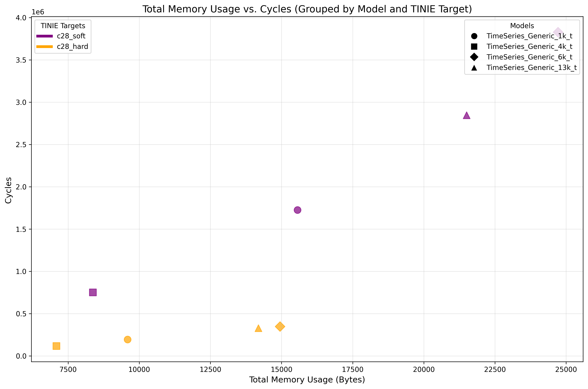
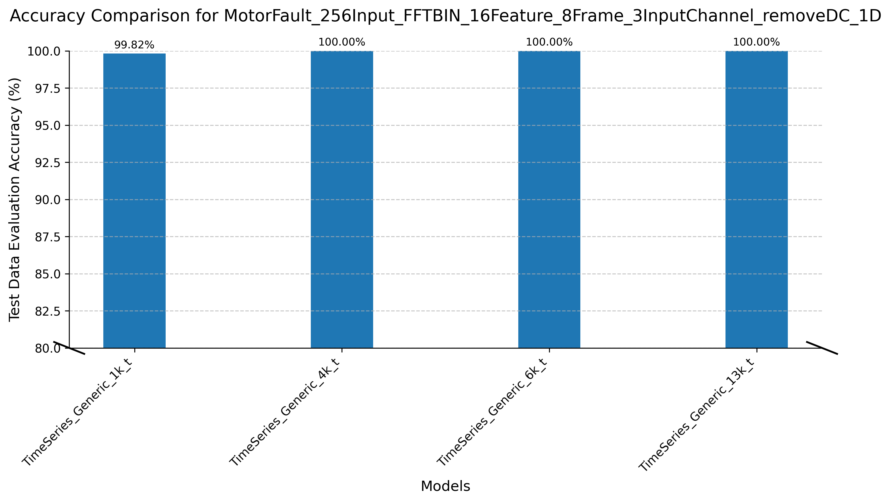
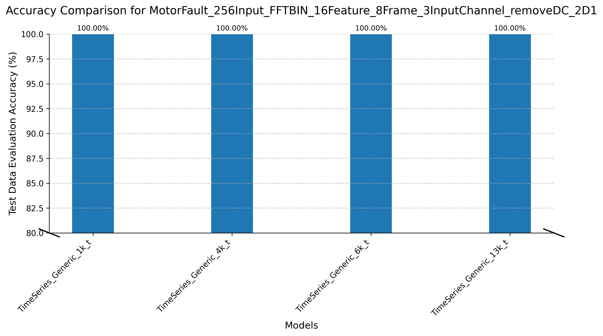
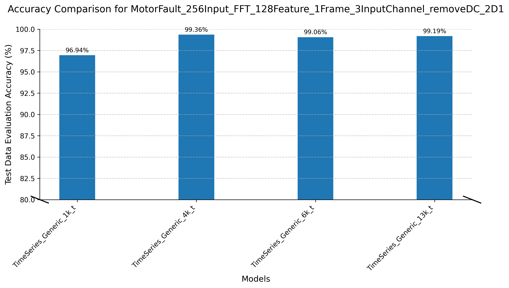
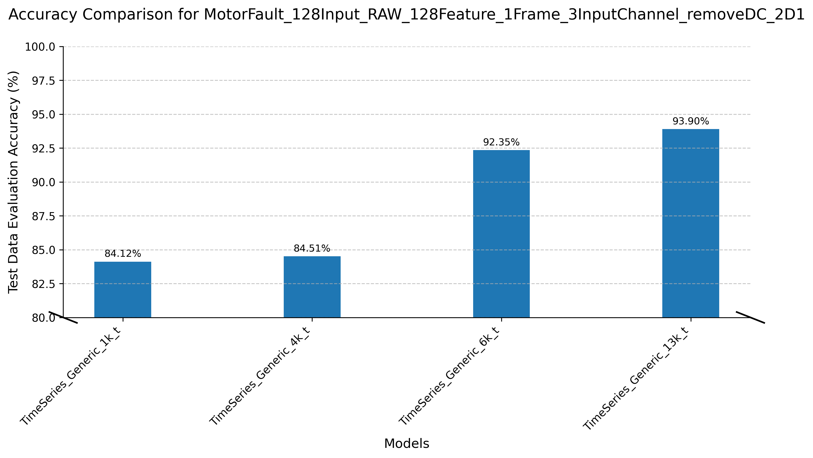
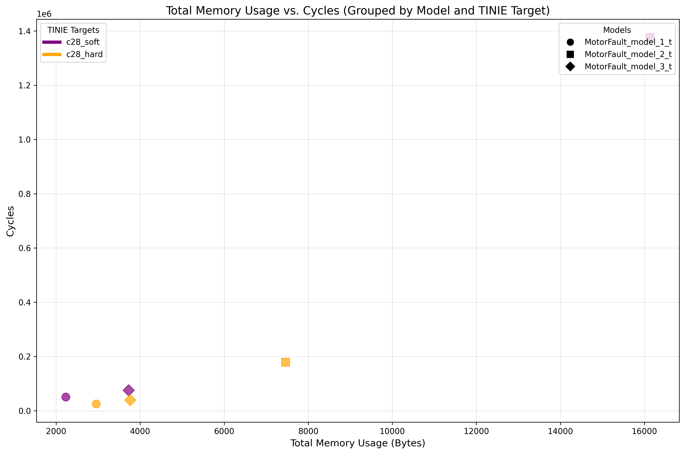
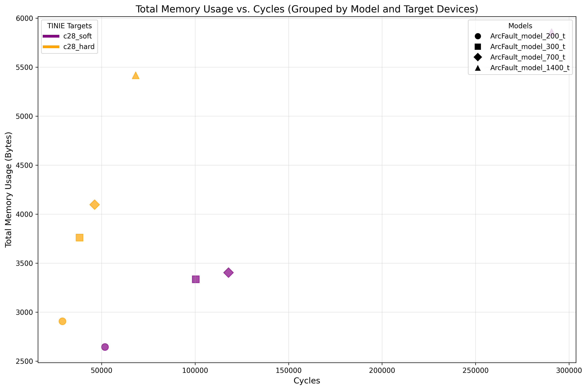

# Model Zoo: TI's Tiny Models for Microcontrollers

Welcome to the **Model Zoo**! 

This repository provides a curated collection of neural network models optimized for **embedded systems** and **low-power microcontrollers**. These models are designed for tasks such as **Classification**, **Regression**, and **Anomaly Detection**. All models are lightweight, efficient, and tailored to run smoothly on resource constrained devices.

### Target Devices and TINPU Overview

To ensure compatibility and efficiency, the models in this repository are designed to run on a variety of target devices. These devices leverage the **TINPU**, a hardware accelerator that enables small, efficient neural networks to run on TI microcontrollers much faster. The TINPU uses integer math and, when available, hardware acceleration to minimize power consumption and memory usage.

#### Supported Target Devices

The table below lists the supported Target Devices. Devices marked as `soft` operate in CPU-only mode, while those marked as `hard` utilize both the CPU and hardware NPU (if available on the device).

| **Target Name**          | **Platform**                                                                   | 
|--------------------------|--------------------------------------------------------------------------------|
| `m0_soft_int_in_int_out` | Optimized libraries and aggressive quantization on Arm M0-core                 |
| `m0_hard_int_in_int_out` | Arm M0-core + TINPU                                                           |
| `c28_soft_int_in_int_out`| Optimized libraries and aggressive quantization on TI C28x DSP                 |
| `c28_hard_int_in_int_out`| TI C28x DSP + TINPU                                                           |
| `c29_soft_int_in_int_out`| Optimized libraries and aggressive quantization on TI C29x DSP                 |
| `m33_soft_int_in_int_out`| Optimized libraries and aggressive quantization on Arm M33-core                |
| `m33_cde_int_in_int_out` | Arm M33-core + TI custom instructions using Arm Custom Datapath Extension (CDE) |

Now select a task category below to explore the available models, their performance details, and use cases:

<b>Classification</b>

 

Our toolchain currently supports the following classification problems. Select a classification problem to see available models:-

<b>Generic Time Series Classification</b>

 

The Generic Time Series Classification Models are versatile models designed to handle **any type of time series classification task**. These models are optimized for embedded systems and are available in the **tinyml-modelmaker**.

## Available models

| **Model**                  | **Total Parameters** | **Total MACs** |
|----------------------------|----------------------|--------------------|
| TimeSeries_Generic_1k_t    | 972                  | 2,95,108                |
| TimeSeries_Generic_4k_t    | 3,684                | 1,41,684              |
| TimeSeries_Generic_6k_t    | 5,188                | 7,82,756              |
| TimeSeries_Generic_13k_t   | 12,980               | 6,66,452               |

*(The performance metrics above are measured for an input shape of **(N=1, C=1, H=512, W=1)**.)*

Some metrics are provided to help you understand the computational requirements of these models:

- **Total Parameters**: This refers to the total number of tunable weights in the model, including weights and biases of all layers. A higher number of parameters generally indicates a more complex model with greater capacity to learn intricate patterns in the data. However, it also means the model requires more memory and computational resources.

- **Total MACs**: Multiply-Accumulate operations performed during a single forward pass of the model. This metric measures the computational complexity of the model and directly correlates with the processing power required to run it.

Additionally, the models were tested with multiple input combinations, varying the **channel (C)** and **height (H)** dimensions. Below is a summary of the tested combinations:

<b>Click to view detailed metrics</b>

## Detailed Metrics for Time Series Models

Below is the detailed table of metrics for various models tested with different input shapes. The table includes the **Shape**, **MACs**, and **Parameters** for each model.

| **Model**                | **Shape (N, C, H, W)** | **MACs** | **Parameters** |
|--------------------------|------------------------|----------|----------------|
| TimeSeries_Generic_1k_t  | 1, 1, 128, 1           | 73924    | 972            |
| TimeSeries_Generic_1k_t  | 1, 1, 256, 1           | 147652   | 972            |
| TimeSeries_Generic_1k_t  | 1, 1, 512, 1           | 295108   | 972            |
| TimeSeries_Generic_1k_t  | 1, 1, 1024, 1          | 590020   | 972            |
| TimeSeries_Generic_1k_t  | 1, 3, 128, 1           | 84428    | 1316           |
| TimeSeries_Generic_1k_t  | 1, 3, 256, 1           | 168396   | 1316           |
| TimeSeries_Generic_1k_t  | 1, 3, 512, 1           | 336332   | 1316           |
| TimeSeries_Generic_1k_t  | 1, 3, 1024, 1          | 672204   | 1316           |
| TimeSeries_Generic_4k_t  | 1, 1, 128, 1           | 35700    | 3684           |
| TimeSeries_Generic_4k_t  | 1, 1, 256, 1           | 71028    | 3684           |
| TimeSeries_Generic_4k_t  | 1, 1, 512, 1           | 141684   | 3684           |
| TimeSeries_Generic_4k_t  | 1, 1, 1024, 1          | 282996   | 3684           |
| TimeSeries_Generic_4k_t  | 1, 3, 128, 1           | 43388    | 4316           |
| TimeSeries_Generic_4k_t  | 1, 3, 256, 1           | 85884    | 4316           |
| TimeSeries_Generic_4k_t  | 1, 3, 512, 1           | 170876   | 4316           |
| TimeSeries_Generic_4k_t  | 1, 3, 1024, 1          | 340860   | 4316           |
| TimeSeries_Generic_6k_t  | 1, 1, 128, 1           | 196004   | 6692           |
| TimeSeries_Generic_6k_t  | 1, 1, 256, 1           | 391588   | 6692           |
| TimeSeries_Generic_6k_t  | 1, 1, 512, 1           | 782756   | 6692           |
| TimeSeries_Generic_6k_t  | 1, 1, 1024, 1          | 1565092  | 6692           |
| TimeSeries_Generic_6k_t  | 1, 3, 128, 1           | 217004   | 7052           |
| TimeSeries_Generic_6k_t  | 1, 3, 256, 1           | 433068   | 7052           |
| TimeSeries_Generic_6k_t  | 1, 3, 512, 1           | 865196   | 7052           |
| TimeSeries_Generic_6k_t  | 1, 3, 1024, 1          | 1729452  | 7052           |
| TimeSeries_Generic_13k_t | 1, 1, 128, 1           | 167252   | 12980          |
| TimeSeries_Generic_13k_t | 1, 1, 256, 1           | 333652   | 12980          |
| TimeSeries_Generic_13k_t | 1, 1, 512, 1           | 666452   | 12980          |
| TimeSeries_Generic_13k_t | 1, 1, 1024, 1          | 1332052  | 12980          |
| TimeSeries_Generic_13k_t | 1, 3, 128, 1           | 175452   | 14124          |
| TimeSeries_Generic_13k_t | 1, 3, 256, 1           | 349020   | 14124          |
| TimeSeries_Generic_13k_t | 1, 3, 512, 1           | 696156   | 14124          |
| TimeSeries_Generic_13k_t | 1, 3, 1024, 1          | 1390428  | 14124          |

## Resource Usage Comparison Across Target Devices

This section compares the resource usage of different models across various target devices. The metrics below provide insights into the computational and memory requirements of each model when deployed on specific hardware platforms.

### **Metrics Used for Comparison**

| Metric              | Description                                                                                      |
|---------------------|--------------------------------------------------------------------------------------------------|
| **Cycles**          | Number of processor cycles required to run inference. Lower is better for performance.          |
| **Code Size (bytes)**| Memory occupied by executable code.                                                             |
| **RO Data (bytes)** | Read-only data size, including constants and weights stored in flash memory.                     |
| **RW Data (bytes)** | Read-write data size, memory used during execution.                                              |
| **Total Bytes**     | Sum of code, RO data, and RW data, representing the overall memory footprint.                    |
| **Flash Usage**     | Sum of code and RO data, representing non-volatile memory usage.                                 |
| **SRAM Usage**      | RW data size, representing volatile memory used during runtime.                                  |

### **Resource Usage Table**

The table below summarizes the resource usage for each model across various target devices. The metrics are calculated using an input shape of **(1, 1, 256, 1)** and with the number of classes set to **2**.

| **Model**              | **Target Device**            | **Cycles** | **Code (bytes)** | **RO Data (bytes)** | **RW Data (bytes)** | **Total Bytes** | **Flash (bytes)** | **SRAM (bytes)** |
|-------------------------|-----------------------------|------------|------------------|---------------------|---------------------|-----------------|-------------------|------------------|
| TimeSeries_Generic_1k_t | m0_soft_int_in_int_out      | 3725652    | 2082             | 1776                | 12320               | 16178           | 3858              | 12320            |
| TimeSeries_Generic_1k_t | m0_hard_int_in_int_out      | 349653     | 1598             | 3732                | 10416               | 15746           | 5330              | 10416            |
| TimeSeries_Generic_1k_t | c28_soft_int_in_int_out     | 1725188    | 1962             | 1280                | 12320               | 15562           | 3242              | 12320            |
| TimeSeries_Generic_1k_t | c28_hard_int_in_int_out     | 195676     | 1368             | 1972                | 6250                | 9590            | 3340              | 6250             |
| TimeSeries_Generic_1k_t | c29_soft_int_in_int_out     | 669310     | 7824             | 1776                | 12320               | 21920           | 9600              | 12320            |
| TimeSeries_Generic_1k_t | m33_soft_int_in_int_out     | 1300325    | 6114             | 1776                | 12320               | 20210           | 7890              | 12320            |
| TimeSeries_Generic_1k_t | m33_cde_int_in_int_out      | 883383     | 9228             | 2512                | 10384               | 22124           | 11740             | 10384            |
| TimeSeries_Generic_4k_t | m0_soft_int_in_int_out      | 1473033    | 2338             | 5184                | 2976                | 10498           | 7522              | 2976             |
| TimeSeries_Generic_4k_t | m0_hard_int_in_int_out      | 195162     | 1658             | 7724                | 2736                | 12118           | 9382              | 2736             |
| TimeSeries_Generic_4k_t | c28_soft_int_in_int_out     | 752342     | 2193             | 4240                | 1936                | 8369            | 6433              | 1936             |
| TimeSeries_Generic_4k_t | c28_hard_int_in_int_out     | 117686     | 1414             | 3986                | 1690                | 7090            | 5400              | 1690             |
| TimeSeries_Generic_4k_t | c29_soft_int_in_int_out     | 277084     | 7424             | 5184                | 2976                | 15584           | 12608             | 2976             |
| TimeSeries_Generic_4k_t | m33_soft_int_in_int_out     | 596086     | 8628             | 5184                | 2976                | 16788           | 13812             | 2976             |
| TimeSeries_Generic_4k_t | m33_cde_int_in_int_out      | 420317     | 7728             | 8432                | 3488                | 19648           | 16160             | 3488             |
| TimeSeries_Generic_6k_t | m0_soft_int_in_int_out      | 9343020    | 2666             | 6960                | 16416               | 26042           | 9626              | 16416            |
| TimeSeries_Generic_6k_t | m0_hard_int_in_int_out      | 408087     | 1798             | 9832                | 8436                | 20066           | 11630             | 8436             |
| TimeSeries_Generic_6k_t | c28_soft_int_in_int_out     | 3828374    | 2462             | 5840                | 16416               | 24718           | 8302              | 16416            |
| TimeSeries_Generic_6k_t | c28_hard_int_in_int_out     | 348174     | 1524             | 5058                | 8364                | 14946           | 6582              | 8364             |
| TimeSeries_Generic_6k_t | c29_soft_int_in_int_out     | 1693785    | 6918             | 6960                | 16416               | 30294           | 13878             | 16416            |
| TimeSeries_Generic_6k_t | m33_soft_int_in_int_out     | 3186844    | 6186             | 6960                | 16416               | 29562           | 13146             | 16416            |
| TimeSeries_Generic_6k_t | m33_cde_int_in_int_out      | 2579155    | 11110            | 11648               | 12512               | 35270           | 22758             | 12512            |
| TimeSeries_Generic_13k_t | m0_soft_int_in_int_out     | 7405900    | 3652             | 16704               | 5408                | 25764           | 20356             | 5408             |
| TimeSeries_Generic_13k_t | m0_hard_int_in_int_out     | 432214     | 2044             | 18480               | 5376                | 25900           | 20524             | 5376             |
| TimeSeries_Generic_13k_t | c28_soft_int_in_int_out    | 2847296    | 2991             | 14352               | 4160                | 21503           | 17343             | 4160             |
| TimeSeries_Generic_13k_t | c28_hard_int_in_int_out    | 328913     | 1512             | 9454                | 3218                | 14184           | 10966             | 3218             |
| TimeSeries_Generic_13k_t | c29_soft_int_in_int_out    | 1508205    | 18942            | 16704               | 5408                | 41054           | 35646             | 5408             |
| TimeSeries_Generic_13k_t | m33_soft_int_in_int_out    | 2887600    | 9658             | 16704               | 5408                | 31770           | 26362             | 5408             |
| TimeSeries_Generic_13k_t | m33_cde_int_in_int_out     | 2045094    | 21776            | 28656               | 6720                | 57152           | 50432             | 6720             |

### Graphical Insights for Model Selection

  <h3>1. Cycles vs. Total Memory Usage</h3>
  

    A model with low cycles is faster but might use more memory. A model with low memory usage is more memory-efficient but might be slower. The ideal models are those that balance both speed and memory efficiency, typically located near the bottom-left corner of the plot (low cycles and low memory usage).
  

  

    Below is the <b>Cycles vs. Total Memory Usage</b> plot for all generic models across <b>C28 (soft and hard)</b>:
  

  
  

   
    <b> If you need similar graphs for other target devices, you can click this link here: <a href="https://software-dl.ti.com/C2000/esd/mcu_ai/01_02_00/misc/generic_cycles_vs_mem_usage.html">Cycles vs. Total Memory Usage of Generic Models Across All Target Devices</a></b>
  

---

<b>Motor Bearing Fault Classification</b>

 

Motor bearing fault classification is a specialized task where models are designed to detect and classify faults in motor bearings. While you can use the **[Generic Time Series Classification](#generic-time-series-classification)** models for this task, we also provide models specifically tailored for motor fault detection. These models are optimized for this application and are **TI proprietary models** and are available only in the **GUI version**. *(They are also available on **tinyml-modelmaker**, and their model definitions are exposed, meaning they can be tweaked by the user.)*

## Available Models

| **Model**                  | **Suited For**                        | **Availability**      | **Total Parameters** | **Total MACs**     |
|----------------------------|----------------------------------------|-----------------------|-----------------------|--------------------|
| TimeSeries_Generic_1k_t    | Generic Time series tasks             | tinyml-modelmaker     | 972                   | 2,95,108           |
| TimeSeries_Generic_4k_t    | Generic Time series tasks             | tinyml-modelmaker     | 3,684                 | 1,41,684           |
| TimeSeries_Generic_6k_t    | Generic Time series tasks             | tinyml-modelmaker     | 5,188                 | 7,82,756           |
| TimeSeries_Generic_13k_t   | Generic Time series tasks             | tinyml-modelmaker     | 12,980                | 6,66,452           |
| MotorFault_model_1_t       | Motor Bearing Fault Classification    | GUI                   | 588                   | 9,660              |
| MotorFault_model_2_t       | Motor Bearing Fault Classification    | GUI                   | 2,808                 | 4,38,912           |
| MotorFault_model_3_t       | Motor Bearing Fault Classification    | GUI                   | 996                   | 17,988             |

*(The performance metrics above are measured for an input shape of **(N=1, C=1, H=512, W=1)**.)*

Some metrics are provided to help you understand the computational requirements of these models:

- **Total Parameters**: This refers to the total number of tunable weights in the model, including the weights and biases of all layers. A higher number of parameters generally indicates a more complex model with greater capacity to learn intricate patterns in the data. However, it also means the model requires more memory and computational resources.

- **Total MACs**: This metric represents the number of multiply-accumulate operations performed during a single forward pass of the model. It is a measure of the model's computational complexity and directly correlates with the processing power required to run the model.

## Model Accuracy Comparison Across Different Feature Extraction Presets

To evaluate the performance of generic models for motor fault classification, we use the **Motor Fault Dataset** ([Dataset Link](https://software-dl.ti.com/C2000/esd/mcu_ai/01_02_00/datasets/motor_fault_classification_dsk.zip)). The dataset is processed using four different feature extraction presets, and the models are trained on the extracted features.  

### Feature Extraction Presets 

1. **MotorFault_256Input_FFTBIN_16Feature_8Frame_3InputChannel_removeDC_1D**
2. **MotorFault_256Input_FFTBIN_16Feature_8Frame_3InputChannel_removeDC_2D1**
3. **MotorFault_256Input_FFT_128Feature_1Frame_3InputChannel_removeDC_2D1**
4. **MotorFault_128Input_RAW_128Feature_1Frame_3InputChannel_removeDC_2D1**

*You can read more about the definitions of these presets [here](https://github.com/TexasInstruments/tinyml-tensorlab/tree/main/tinyml-modelmaker/examples/data_processing_and_feature_extraction#predefined-feature-extraction-presets).*

### Accuracy Results

The table below shows the float train accuracy, quant train accuracy, and test evaluation accuracy for each model under each preset:

<table>
  <tr>
    <th rowspan="2" style="text-align:center;">Model</th>
    <th rowspan="2" style="text-align:center;">Parameters</th>
    <th colspan="3" style="text-align:center;">MotorFault_256Input_FFTBIN_16Feature_8Frame_3InputChannel_removeDC_1D</th>
    <th colspan="3" style="text-align:center;">MotorFault_256Input_FFTBIN_16Feature_8Frame_3InputChannel_removeDC_2D1</th>
    <th colspan="3" style="text-align:center;">MotorFault_256Input_FFT_128Feature_1Frame_3InputChannel_removeDC_2D1</th>
    <th colspan="3" style="text-align:center;">MotorFault_128Input_RAW_128Feature_1Frame_3InputChannel_removeDC_2D1</th>
  </tr>
  <tr>
    <th>Float Train Accuracy</th>
    <th>Quant Train Accuracy</th>
    <th>Test Evaluation Accuracy</th>
    <th>Float Train Accuracy</th>
    <th>Quant Train Accuracy</th>
    <th>Test Evaluation Accuracy</th>
    <th>Float Train Accuracy</th>
    <th>Quant Train Accuracy</th>
    <th>Test Evaluation Accuracy</th>
    <th>Float Train Accuracy</th>
    <th>Quant Train Accuracy</th>
    <th>Test Evaluation Accuracy</th>
  </tr>
  <tr>
    <td style="text-align:center;">TimeSeries_Generic_1k_t</td>
    <td style="text-align:center;">1k</td>
    <td style="text-align:center;">99.97%</td>
    <td style="text-align:center;">99.97%</td>
    <td style="text-align:center;">99.82%</td>
    <td style="text-align:center;">100.00%</td>
    <td style="text-align:center;">100.00%</td>
    <td style="text-align:center;">100.00%</td>
    <td style="text-align:center;">96.28%</td>
    <td style="text-align:center;">96.28%</td>
    <td style="text-align:center;">96.94%</td>
    <td style="text-align:center;">95.76%</td>
    <td style="text-align:center;">89.95%</td>
    <td style="text-align:center;">84.12%</td>
</tr>
<tr>
    <td style="text-align:center;">TimeSeries_Generic_4k_t</td>
    <td style="text-align:center;">4k</td>
    <td style="text-align:center;">99.99%</td>
    <td style="text-align:center;">99.99%</td>
    <td style="text-align:center;">100.00%</td>
    <td style="text-align:center;">100.00%</td>
    <td style="text-align:center;">100.00%</td>
    <td style="text-align:center;">100.00%</td>
    <td style="text-align:center;">99.13%</td>
    <td style="text-align:center;">99.12%</td>
    <td style="text-align:center;">99.36%</td>
    <td style="text-align:center;">93.93%</td>
    <td style="text-align:center;">90.11%</td>
    <td style="text-align:center;">84.51%</td>
</tr>
<tr>
    <td style="text-align:center;">TimeSeries_Generic_6k_t</td>
    <td style="text-align:center;">6k</td>
    <td style="text-align:center;">100.00%</td>
    <td style="text-align:center;">100.00%</td>
    <td style="text-align:center;">100.00%</td>
    <td style="text-align:center;">100.00%</td>
    <td style="text-align:center;">100.00%</td>
    <td style="text-align:center;">100.00%</td>
    <td style="text-align:center;">98.87%</td>
    <td style="text-align:center;">98.85%</td>
    <td style="text-align:center;">99.06%</td>
    <td style="text-align:center;">98.35%</td>
    <td style="text-align:center;">93.68%</td>
    <td style="text-align:center;">92.35%</td>
</tr>
<tr>
    <td style="text-align:center;">TimeSeries_Generic_13k_t</td>
    <td style="text-align:center;">14k</td>
    <td style="text-align:center;">100.00%</td>
    <td style="text-align:center;">100.00%</td>
    <td style="text-align:center;">100.00%</td>
    <td style="text-align:center;">100.00%</td>
    <td style="text-align:center;">100.00%</td>
    <td style="text-align:center;">100.00%</td>
    <td style="text-align:center;">99.08%</td>
    <td style="text-align:center;">99.09%</td>
    <td style="text-align:center;">99.19%</td>
    <td style="text-align:center;">96.96%</td>
    <td style="text-align:center;">93.49%</td>
    <td style="text-align:center;">93.90%</td>
</tr>
</table>

### Visualizing Accuracy

To help you visualize the above information, bar graphs are provided below for each preset. Each graph compares the **Float Train Accuracy**, **Quant Train Accuracy**, and **Test Evaluation Accuracy** for all models under the respective preset.

| **Preset 1**: MotorFault_256Input_FFTBIN_16Feature_8Frame_3InputChannel_removeDC_1D | **Preset 2**: MotorFault_256Input_FFTBIN_16Feature_8Frame_3InputChannel_removeDC_2D1 |
|-------------------------------------------------------------------------------------|-------------------------------------------------------------------------------------|
|                                     |                                     |

| **Preset 3**: MotorFault_256Input_FFT_128Feature_1Frame_3InputChannel_removeDC_2D1  | **Preset 4**: MotorFault_128Input_RAW_128Feature_1Frame_3InputChannel_removeDC_2D1  |
|-------------------------------------------------------------------------------------|-------------------------------------------------------------------------------------|
|                                     |                                     |

---

### Key Insights:

- Presets 1, 2, and 3 involve FFT-based feature extraction, which simplifies the learning process for models and generally results in higher accuracy. Preset 4, on the other hand, uses raw feature extraction, making it a more realistic benchmark for model performance.

- In the 4th preset, we observe an increasing accuracy trend across all four models (1k_t, 4k_t, 6k_t, and 13k_t parameter models). This is because, as the number of parameters increases, the model has a greater capacity to learn more complex patterns, resulting in higher accuracy. However, this improvement comes with a trade-off: models with more parameters require more memory and computational resources, which can make them less efficient for deployment on resource-constrained devices.

- For the 4th preset, the accuracy values for the models are as follows:

  - 1k_t: 84.12%
  - 4k_t: 84.51%
  - 6k_t: 92.35%
  - 13k_t: 93.90%

  Considering this trade-off between accuracy and the number of parameters, the `TimeSeries_Generic_6k_t` model stands out as the best choice. It achieves a high accuracy of 92.35% while maintaining a relatively lower parameter count compared to the 13k_t model, making it a balanced option for this classification problem.

- Furthermore, when using the 2nd feature extraction preset (FFT-based), the `TimeSeries_Generic_6k_t` model achieves 100% accuracy across all three metrics: float train, quant train, and test evaluation accuracy. This demonstrates the model's ability to perform exceptionally well under optimized feature extraction conditions.

## Resource Usage Comparison Across Target Devices

This section compares the resource usage of different models across various target devices. The metrics below provide insights into the computational and memory requirements of each model when deployed on specific hardware platforms. 

### **Metrics Used for Comparison**

| Metric              | Description                                                                                      |
|---------------------|--------------------------------------------------------------------------------------------------|
| **Cycles**          | Number of processor cycles required to run inference. Lower is better for performance.          |
| **Code Size (bytes)**| Memory occupied by executable code.                                                             |
| **RO Data (bytes)** | Read-only data size, including constants and weights stored in flash memory.                     |
| **RW Data (bytes)** | Read-write data size, memory used during execution.                                              |
| **Total Bytes**     | Sum of code, RO data, and RW data, representing the overall memory footprint.                    |
| **Flash Usage**     | Sum of code and RO data, representing non-volatile memory usage.                                 |
| **SRAM Usage**      | RW data size, representing volatile memory used during runtime.                                  |

### **Resource Usage Table**

The table below summarizes the resource usage for each model across various target devices. The metrics are calculated using an input shape of **(1, 1, 256, 1)** and with the number of classes set to **2**.

| **Model**              | **Target Device**            | **Cycles** | **Code (bytes)** | **RO Data (bytes)** | **RW Data (bytes)** | **Total Bytes** | **Flash (bytes)** | **SRAM (bytes)** |
|-------------------------|-----------------------------|------------|------------------|---------------------|---------------------|-----------------|-------------------|------------------|
| MotorFault_model_1_t    | m0_soft_int_in_int_out      | 142067     | 952              | 752                 | 1024                | 2728            | 1704              | 1024             |
| MotorFault_model_1_t    | m0_hard_int_in_int_out      | 16831      | 1010             | 2236                | 916                 | 4162            | 3246              | 916              |
| MotorFault_model_1_t    | c28_soft_int_in_int_out     | 50830      | 571              | 643                 | 1016                | 2230            | 1214              | 1016             |
| MotorFault_model_1_t    | c28_hard_int_in_int_out     | 25354      | 800              | 1038                | 1112                | 2950            | 1838              | 1112             |
| MotorFault_model_1_t    | c29_soft_int_in_int_out     | 28179      | 16378            | 752                 | 1024                | 18154           | 17130             | 1024             |
| MotorFault_model_1_t    | m33_soft_int_in_int_out     | 55830      | 3642             | 752                 | 1024                | 5418            | 4394              | 1024             |
| MotorFault_model_1_t    | m33_cde_int_in_int_out      | 49626      | 4062             | 1072                | 1376                | 6510            | 5134              | 1376             |
| MotorFault_model_2_t    | m0_soft_int_in_int_out      | 3698626    | 2664             | 3872                | 10880               | 17416           | 6536              | 10880            |
| MotorFault_model_2_t    | m0_hard_int_in_int_out      | 94637      | 1334             | 6684                | 3252                | 11270           | 8018              | 3252             |
| MotorFault_model_2_t    | c28_soft_int_in_int_out     | 1375817    | 1611             | 3651                | 10872               | 16134           | 5262              | 10872            |
| MotorFault_model_2_t    | c28_hard_int_in_int_out     | 178527     | 970              | 3292                | 3198                | 7460            | 4262              | 3198             |
| MotorFault_model_2_t    | c29_soft_int_in_int_out     | 740243     | 11532            | 3872                | 10880               | 26284           | 15404             | 10880            |
| MotorFault_model_2_t    | m33_soft_int_in_int_out     | 1527162    | 13738            | 3872                | 10880               | 28490           | 17610             | 10880            |
| MotorFault_model_2_t    | m33_cde_int_in_int_out      | 1762990    | 9548             | 7968                | 4608                | 22124           | 17516             | 4608             |
| MotorFault_model_3_t    | m0_soft_int_in_int_out      | 179145     | 2132             | 1952                | 672                 | 4756            | 4084              | 672              |
| MotorFault_model_3_t    | m0_hard_int_in_int_out      | 22974      | 1286             | 3636                | 932                 | 5854            | 4922              | 932              |
| MotorFault_model_3_t    | c28_soft_int_in_int_out     | 75270      | 1530             | 1539                | 656                 | 3725            | 3069              | 656              |
| MotorFault_model_3_t    | c28_hard_int_in_int_out     | 39528      | 941              | 1702                | 1116                | 3759            | 2643              | 1116             |
| MotorFault_model_3_t    | c29_soft_int_in_int_out     | 37994      | 8486             | 1952                | 672                 | 11110           | 10438             | 672              |
| MotorFault_model_3_t    | m33_soft_int_in_int_out     | 78771      | 6236             | 1952                | 672                 | 8860            | 8188              | 672              |
| MotorFault_model_3_t    | m33_cde_int_in_int_out      | 106876     | 7232             | 3104                | 1408                | 11744           | 10336             | 1408             |

(*To see the resourge usage table of generic models, check under Generic Time Series Classification*)

### Graphical Insights for Model Selection

  <h3>1. Cycles vs. Total Memory Usage</h3>
  

    A model with low cycles is faster but might use more memory. A model with low memory usage is more memory-efficient but might be slower. The ideal models are those that balance both speed and memory efficiency, typically located near the bottom-left corner of the plot (low cycles and low memory usage).
  

  

    Below is the <b>Cycles vs. Total Memory Usage</b> plot for all generic models across <b>C28 (soft and hard)</b>:
  

  
  

   
    <b> If you need similar graphs for other target devices, you can click this link here: <a href="https://software-dl.ti.com/C2000/esd/mcu_ai/01_02_00/misc/motor_fault_cycles_vs_mem_usage.html">Cycles vs. Total Memory Usage of Motor Fault GUI Models Across All Target Devices</a></b>
  

---

<b>Arc Fault Classification</b>

 

Arc fault classification models are designed to detect and classify electrical arc faults, which are critical for ensuring the safety and reliability of electrical systems. These models are optimized for embedded systems and are tailored for real-time fault detection.

While you can use the **[Generic Time Series Classification](#generic-time-series-classification)** models for arc fault detection, we provide specialized models specifically designed for this task. These models are optimized for this application and are **TI proprietary models** and are available only in the **GUI version**. *(They are also available on **tinyml-modelmaker**, and their model definitions are exposed, meaning they can be tweaked by the user.)*

## Available Models

| **Model**                  | **Suited For**                        | **Availability**      | **Total Parameters** | **Total MACs** |
|----------------------------|----------------------------------------|-----------------------|-----------------------|--------------------|
| TimeSeries_Generic_1k_t    | Generic Time series tasks             | tinyml-modelmaker     | 972                   | 2,95,108                |
| TimeSeries_Generic_4k_t    | Generic Time series tasks             | tinyml-modelmaker     | 3,684                 | 1,41,684               |
| TimeSeries_Generic_6k_t    | Generic Time series tasks             | tinyml-modelmaker     | 5,188                 | 7,82,756               |
| TimeSeries_Generic_13k_t   | Generic Time series tasks             | tinyml-modelmaker     | 12,980                | 6,66,452               |
| ArcFault_model_200_t       | Arc Fault Classification              | GUI                   | 296                   | 10,408               |
| ArcFault_model_300_t       | Arc Fault Classification              | GUI                   | 388                   | 19,484               |
| ArcFault_model_700_t       | Arc Fault Classification              | GUI                   | 844                   | 30,540               |
| ArcFault_model_1400_t      | Arc Fault Classification              | GUI                   | 1,648                     | 60,400                  |

*The performance metrics above are measured for an input dimension of **(N=1, C=1, H=512, W=1)**.*

Some metrics are provided to help you understand the computational requirements of these models:

- **Total Parameters**: This refers to the total number of tunable weights in the model, including the weights and biases of all layers. A higher number of parameters generally indicates a more complex model with greater capacity to learn intricate patterns in the data. However, it also means the model requires more memory and computational resources.

- **Total MACs**: This metric represents the number of multiply-accumulate operations performed during a single forward pass of the model. It is a measure of the computational complexity and directly correlates with the processing power required to run the model.

## Resource Usage Comparison Across Target Devices

This section compares the resource usage of different models across various target devices. The metrics below provide insights into the computational and memory requirements of each model when deployed on specific hardware platforms.

### **Metrics Used for Comparison**

| Metric              | Description                                                                                      |
|---------------------|--------------------------------------------------------------------------------------------------|
| **Cycles**          | Number of processor cycles required to run inference. Lower is better for performance.          |
| **Code Size (bytes)**| Memory occupied by executable code.                                                             |
| **RO Data (bytes)** | Read-only data size, including constants and weights stored in flash memory.                     |
| **RW Data (bytes)** | Read-write data size, memory used during execution.                                              |
| **Total Bytes**     | Sum of code, RO data, and RW data, representing the overall memory footprint.                    |
| **Flash Usage**     | Sum of code and RO data, representing non-volatile memory usage.                                 |
| **SRAM Usage**      | RW data size, representing volatile memory used during runtime.                                  |

### **Resource Usage Table**

The table below summarizes the resource usage for each model across various target devices. The metrics are calculated using an input shape of **(1, 1, 256, 1)** and with the number of classes set to **2**.

| **Model**              | **Target Device**            | **Cycles** | **Code (bytes)** | **RO Data (bytes)** | **RW Data (bytes)** | **Total Bytes** | **Flash (bytes)** | **SRAM (bytes)** |
|-------------------------|-----------------------------|------------|------------------|---------------------|---------------------|-----------------|-------------------|------------------|
| ArcFault_model_200_t    | m0_soft_int_in_int_out      | 130223     | 1780             | 432                 | 1040                | 3252            | 2212              | 1040             |
| ArcFault_model_200_t    | m0_hard_int_in_int_out      | 16650      | 1338             | 2268                | 900                 | 4506            | 3606              | 900              |
| ArcFault_model_200_t    | c28_soft_int_in_int_out     | 51799      | 1184             | 435                 | 1026                | 2645            | 1619              | 1026             |
| ArcFault_model_200_t    | c28_hard_int_in_int_out     | 29020      | 880              | 1170                | 858                 | 2908            | 2050              | 858              |
| ArcFault_model_200_t    | c29_soft_int_in_int_out     | 24915      | 6694             | 432                 | 1040                | 8166            | 7126              | 1040             |
| ArcFault_model_200_t    | m33_soft_int_in_int_out     | 56519      | 7506             | 432                 | 1040                | 8978            | 7938              | 1040             |
| ArcFault_model_200_t    | m33_cde_int_in_int_out      | 39327      | 4832             | 576                 | 1048                | 6456            | 5408              | 1048             |
| ArcFault_model_300_t    | m0_soft_int_in_int_out      | 238404     | 1838             | 560                 | 1552                | 3950            | 2398              | 1552             |
| ArcFault_model_300_t    | m0_hard_int_in_int_out      | 21269      | 1338             | 2476                | 1644                | 5458            | 3814              | 1644             |
| ArcFault_model_300_t    | c28_soft_int_in_int_out     | 100332     | 1282             | 515                 | 1538                | 3335            | 1797              | 1538             |
| ArcFault_model_300_t    | c28_hard_int_in_int_out     | 38202      | 880              | 1274                | 1606                | 3760            | 2154              | 1606             |
| ArcFault_model_300_t    | c29_soft_int_in_int_out     | 42968      | 8088             | 560                 | 1552                | 10200           | 8648              | 1552             |
| ArcFault_model_300_t    | m33_soft_int_in_int_out     | 108050     | 7046             | 560                 | 1552                | 9158            | 7606              | 1552             |
| ArcFault_model_300_t    | m33_cde_int_in_int_out      | 70614      | 6054             | 784                 | 1576                | 8414            | 6838              | 1576             |
| ArcFault_model_700_t    | m0_soft_int_in_int_out      | 347458     | 2096             | 1056                | 1552                | 4704            | 3152              | 1552             |
| ArcFault_model_700_t    | m0_hard_int_in_int_out      | 25261      | 1338             | 3108                | 1644                | 6090            | 4446              | 1644             |
| ArcFault_model_700_t    | c28_soft_int_in_int_out     | 117877     | 983              | 883                 | 1538                | 3404            | 1866              | 1538             |
| ArcFault_model_700_t    | c28_hard_int_in_int_out     | 46215      | 878              | 1614                | 1606                | 4098            | 2492              | 1606             |
| ArcFault_model_700_t    | c29_soft_int_in_int_out     | 60153      | 7988             | 1056                | 1552                | 10596           | 9044              | 1552             |
| ArcFault_model_700_t    | m33_soft_int_in_int_out     | 145336     | 8698             | 1056                | 1552                | 11306           | 9754              | 1552             |
| ArcFault_model_700_t    | m33_cde_int_in_int_out      | 91920      | 9400             | 1600                | 1576                | 12576           | 11000             | 1576             |
| ArcFault_model_1400_t   | m0_soft_int_in_int_out      | 579321     | 2180             | 1936                | 2280                | 6396            | 4116              | 2280             |
| ArcFault_model_1400_t   | m0_hard_int_in_int_out      | 35332      | 1338             | 4176                | 2408                | 7922            | 5514              | 2408             |
| ArcFault_model_1400_t   | c28_soft_int_in_int_out     | 290613     | 1813             | 1763                | 2280                | 5856            | 3576              | 2280             |
| ArcFault_model_1400_t   | c28_hard_int_in_int_out     | 68180      | 876              | 2172                | 2370                | 5418            | 3048              | 2370             |
| ArcFault_model_1400_t   | c29_soft_int_in_int_out     | 147500     | 15138            | 1936                | 2280                | 19354           | 17074             | 2280             |
| ArcFault_model_1400_t   | m33_soft_int_in_int_out     | 288124     | 7228             | 1936                | 2280                | 11444           | 9164              | 2280             |
| ArcFault_model_1400_t   | m33_cde_int_in_int_out      | 170529     | 10508            | 3136                | 2280                | 15924           | 13644             | 2280             |

(*To see the resourge usage table of generic models, check under Generic Time Series Classification*)

### Graphical Insights for Model Selection

  <h3>1. Cycles vs. Total Memory Usage</h3>
  

    A model with low cycles is faster but might use more memory. A model with low memory usage is more memory-efficient but might be slower. The ideal models are those that balance both speed and memory efficiency, typically located near the bottom-left corner of the plot (low cycles and low memory usage).
  

  

    Below is the <b>Cycles vs. Total Memory Usage</b> plot for all generic models across <b>C28 (soft and hard)</b>:
  

  
  

   
    <b> If you need similar graphs for other target devices, you can click this link here: <a href="https://software-dl.ti.com/C2000/esd/mcu_ai/01_02_00/misc/arc_fault_cycles_vs_mem_usage.html">Cycles vs. Total Memory Usage of Arc Fault GUI Models Across All Target Devices</a></b>
  

---

<b>Regression</b>

**Coming Soon!**

---

<b>Anomaly Detection</b>

**Coming Soon!**

