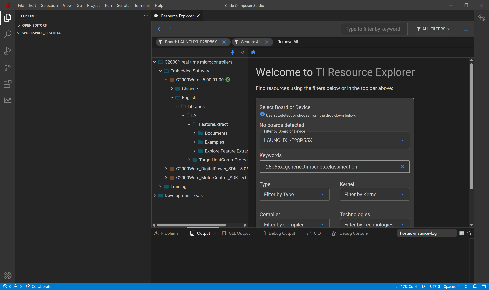
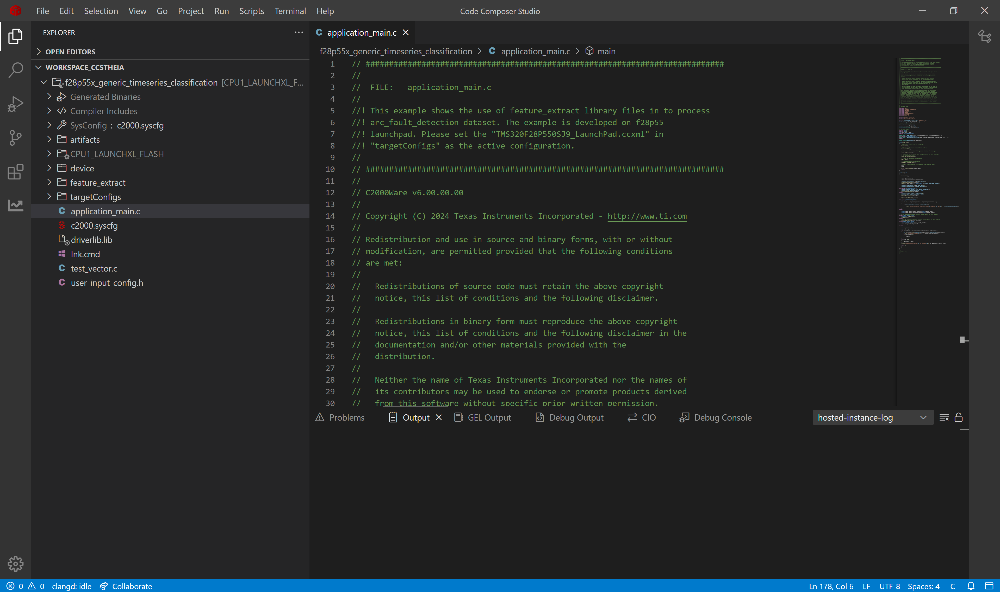
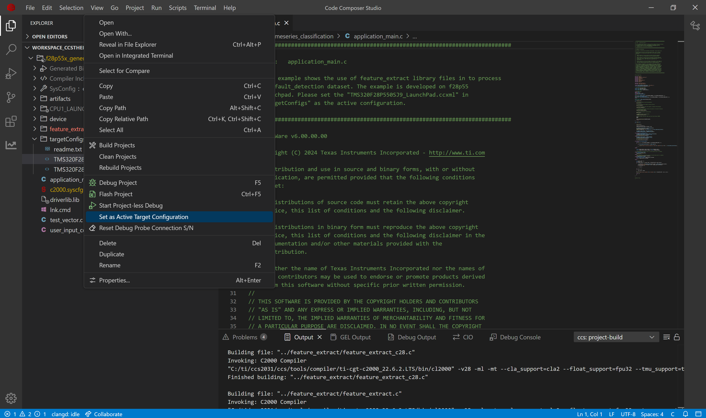
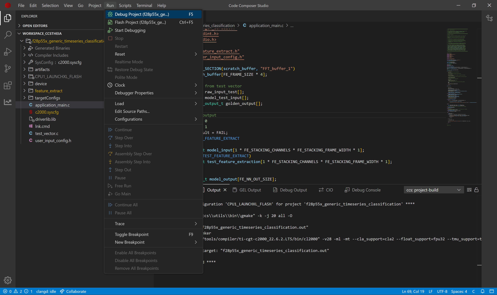
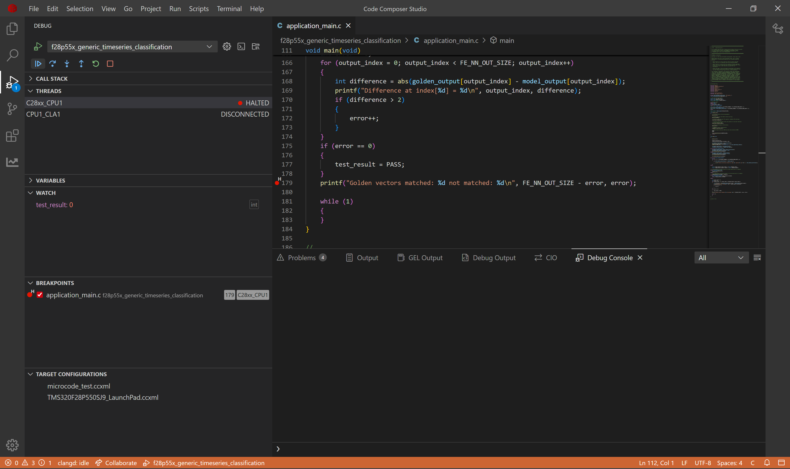
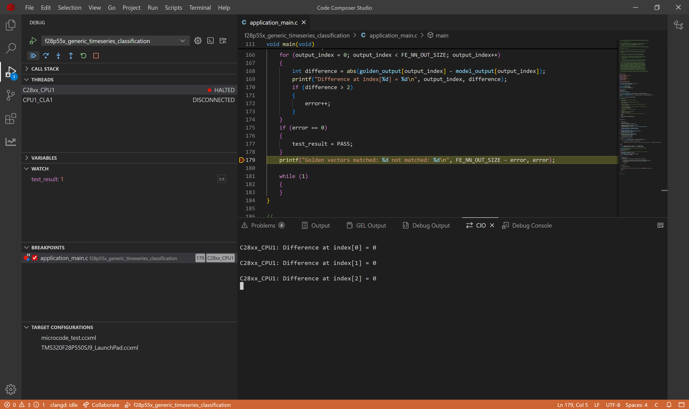

# Project Compilation Guide: Timeseries Classification Examples

## Overview

This guide explains how any classification example from tinyml-modelzoo can be used on an MCU. We will understand the outputs from the modelzoo and their meaning. We will see how a generic timeseries classification project looks like. The guide will explain how to use the outputs from modelzoo in the CCS Project and finally run it on the device.

---

## Table of Contents

1. [Overview](#overview)
2. [Required Tools](#required-tools)
2. [Output From Modelzoo](#output-from-modelzoo)
2. [How to run on device](#how-to-run-on-device)
5. [Next Steps](#next-steps)

---

## Required Tools

### **Code Composer Studio (CCS) IDE**
TI's integrated development environment. Download CCS from [TI's website](https://www.ti.com/tool/CCSTUDIO). Version used in this guide: 20.4.0

### **Supported Devices and SDK Requirements**

#### C2000 Family (F28x)

These devices use **C2000Ware SDK**. It is recommended to use the SDK Version: 6.1.0 (Release: 06_01_00_00)

| Device | LaunchPad/EVM | Product Page | SDK Download |
|--------|---------------|--------------|--------------|
| **F28003x** | [LAUNCHXL-F280039C](https://www.ti.com/tool/LAUNCHXL-F280039C) | [TMS320F280039C](https://www.ti.com/product/TMS320F280039C) | [C2000Ware](https://www.ti.com/tool/C2000WARE) |
| **F28004x** | [LAUNCHXL-F280049C](https://www.ti.com/tool/LAUNCHXL-F280049C) | [TMS320F280049C](https://www.ti.com/product/TMS320F280049C) | [C2000Ware](https://www.ti.com/tool/C2000WARE) |
| **F28P55x** | [LAUNCHXL-F28P55X](https://www.ti.com/tool/LAUNCHXL-F28P55X) | [TMS320F28P550SJ](https://www.ti.com/product/TMS320F28P550SJ) | [C2000Ware](https://www.ti.com/tool/C2000WARE) |
| **F28P65x** | [LAUNCHXL-F28P65X](https://www.ti.com/tool/LAUNCHXL-F28P65X) | [TMS320F28P650DK](https://www.ti.com/product/TMS320F28P650DK) | [C2000Ware](https://www.ti.com/tool/C2000WARE) |


#### C2000 Family (F29x)

These devices use **F29H85x SDK**. It is recommended to use the SDK Version: 1.04 (Release: 01_04_0000)

| Device | LaunchPad/EVM | Product Page | SDK Download |
|--------|---------------|--------------|--------------|
| **F29H85x** | [F29H85X-SOM-EVM](https://www.ti.com/tool/F29H85X-SOM-EVM) | [F29H850TU](https://www.ti.com/product/F29H850TU) | [F29H85X-SDK](https://www.ti.com/tool/download/F29H85X-SDK/) |


#### MSPM33 Family

These devices use **MSPM33 SDK**. It is recommended to use the SDK Version: 1.03.00.00 (Release: 1_03_00_00)

| Device | LaunchPad/EVM | Product Page | SDK Download |
|--------|---------------|--------------|--------------|
| **MSPM33C321Ax** | [LP-MSPM33C321A](https://www.ti.com/tool/LP-MSPM33C321A) | [MSPM33C321A](https://www.ti.com/product/MSPM33C321A) | [MSPM33-SDK](https://www.ti.com/tool/download/MSPM33-SDK) |


#### Sitara MCU Family (AM13x)

These devices use **MCU SDK**. It is recommended to use the SDK Version: 1.00.00.00 (Release: 1_00_00_00)

| Device | Product Page | SDK Download |
|--------|--------------|--------------|
| **AM13E2x** | [AM13E2](https://www.ti.com/product/AM13E2) | [MCU-SDK](https://www.ti.com/tool/download/MCU-SDK-AM13E2X) |


#### Sitara MCU Family (AM26x)

These devices use **MCU-PLUS-SDK**. It is recommended to use the SDK Version: 11.03.00.00 (Release: 11_03_00_00)

| Device | LaunchPad/EVM | Product Page | SDK Download |
|--------|---------------|--------------|--------------|
| **AM263x** | [LP-AM263](https://www.ti.com/tool/LP-AM263) | [AM2634](https://www.ti.com/product/AM2634) | [MCU-PLUS-SDK-AM263X](https://www.ti.com/tool/MCU-PLUS-SDK-AM263X) |

---

## Output From Modelzoo

Modelzoo will start by loading the dataset, train the model, test the model, compile the model. Modelzoo will create the output folder in `tinyml-modelmaker/data/projects/{dataset_name}`. You can find the dataset name in the [configuration](config.yaml) yaml. Let's assume the dataset_name to be hello_world_example_dsg as we will use the hello world example for generic timeseries classification.

```bash
cd tinyml-Modelzoo
run_tinyml_modelzoo.sh examples/generic_timeseries_classification/config.yaml
```

### Understanding the outputs

These files are located in the following directory structure:

```
tinyml-modelmaker/
└── data/
    └── projects/
        └── hello_world_example_dsg/
            └── run/
                └── {date-time}/
                    └── {model_name}/
                        ├── compilation/
                        │   └── artifacts/
                        │       ├── mod.a                     <-- Compiled model
                        │       └── tvmgen_default.h          <-- Model API header
                        │
                        └── training/
                            ├── base/                         <-- For float (non-quantized) models
                            │   └── golden_vectors/
                            │       ├── test_vector.c
                            │       └── user_input_config.h
                            │
                            └── quantization/                 <-- For quantized models
                                └── golden_vectors/
                                    ├── test_vector.c
                                    └── user_input_config.h
```

The example project has four useful file outputs by ModelMaker. We will see their name and meaning.
- `mod.a`: The ONNX model is compiled by tvm to get C files, which are converted into a single mod.a that can run on device. This file stores the core functionality of AI model.
- `tvmgen_default.h`: Mod.a exposes few APIs to interact with model which are present here. You can use these APIs in your application to run model

- `test_vector.c`: ModelMaker gives a test dataset and the expected output. You can use the model to inference this test dataset and check if the output is matching. 
- `user_input_config.h`: This configuration file has preprocessing flag definitions for the parameters used for feature extraction.

These 4 files can be used in a CCS Project to perform AI on edge.

### How are these obtained

The modelzoo is built on PyTorch framework and the training of the CNN model is done using PyTorch. After the training is converted we convert the layers in TI NPU understandable format. Then the AI model is exported in ONNX format using torch.onnx.export. The ONNX model can be found in the modelmaker run output *tinyml-modelmaker/data/projects/hello_world_example_dsg/run/{date-time}/{model}/training/quantization/model.onnx*.

This ONNX model is compiled using [TI MCU NNC](https://software-dl.ti.com/mctools/nnc/mcu/users_guide/). You can go to the compiler page and check for different options and optimizations present. For different AI tasks such as Classification, Regression, Forecasting, Anomaly Detection, we use different optimizations. For classification example we use:

- SKIP_NORMALIZE
- OUTPUT_INT

To get the artifacts with mod.a and the tvmgen_default.h, we use TI MCU NNC and compile the onnx model. Below is the command to perform this. You can explore more [compilation option](https://software-dl.ti.com/mctools/nnc/mcu/users_guide/compiling.html).

```bash
tvmc compile --target="c, ti-npu type=hard skip_normalize=true output_int=true" --target-c-mcpu=c28 ./model.onnx -o artifacts_c28/mod.a --cross-compiler="cl2000" --cross-compiler-options="$CL2000_OPTIONS"
```

---

## How to run on device

### CCS Studio

Code Composer Studio (CCS) is a free integrated development environment (IDE) provided by Texas Instruments (TI) for developing and debugging applications for TI's micro-controllers and processors. It offers various examples for users to get started with their problem statement. One of the application is f28p55x_generic_timeseries_classification. We will use this example to run on device f28p55x for this guide.

### Requirements

The CCS example *f28p55x_generic_timeseries_classification* requires 4 files from modelmaker. We will copy the files from modelmaker run to the CCS example project. 

1. C2000Ware 6.01.00.00
2. Location of example: *C:\ti\c2000\C2000Ware_6_01_00_00\libraries\ai\examples\generic_timeseries_classification\f28p55x*

Location of examples for other device families:
- For C2000 Family (F29x) Example: *C:\ti\f29h85x-sdk_1_04_00_00\examples\ai\generic_timeseries_classification*
- For Sitara MCU Family (AM13x) Example: *C:\ti\mcu_sdk\examples\ai\generic_timeseries_classification*
- For Sitara MCU Family (AM26x) Example: *C:\ti\mcu_plus_sdk_am263x_11_03_00_00\examples\ai\generic_timeseries_classification*

### Running for Target Device

After run the modelmaker from command line is finished. Copy the 4 files (path present below) from Modelmaker to CCS Project. Build the CCS Project, flash the program and start debugging the application. Check for the variable *error* for different sets of test cases preset in test_vector.c.

#### Compiled model files

- mod.a: The compiled model is present in this file. 
  - Path Modelmaker: *tinyml-modelmaker/data/projects/hello_world_example_dsg/run/{date-time}/{model}/compilation/artifacts/mod.a*
  - Path CCS Project: *f28p55x_generic_timeseries_classification/artifacts/mod.a*
- tvmgen_default.h: Header file to access the model inference APIs from mod.a 
  - Path Modelmaker: *tinyml-modelmaker/data/projects/hello_world_example_dsg/run/{date-time}/{model}/compilation/artifacts/tvmgen_default.h*
  - Path CCS Project: *f28p55x_generic_timeseries_classification/artifacts/tvmgen_default.h*

#### Test data for device verification

- test_vector.c: Test cases to check if the model works on device currently
  - Path Modelmaker: *tinyml-modelmaker/data/projects/hello_world_example_dsg/run/{date-time}/{model}/training/quantization/golden_vectors/test_vector.c*
  - Path CCS Project: *f28p55x_generic_timeseries_classification/test_vector.c*
- user_input_config.h: Configuration of feature extraction library in SDK. 
  - Path Modelmaker: *tinyml-modelmaker/data/projects/hello_world_example_dsg/run/{date-time}/{model}/training/quantization/golden_vectors/user_input_config.h*
  - Path CCS Project: *f28p55x_generic_timeseries_classification/user_input_config.h*

### Load sample example

We will load the generic timeseries example for f28p55 device using Code Composer Studio.

1. Open Code Composer Studio
2. Go to View tab -> Open Resource Explorer

3. Type the Board or Device to filter as **LAUNCHXL-F28P55X**
4. Type keyword as **f28p55x_generic_timeseries_classification**

5. Select the folder **f28p55x_generic_timeseries_classification** and click Import
6. Download and install the required dependencies of the project.
7. The imported project will look like this in the CCS Project


### Run the sample example

We will build the project and flash the program in device. The project has a 'C' file application_main.c, which contains the code for calling APIs to the feature extraction lib and model inference. We will use debug mode to see the result of model inference present in *test_result*.

8. Now we will build the project. Go to Project Tab -> Select Build Project(s)

9. Switch the active target device from **TMS320F28P550SJ9.ccxml** to **TMS320F28P550SJ9_LaunchPad.ccxml**.

10. Connect launchpad F28P55x to your system.
11. Flash the built project in device with debug mode. Go to Run tab -> Select Debug Project

12. After the application is flashed, debug screen will appear. Place the breakpoint at the point where it is shown below.

14. Add the following variable in Watch section of debug and continue the program.

15. If the test_result is 1 it means the model inference is working correctly, if it is 0, the model inference is wrong.


### Test Multiple Cases

The `test_vector.c` file contains multiple test cases. To test different cases:

1. Open `test_vector.c` in the editor
2. Comment out the current test set (SET 0)
3. Uncomment another test set (e.g., SET 1)
4. Rebuild and flash the project again
5. Verify that the golden vector matches the model output

---

## Next Steps

You have successfully deployed a classification model to a TI MCU !

### Build Your Own Classification Application

With this workflow, you can create your own generic time series classification applications using the same process.

#### Explore Other Application Examples

To explore more classification use cases, refer to the following examples:

- [Hello World](../../examples/generic_timeseries_classification/readme.md) - Prediction of the type of waveform of signal
- [AC Arc Fault](../../examples/ac_arc_fault/readme.md) - Predict whether an arc is present in circuit or not
- [Blower Imbalance](../../examples/blower_imbalance/readme.md) - Prediction of imbalance present in fan blowers
- [ECG Classification](../../examples/ecg_classification/readme.md) - Classifying ECG Signals
- [Electrical Fault](../../examples/electrical_fault/readme.md) - Predicting presence of electrical faults between lines 
- [Fan Blade Fault Classification](../../examples/fan+blade_fault_classification/readme.md) - Prediction of faults in blades of fans
- [Gas Sensor](../../examples/gas_sensor/readme.md) - Prediction of the type of gas present in a room
- [Grid Stability](../../examples/grid_stability/readme.md) - Predicting the stability of a grid
- [MNIST Image Classification](../../examples/MNIST_image_classification/readme.md) - Classifying the images of integers
- [DC Arc Fault](../../examples/dc_arc_fault/readme.md) - Predict whether an arc is present in circuit or not
- [WISDM](../../examples/branched_model_parameters/readme.md) - Wearable Hand Movement detection from accelerometer

<hr>

**Update History:**
- [28th Jan 2026]: Compatible with TinyML ModelMaker v1.3.0