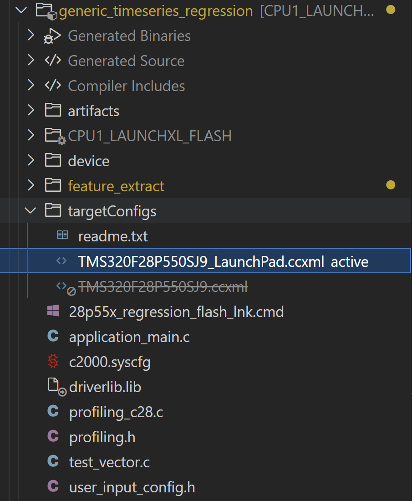
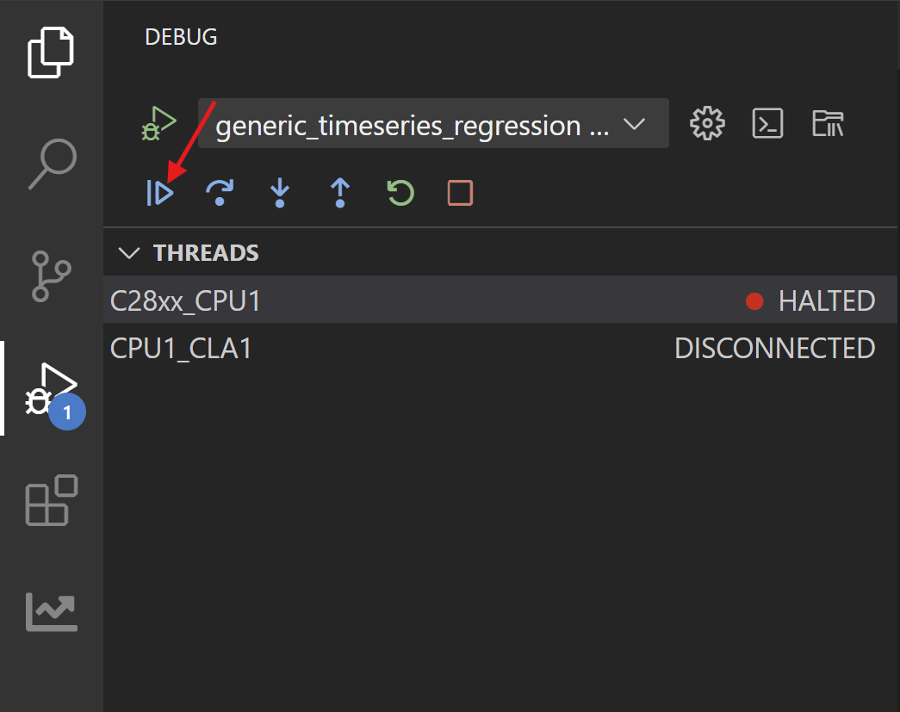

# Deploying Regression Models from ModelMaker to Device
### Abhijeet Pal, Adithya Thonse, Tushar Sharma, Fasna Sharaf, Jaswanth Kumar
<hr>

## Table of Contents

1. [Overview](#overview)
2. [Prerequisites](#prerequisites)
3. [Deployment Steps](#deployment-steps)
4. [Verify Your Model](#verify-your-model)

---

## Overview

This guide walks you through the process of taking a timeseries regression model trained in **TinyML Modelzoo** and running it on a Texas Instruments (TI) microcontroller. Timeseries regression predicts target variable based on independent variables, and previous context.

To learn more about running timeseries regression examples on ModelMaker, refer to the [Generic TimeSeries Regression Example](../../examples/generic_timeseries_regression/readme.md), which demonstrates how to run regression examples using a synthetically generated dataset.

---

## Prerequisites

Before starting, ensure you have the following:

### Hardware

Ensure you have a TI LaunchPad for your target device. The following devices are currently supported:

| Device Family | Device |
|---------------|--------|
| C2000 (F28x) | F28003x, F28004x, F280013x, F280015x, F28P55x, F28P65x, F2837x |
| C2000 (F29x) | F29H85x, F29P58x, F29P32x |
| MSPM33 | MSPM33C321Ax |
| Sitara MCU | AM263x, AM263P, AM261 |

---

### Software

1. **TinyML ModelMaker**: Latest version from [TinyML Tensorlab GitHub Repository](https://github.com/TexasInstruments/tinyml-tensorlab) Current version: 1.3.0.

After running a regression example, ModelMaker generates the following files required for deploying the model on MCUs (Refer to the [Generic Timeseries Regression Example](../../examples/generic_timeseries_regression/readme.md)).

| File | Description |
|------|-------------|
| **mod.a** | Compiled model library |
| **tvmgen_default.h** | Header file for model inference APIs |
| **test_vector.c** | Test data to verify model correctness |
| **user_input_config.h** | Configuration parameters for the model |

These files are located in the following directory structure:

```
tinyml-modelmaker/
└── data/
    └── projects/
        └── {dataset_name}/
            └── run/
                └── {date-time}/
                    └── {model_name}/
                        ├── compilation/
                        │   └── artifacts/
                        │       ├── mod.a                     <-- Compiled model
                        │       └── tvmgen_default.h          <-- Model API header
                        │
                        └── training/
                            ├── base/                         <-- For float (non-quantized) models
                            │   └── golden_vectors/
                            │       ├── test_vector.c
                            │       └── user_input_config.h
                            │
                            └── quantization/                 <-- For quantized models
                                └── post_training_analysis/
                                |    |── actual_vs_predicted.png
                                |    └── residual_error_test.png
                                |    └── results_on_test_set.csv
                                |
                                └── golden_vectors/
                                    ├── test_vector.c
                                    └── user_input_config.h

```

**Note:** Choose the golden vectors based on the model type you compiled in ModelMaker:
- **Float model (non-quantized):** Use golden vectors from `tinyml-modelmaker/data/projects/{dataset-name}/run/{date-time}/{model-name}/training/base/golden_vectors/`
- **Quantized model:** Use golden vectors from `tinyml-modelmaker/data/projects/{dataset-name}/run/{date-time}/{model-name}/training/quantization/golden_vectors/`


If quantization is not used i.e. set to 0, the post_training_analysis folder is present in `tinyml-modelmaker/data/projects/{dataset-name}/run/{date-time}/{model-name}/training/base/`

### Exact File Locations

| File | Float Model Location | Quantized Model Location |
|------|---------------------|--------------------------|
| **mod.a** | `tinyml-modelmaker/data/projects/{dataset-name}/run/{date-time}/{model-name}/compilation/artifacts/mod.a` | `tinyml-modelmaker/data/projects/{dataset-name}/run/{date-time}/{model-name}/compilation/artifacts/mod.a` |
| **tvmgen_default.h** | `tinyml-modelmaker/data/projects/{dataset-name}/run/{date-time}/{model-name}/compilation/artifacts/tvmgen_default.h` | `tinyml-modelmaker/data/projects/{dataset-name}/run/{date-time}/{model-name}/compilation/artifacts/tvmgen_default.h` |
| **test_vector.c** | `tinyml-modelmaker/data/projects/{dataset-name}/run/{date-time}/{model-name}/training/base/golden_vectors/test_vector.c` | `tinyml-modelmaker/data/projects/{dataset-name}/run/{date-time}/{model-name}/training/quantization/golden_vectors/test_vector.c` |
| **user_input_config.h** | `tinyml-modelmaker/data/projects/{dataset-name}/run/{date-time}/{model-name}/training/base/golden_vectors/user_input_config.h` | `tinyml-modelmaker/data/projects/{dataset-name}/run/{date-time}/{model-name}/training/quantization/golden_vectors/user_input_config.h` |

2. **Code Composer Studio (CCS)**: TI's integrated development environment. Download CCS from [TI's website](https://www.ti.com/tool/CCSTUDIO). Version used in this guide: 20.2.0.

3. **Device-specific SDK**: After installing CCS, install the appropriate SDK for your device.

#### Supported Devices and SDK Requirements

### C2000 Family (F28x)

These devices use **C2000Ware SDK**.

| Device | LaunchPad/EVM | Product Page | SDK Download |
|--------|---------------|--------------|--------------|
| **F280013x** | [LAUNCHXL-F2800137](https://www.ti.com/tool/LAUNCHXL-F2800137) | [TMS320F2800137](https://www.ti.com/product/TMS320F2800137) | [C2000Ware](https://www.ti.com/tool/C2000WARE) |
| **F280015x** | [LAUNCHXL-F2800157](https://www.ti.com/tool/LAUNCHXL-F2800157) | [TMS320F2800157](https://www.ti.com/product/TMS320F2800157) | [C2000Ware](https://www.ti.com/tool/C2000WARE) |
| **F28003x** | [LAUNCHXL-F280039C](https://www.ti.com/tool/LAUNCHXL-F280039C) | [TMS320F280039C](https://www.ti.com/product/TMS320F280039C) | [C2000Ware](https://www.ti.com/tool/C2000WARE) |
| **F28004x** | [LAUNCHXL-F280049C](https://www.ti.com/tool/LAUNCHXL-F280049C) | [TMS320F280049C](https://www.ti.com/product/TMS320F280049C) | [C2000Ware](https://www.ti.com/tool/C2000WARE) |
| **F28P55x** | [LAUNCHXL-F28P55X](https://www.ti.com/tool/LAUNCHXL-F28P55X) | [TMS320F28P550SJ](https://www.ti.com/product/TMS320F28P550SJ) | [C2000Ware](https://www.ti.com/tool/C2000WARE) |
| **F28P65x** | [LAUNCHXL-F28P65X](https://www.ti.com/tool/LAUNCHXL-F28P65X) | [TMS320F28P650DK](https://www.ti.com/product/TMS320F28P650DK) | [C2000Ware](https://www.ti.com/tool/C2000WARE) |
| **F2837x** | [LAUNCHXL-F28379D](https://www.ti.com/tool/LAUNCHXL-F28379D) | [TMS320F28377D](https://www.ti.com/product/TMS320F28377D) | [C2000Ware](https://www.ti.com/tool/C2000WARE) |

**SDK Version**: 6.1.0 (Release: 6_01_00_00)

### C2000 Family (F29x)

These devices use **F29H85x SDK**.

| Device | LaunchPad/EVM | Product Page | SDK Download |
|--------|---------------|--------------|--------------|
| **F29H85x** | [F29H85X-SOM-EVM](https://www.ti.com/tool/F29H85X-SOM-EVM) | [F29H850TU](https://www.ti.com/product/F29H850TU) | [F29H85X-SDK](https://www.ti.com/tool/download/F29H85X-SDK/) |
| **F29P58x** | - | - | [F29H85X-SDK](https://www.ti.com/tool/download/F29H85X-SDK/) |
| **F29P32x** | - | - | [F29H85X-SDK](https://www.ti.com/tool/download/F29H85X-SDK/) |

**SDK Version**: 1.4.0 (Release: 01_04_00_00)

### MSPM33 Family

These devices use **MSPM33 SDK**.

| Device | LaunchPad/EVM | Product Page | SDK Download |
|--------|---------------|--------------|--------------|
| **MSPM33C321Ax** | [LP-MSPM33C321A](https://www.ti.com/tool/LP-MSPM33C321A) | [MSPM33C321A](https://www.ti.com/product/MSPM33C321A) | [MSPM33-SDK](https://www.ti.com/tool/download/MSPM33-SDK) |

**SDK Version**: 1.03.00.00 (Release: 1_03_00_00)

### Sitara MCU Family (AM26x)

These devices use **MCU-PLUS-SDK**.

| Device | LaunchPad/EVM | Product Page | SDK Download |
|--------|---------------|--------------|--------------|
| **AM263** | [LP-AM263](https://www.ti.com/tool/LP-AM263) | [AM2634](https://www.ti.com/product/AM2634) | [MCU-PLUS-SDK-AM263X](https://www.ti.com/tool/MCU-PLUS-SDK-AM263X) |
| **AM263P** | [LP-AM263P](https://www.ti.com/tool/LP-AM263P) | [AM263P4](https://www.ti.com/product/AM263P4) | [MCU-PLUS-SDK-AM263PX](https://www.ti.com/tool/MCU-PLUS-SDK-AM263PX) |
| **AM261** | [LP-AM261](https://www.ti.com/tool/LP-AM261) | - | [MCU-PLUS-SDK-AM261X](https://www.ti.com/tool/MCU-PLUS-SDK-AM261X) |

**SDK Version**: 11.2.0 (Release: 11_02_00_00)

---

## Deployment Steps

Once all prerequisites are met, follow these steps to deploy the model on your device.

**1. Open Code Composer Studio**

**2. Import the Project**

- Go to **File** > **Import Projects**
- A dialog box will appear. Click **Browse** to select the project folder.


- Select the `generic_timeseries_regression` folder

   The project location depends on your target device:

   - **For C2000 F28P55x devices**: Navigate to your C2000Ware SDK installation directory:
     ```
     {C2000Ware_SDK_INSTALL_PATH}/libraries/ai/examples/generic_timeseries_regression
     ```
     

**3. Click Finish**

**4. Verify Project Import**

After importing, the project should appear in the **Project Explorer** panel on the left side of CCS.

*Project Explorer showing F28P55 project:*



**5. Copy Artifacts and Golden Vectors**

Copy the following 4 files from ModelMaker to your CCS project:

- Copy the artifacts (`mod.a`, `tvmgen_default.h`) to `{CCS_project}/artifacts/` (replace existing files)
- Copy the golden vectors (`user_input_config.h`, `test_vector.c`) to `{CCS_project}/` (replace existing files)

**6. Select the Target Configuration**

1. In the Project Explorer, expand your project
2. Find the **targetConfigs** folder
3. Right-click on the LaunchPad configuration file (e.g., `TMS320F28P550SJ9_LaunchPad.ccxml`)
4. Select **Set as Active Target Configuration**


**7. Build the Project**

Right-click on the target configuration > **Build Project**

Wait for the build to complete. Check the **Console** panel for any errors.

**8. Connect Your LaunchPad**

Connect your TI LaunchPad to your computer using a USB cable.

**10. Flash the Project**

Right click on targte config > **Flash Project**

---

## Verify Your Model

### Start Debug Session

After flashing, the debug perspective should open automatically. If not, go to **Run** > **Debug**.


### Run the Program

Click the **Resume** button (green play button).



### Check the Results


### Test Multiple Cases

The `test_vector.c` file contains multiple test cases. To test different cases:

1. Open `test_vector.c` in the editor
2. Comment out the current test set (SET 0)
3. Uncomment another test set (e.g., SET 1)
4. Rebuild and reflash the project
5. Verify that the golden vector matches the model output

---

With this workflow, you can create your own generic time series regression applications using the same process.
#### Explore Other Regression Examples

To explore more regression examples refer to the following examples:

- [Washing Machine load weighing](../../examples/reg_washing_machine/readme.md) - Washing machine load weighing using current, voltage, speed data
- [Torque Measurement](../../examples/torque_measurement_regression/readme.md) - Predicting torque of motor using current, voltage, collant temperature and other features.
- [Induction Motor Speed Prediction](../../examples/induction_motor_speed_prediction/readme.md) Induction motor speed prediction


**Update History:**
- [29th Jan 2026]: Compatible with TinyML ModelMaker v1.3