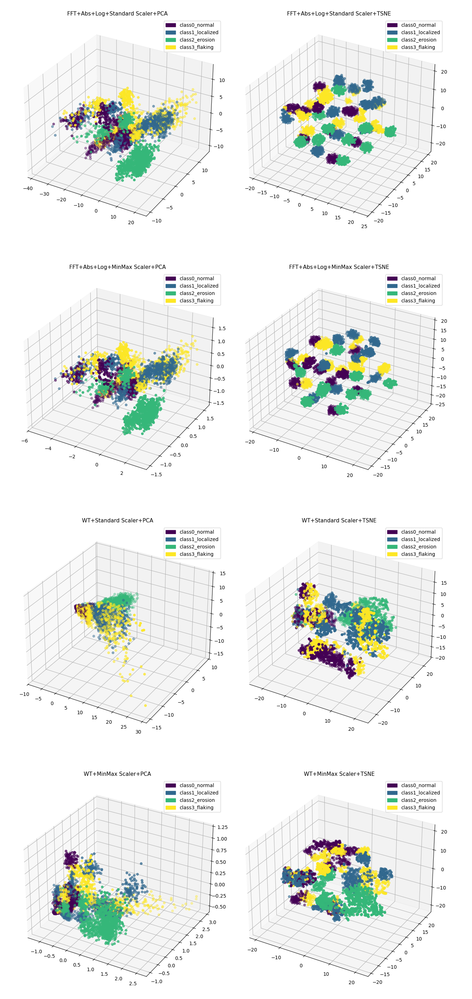
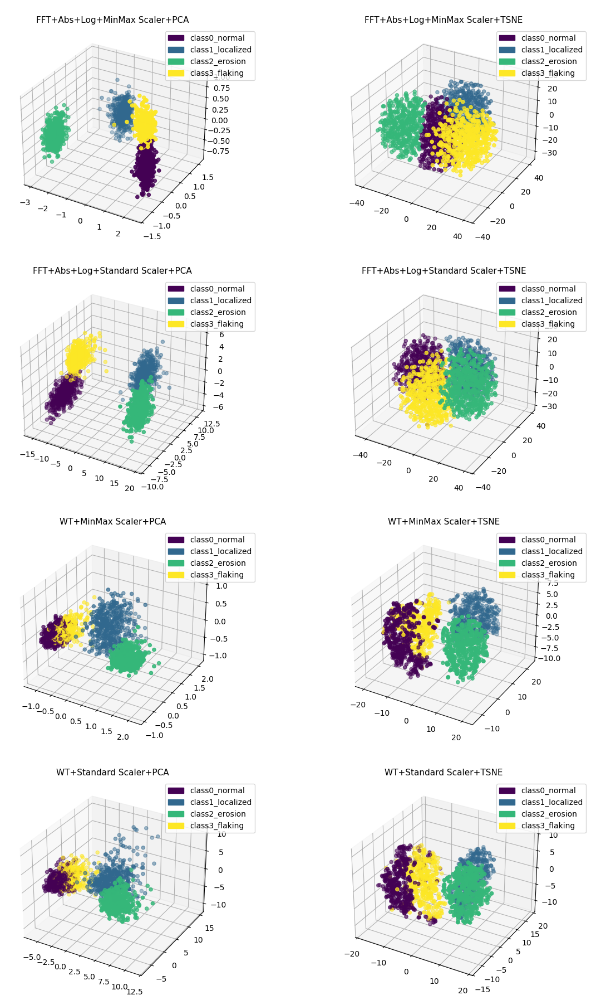
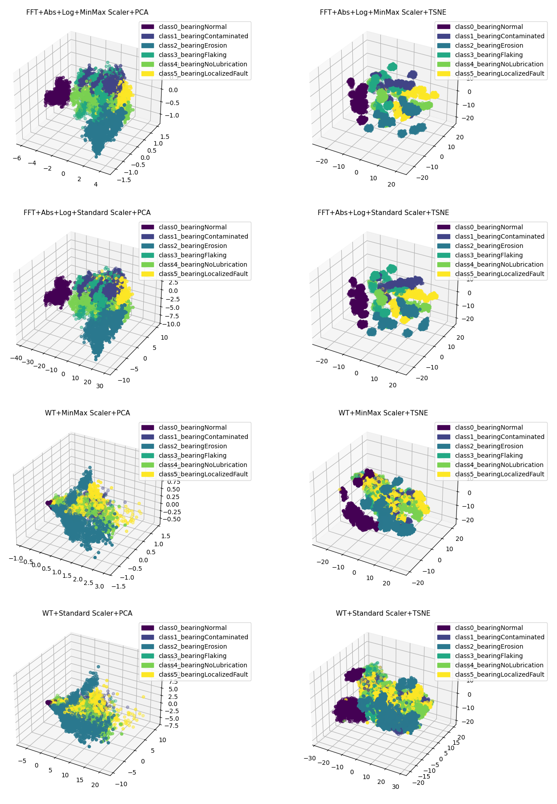
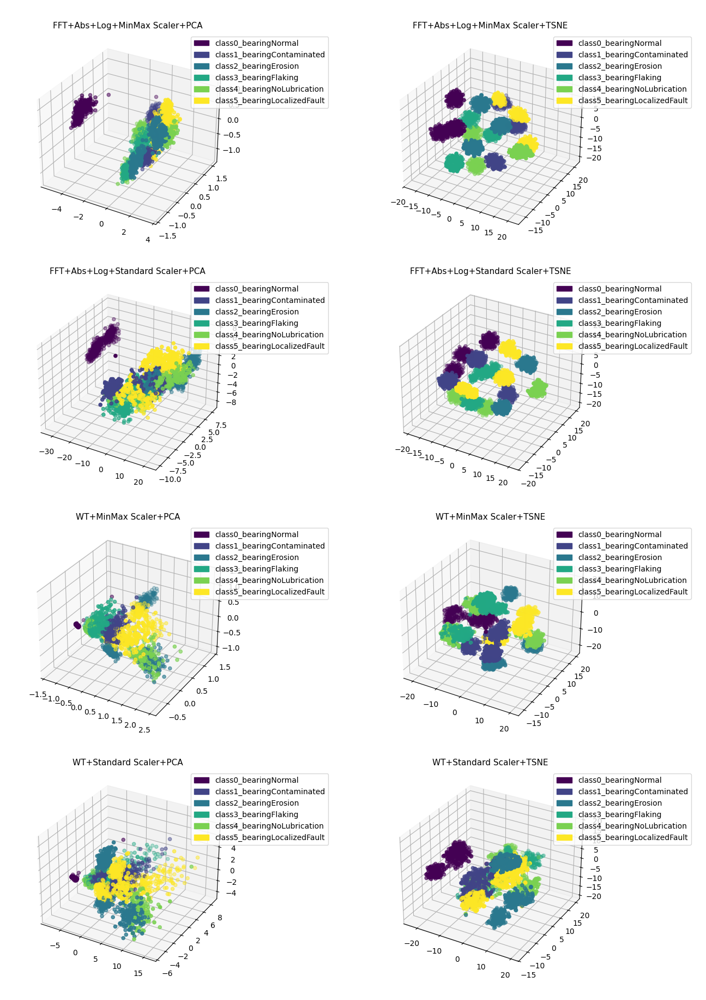
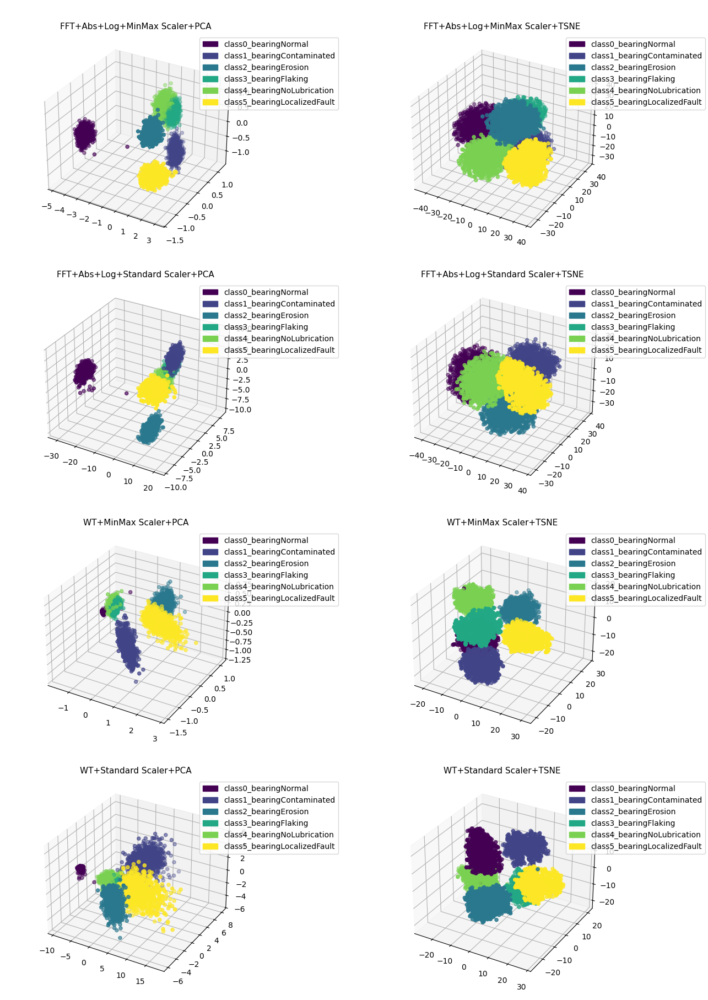
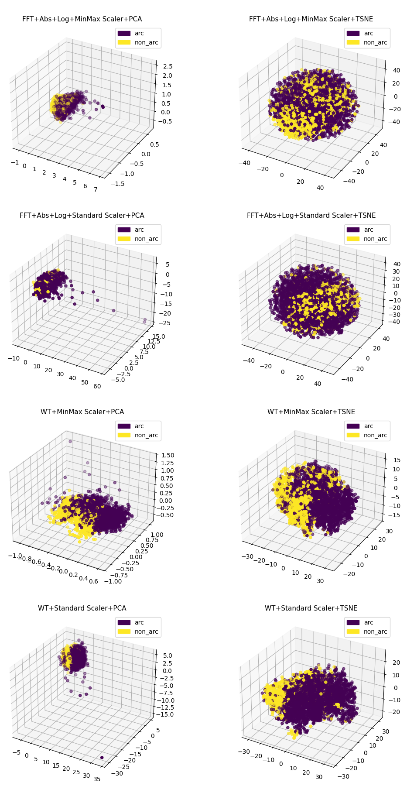
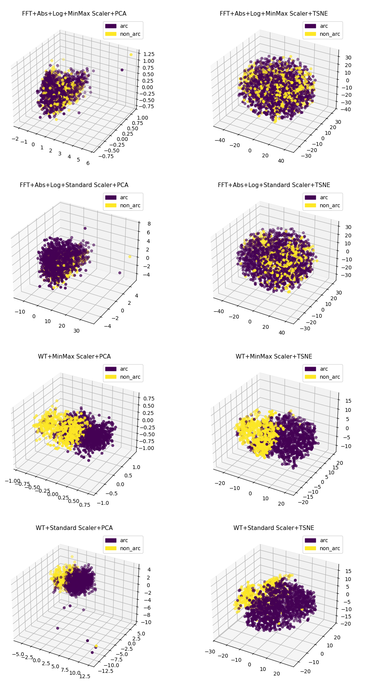
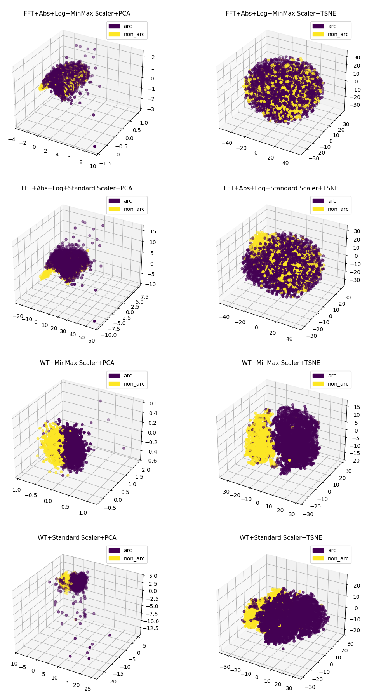
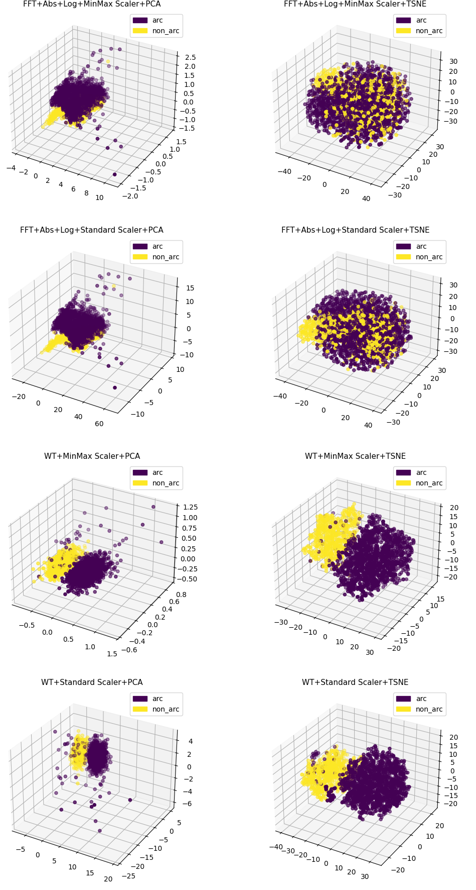
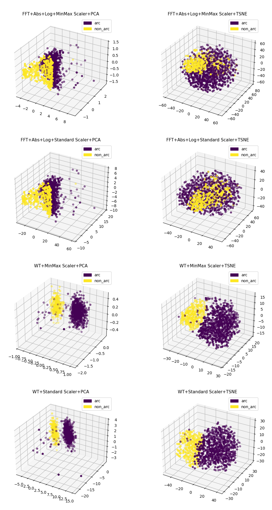

# Motor Fault Four Class Dataset : Focus on Goodness of Fit (GoF) Test for Time-Series Classification Datasets
### -Fasna Sharaf, Adithya Thonse, Tushar Sharma
<hr>

<details>
<summary> Preface </summary>

The Motor Fault Four Class Dataset is a multivariate time series dataset designed for bearing fault detection and classification in industrial motors based on extracted features from the dataset. This has been collected on an internal TI Testbed.

The dataset consists of measurements from a vibration sensor along _3 axes_ domains and is categorized into **four** fault classes. Each class represents a specific bearing condition, ranging from normal operation to various fault types. The classes are:

1. **Normal**<br>
2. **Localized**<br>
3. **Erosion**<br>
4. **Flaking**<br>

This dataset is already formatted according to TinyML Modelmaker needs. It can be found in the same directory as this README file.

## Usage in TinyML ModelMaker

This dataset is designed to work with TinyML ModelMaker, an end-to-end model development tool that provides dataset handling, model training, and compilation.

```bash
./run_tinyml_modelmaker.sh F28P55 examples/goodness_of_fit_test/config.yaml
```

Users can configure the model pipeline using a YAML configuration file (like shown in the command above), where different stages (dataset loading, data processing and feature extraction, training, testing, and compilation) can be enabled or disabled based on requirements.

## Understanding the YAML Configuration File
The YAML configuration file sets up the model training process in TinyML ModelMaker. It has several sections:

- **Common Section**: Defines general settings like the module type, task type, target device, and run name.
- **Dataset Section**: Provides details about the dataset, including whether to load it, the dataset name and the path to the data file.
- **Data Processing and Feature Extraction Section**: Involves preparing data for the model by applying techniques such as downsampling, windowing, and feature extraction methods like FFT (Fast Fourier Transform) and whether to enable the GoF test or not.
- **Training Section**: Configures the model training parameters, including the model name, batch size, epochs, and learning rate.
- **Testing Section**: Indicates if testing should be enabled.
- **Compilation Section**: Sets options for compiling the trained model.

</details>

In this example, we'll dive deeper into the GoF test for time-series classification datasets.

## Understanding the Goodness of Fit (GoF) Test

The Goodness of Fit (GoF) test helps us evaluate whether a time-series dataset is suitable for classification. This is achieved by applying certain transformations, scaling and dimensionality reduction techniques to the raw data, followed by plotting the data with its true labels. These plots help us visualize how the data naturally clusters into groups. If the clusters for different classes are well-separated (show minimal overlap) and exhibit strong cluster purity, where most points in a cluster belong to the same class, we can confidently say that the dataset is good enough for classification tasks.

This test becomes crucial when a dataset may have problems such as mislabeled data, noisy entries, or inadequate features. For instance, imagine a dataset with multiple classes where some samples are mislabeled, or the features are insufficient to properly distinguish between classes. Instead of feeding such a dataset directly into a classification model, where poor quality data would inevitably lead to poor results, we can use the GoF test to assess its quality beforehand. By examining aspects like class separability and cluster purity in the plots, we can determine whether the dataset requires enhancements before further processing.

## Methods Used in the GoF Test

To evaluate the quality of a time-series classification dataset, we use different combinations of transformations, scaling techniques, and dimensionality reduction methods. These combinations allow us to generate a total of **8 distinct plots**, each offering a unique perspective on the dataset. Below, we’ll walk you through each method and its purpose.

### 1. Transformations
Transformations help us process the raw time-series data into a format that can be analyzed more effectively. We use the following two techniques:

- **Fast Fourier Transform (FFT) + Absolute value + Log Transformation**: 
  This method converts the time-series data from the time domain into the frequency domain. By doing this, we can analyze patterns in the data, such as repetitive cycles or periodic signals, which might not be obvious in the raw time format. Then FFT produces symmetric output, only first half of the spectrum is retained. Next, the absolute value is taken followed by it's log transformation which compress large magnitudes.

- **Wavelet Transform (WT)**: 
  Unlike FFT, Wavelet Transform analyzes the data in both the time and frequency domains simultaneously. This makes it a powerful tool for capturing localized events in time-series data, such as sudden spikes or anomalies.

### 2. Scaling
Scaling ensures that the values in the dataset are normalized to a comparable range, which prevents larger numerical values from dominating the analysis. We use two types of scaling:

- **Standard Scaler (Z-score Normalization)**: 
  This method standardizes the data by subtracting the mean and dividing by the standard deviation, ensuring that it has a mean of 0 and a standard deviation of 1.

- **Min-Max Scaler**: 
  This technique scales the data to a fixed range (typically 0 to 1). It’s particularly useful when you want to preserve the relative distances between data points.

### 3. Dimensionality Reduction
Dimensionality reduction reduces the number of features in the data while retaining its most important characteristics. This helps us visualize high-dimensional data more easily. We use:

- **Principal Component Analysis (PCA)**: 
  PCA compresses the data into fewer dimensions while keeping most of the variability intact. It’s commonly used to simplify high-dimensional datasets.

- **t-Distributed Stochastic Neighbor Embedding (t-SNE)**: 
  t-SNE maps high-dimensional data into 2D or 3D spaces, focusing on preserving local relationships between data points. This makes it great for visualizing clusters.

### Combining These Methods
For the Goodness of Fit test, we combine these techniques in every possible way: **2 Transformations (FFT, WT)** × **2 Scaling Methods (Standard Scaler, Min-Max Scaler)** × **2 Dimensionality Reduction Techniques (PCA, t-SNE)**.

This gives us a total of **8 unique combinations**, and we generate one plot for each combination. The aim is to evaluate the dataset from different perspectives. A very good dataset will exhibit strong class separability (minimal overlap between clusters) and high cluster purity (where most points within a cluster belong to the same class) in atleast one of these 8 distinct plots. That combination is an indication that the dataset is well structured and suitable for classification tasks.

### <u> Important: Not all 8 plots need to have separable clusters. Each plot represents a different method to analyze the time-series classification dataset. If any one of the plots shows separable clusters, it’s a strong sign that the dataset is suitable for classification.</u>

## Configuring the Goodness of Fit Test in the YAML File

This section explains how to configure the YAML file to enable and customize the GoF test. Here's how you can set it up step by step:

### 1. Required Parameters for the GoF Test
To activate the GoF test and specify the frame size for processing the dataset, update the `data_processing_feature_extraction` section in the YAML file as follows:

```yaml
data_processing_feature_extraction:
    gof_test: True   # Enables GoF test
    frame_size: 256  # Frame size required for the GoF test
```
Here, `frame_size: 256` means the data will be divided into frames of 256 rows for processing.

### 2. Enabling Training for GoF Test
To generate plots, training must be enabled. Set the following under training:

```yaml
training:
    enable: True  # Required for GoF test
```

## Results and Analysis of the Goodness of Fit Test

On running the GoF test on the Motor Fault Four Class Dataset, the generated plot is saved here:

`tinyml-modelmaker/data/projects/motor_fault_classification_dsk3/run/{date-time}/{model_name}/training/base/GoF_frame_size_{frame_size}.png`

Here, {date-time} represents the timestamp of the run, {model_name} is the name of the model used, and {frame_size} correspond to the specific frame size value chosen for the test.

### Analysis 1 : Exploring Class Clusters

Here is the plot we got for the Motor Fault Four Class Dataset (frame_size=256):

<p align="center">
    
</p>
<p align="center">GoF Test Plots for Motor Fault Four Class Dataset</p>

Each of these 8 plots represents a different combination of transformations applied to the raw time-series data. Some plots reveal distinct clusters, while others show significant overlap between classes, indicating poor separability. Again reminding, **not all 8 plots need to have separable clusters. Each plot represents a different method to analyze the time-series classification dataset. If any one of the plots shows separable clusters, it’s a strong sign that the dataset is suitable for classification.**

Interestingly, the second (FFT + Abs + Log + Standard Scaler + TSNE) and fourth (FFT + Abs + Log + MinMax Scaler + TSNE) plots stand out. Unlike the others, where clusters are heavily overlapped and not well defined, these two plots exhibit high cluster purity, meaning that most points in a cluster belong to the same class.

However, an intriguing pattern emerges in these two plots, each class forms multiple smaller clusters, roughly around 10 per class. This raises an important question: why does the same class split into multiple clusters?

One possible explanation is the dataset’s sampling frequency. Upon closer inspection, the dataset contains time-series data sampled at 10 different frequencies, ranging from 10Hz to 100Hz. This variability in sampling rates might be causing the formation of multiple clusters for the same class.

To explore this further, the dataset was filtered to include only samples collected at 40Hz, and the GoF test was run again (frame_size=256).

<p align="center">
    
</p>
<p align="center">Filtered GoF Test Plot for Motor Fault Four Class Dataset (40Hz)</p>

**The result is striking. The number of clusters reduces from 10 per class to just 4, aligning perfectly with the four actual classes in the dataset. This suggests that differences in sampling frequency were introducing unwanted  variations, making the dataset appear more complex than it actually is.**

**<u>However, multiple clusters per class do not always indicate a sampling frequency issue. The variation in clusters could be due to several factors, such as differences in environmental conditions during data collection or inconsistencies in the way the data was recorded.</u>**

For example, consider the Motor Fault Six-Class Dataset. Running the GoF test on this dataset with frame_size=256 produces the following plot:

<p align="center">
    
</p>
<p align="center">GoF Test Plot for Motor Fault Six Class Dataset</p>

This time, the second and fourth plots display many clusters per class, suggesting a more complex structure in the data.

To investigate further, the dataset was filtered to include only 40Hz samples, just like before (frame_size=256):

<p align="center">
    
</p>
<p align="center">Filtered GoF Test Plot for Motor Fault Six Class Dataset (40Hz)</p>

Interestingly, even after filtering by frequency, each class still has around three clusters, rather than forming a single well defined group.

A deeper look into the dataset reveals a key detail, it contains records collected from three different motors. This suggests that the clustering pattern may be influenced by the specific motor used during data collection. To test this, the data was further filtered to include records from only one specific motor (frame_size=256):

<p align="center">
    
</p>
<p align="center">Filtered GoF Test Plot for Motor Fault Six Class Dataset (40Hz, Single motor)</p>

Now, the result is clear. Each class forms exactly six clusters, perfectly matching the number of actual classes in the dataset.

**This demonstrates an important point: multiple clusters per class can arise for different reasons, such as variations in frequency, environmental conditions, differences in the data collection process itself etc**. When working with real world datasets, the data is often not pre-filtered based on these factors.

### Analysis 2 : Cluster Separation in GoF Test

In this analysis, we observe the separation and overlap of clusters of different classes in the GoF test plots, which helps us understand potential classification issues within the dataset.

For example, take a look at the filtered GoF test plot for Motor Fault Four Class Dataset (40Hz) which we saw earlier:

<p align="center">
    
</p>
<p align="center">Filtered GoF Test Plot for Motor Fault Four Class Dataset (40Hz)</p>

In this plot, we can see 8 different plots, each representing a unique combination of transformations applied to the data. By analyzing these plots we can see that class 3 (Flaking) and class 0 (Normal) overlap significantly in all 8 plots, indicating a high risk of misclassification. This overlap suggests that a motor in the flaking condition could sometimes be incorrectly classified as normal, which is a potential concern.

On the other hand, class 0 (Normal) and class 2 (Erosion) are consistently well separated across all the plots. This clear separation indicates that an eroded motor is very unlikely to be misclassified as normal, ensuring reliable classification between these two classes. These observations help us understand where the dataset might face classification challenges and where it performs well.

### Analysis 3: Sweeping Through Frame Sizes to Find the Right Plot

Now let's take **Arc Fault Classification Dataset** for this analysis. When working with this dataset which has two classes, *Arc* and *Normal*, we explore how changing the `frame_size` impacts the results of the GoF plots. Let’s start by plotting with `frame_size=256`.

<p align="center">
    
</p>

Unfortunately, the plot doesn’t look great; the clusters lack purity, meaning they are not suitable for classification. So, let's increase the `frame_size` to `512`.

<p align="center">
    
</p>

There is still not much improvement. The classes overlap significantly in the first four plots, while the next four plots show less overlap. However, the separation is still not good enough for classification and can increase the risk of misclassification. So let's increase the `frame_size` further to `1024` and `2048`.

<table align="center">
  <tr>
    <td align="center">
      
      <br>Frame Size: 1024
    </td>
    <td align="center">
      
      <br>Frame Size: 2048
    </td>
  </tr>
</table>

Once again, in both these graphs, in the first four plots there is no cluster purity as well no class separation. However, when we compare 5th and 6th plots with the earlier plot, we can see that classes tend to overlap less in these plots. However, there is still a risk of misclassification because the classes here don't have much sufficient separation. Now, let’s try with `frame_size=4096`. 

<p align="center">
    
</p>

Now we get a good result! Particularly in the 5th plot, which uses the combination **WT+MinMax Scaler+PCA**, we see clear, well separated clusters. This means the dataset is classifiable using this setup.

An important observation in this combination here in this plot is the presence of small, scattered points outside the main clusters. These might represent **outliers** or **noise** in the data, which are common in real-world datasets and worth paying attention to.

#### Why Does Larger Frame Size Work?
Sometimes, it’s necessary to adjust or “sweep across” frame sizes to get meaningful plots. For this dataset, the need for a larger frame size comes down to its **high sampling frequency**. High frequency means that a lot of data points are recorded in just one second. With so many data points, smaller frame sizes don’t capture the full pattern of the signal effectively, resulting in poor plots. So when the dataset is sampled at very high frequency, by using a larger frame size, we can include more data points in a frame, allowing us to visualize the true structure of data.

Update history:
[21st March 2025]: Compatible with v1.0 of Tiny ML Modelmaker
