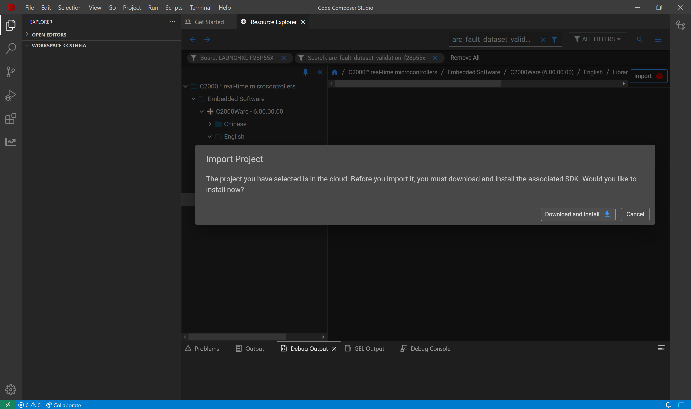
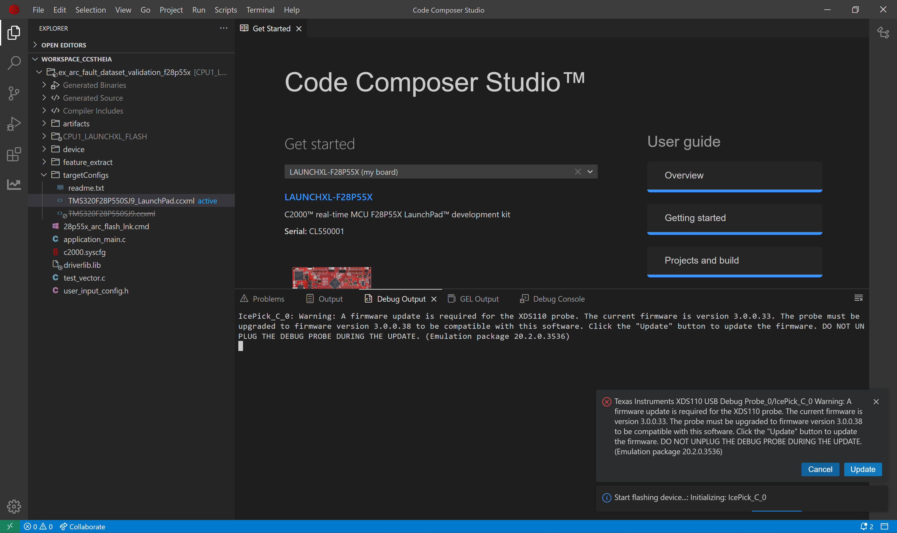

# Running Arc Fault Model on device F28P55x
### -Tushar Sharma, Adithya Thonse, Fasna S, Jaswanth Jadda, Abhijeet Pal
<hr>

## Overview

Tiny ML Modelmaker is a development tool that contains dataset handling, model training and compilation. Modelmaker will take the dataset, run the training scripts and compile the model using ti-mcu-nnc. The compiled model can be used to work on TI based MCUs. This example talks about how user can utilize the compiled model in their application to enable ml inference on MCUs. We will walkthrough the example by understanding CCS Studio, Modelmaker and integration of model on device.

In this example we will use the following:
- Device: LAUNCHXL-F28P55X
- C2000Ware 6.00
- CCS Studio 20.2.0


## CCS Studio

Code Composer Studio (CCS) is a free integrated development environment (IDE) provided by Texas Instruments (TI) for developing and debugging applications for TI's micro-controllers and processors. It offers various examples for users to get started with their problem statement. One of the application is ex_arc_fault_dataset_validation_f28p55x. We will use this example to run on device.

### Load sample example

We will load the arc fault example for f28p55 device using Code Composer Studio.

1. Open Code Composer Studio
2. Go to View tab -> Open Resource Explorer

3. Type the Board or Device to filter as **LAUNCHXL-F28P55X**
4. Type keyword as **arc_fault_dataset_validation_f28p55x**

5. Select the folder **arc_fault_dataset_validation_f28p55x** and click Import

6. Download and install the required dependencies of the project.

7. After all the packages are successfully installed, following import options would appear on screen. Import the project


### Run the sample example

We will build the project and flash the program in device. The project has a 'C' file application_main.c, which contains the code for configuring the feature extraction lib and model inference. We will use debug mode to see the result of model inference present in *test_result*.

8. Now we will build the project. Go to Project Tab -> Select Build Project(s)

9. Switch the active target device from **TMS320F28P550SJ9.ccxml** to **TMS320F28P550SJ9_LaunchPad.ccxml**.

10. Connect launchpad F28P55x to your system.
11. Flash the built project in device. Go to Run tab -> Select Flash Project

12. (Optional) If the following error comes, select 'Update'.

13. After the application is flashed, debug screen will appear. Select the debug icon.

14. Place a breakpoint at the following line.

15. Continue the program and add the following variable in Watch section of debug

16. If the test_result is 1 it means the model inference is working correctly, if it is 0, the model inference is wrong.


## ModelMaker

Modelmaker is configured using a [CONFIG_YAML](config.yaml) file. The config file controls the data processing, feature extraction, model configuration and model selection. In this example we will try the 2 different feature extraction presets.

1. FFT1024Input_256Feature_1Frame_Full_Bandwidth
2. FFT1024Input_256Feature_1Frame_Half_Bandwidth

### Run arc fault example

To run the modelmaker, go to tinyml-modelmaker folder. Open terminal and run the following commands

```sh
run_tinyml_modelmaker.sh docs/running_model_on_device/config.yaml
```
This will run the default selected preset *FFT1024Input_256Feature_1Frame_Full_Bandwidth*. Comment out this preset and uncomment the second preset to run the second preset *FFT1024Input_256Feature_1Frame_Half_Bandwidth* with the same command.

You can see the output from running modelmaker in the following folder **tinyml-modelmaker/data/projects/dc_arc_fault_example_dsk/run/running_model_on_device**.

## Requirements

The CCS example *arc_fault_dataset_validation_f28p55x* requires 4 files from modelmaker. We will copy the files from modelmaker run to the CCS example project.

### Compiled model files

- mod.a: The compiled model is present in this file. 
  - Path Modelmaker: *tinyml-modelmaker/data/projects/dc_arc_fault_example_dsk/run/running_model_on_device/compilation/artifacts/mod.a*
  - Path CCS Project: *ex_arc_fault_dataset_validation_f28p55x/artifacts/mod.a*
- tvmgen_default.h: Header file to access the model inference APIs from mod.a 
  - Path Modelmaker: *tinyml-modelmaker/data/projects/dc_arc_fault_example_dsk/run/running_model_on_device/compilation/artifacts/tvmgen_default.h*
  - Path CCS Project: *ex_arc_fault_dataset_validation_f28p55x/artifacts/tvmgen_default.h*

### Test data for device verification

- test_vector.c: Test cases to check if the model works on device currently
  - Path Modelmaker: *tinyml-modelmaker/data/projects/dc_arc_fault_example_dsk/run/running_model_on_device/training/quantization/golden_vectors/test_vector.c*
  - Path CCS Project: *ex_arc_fault_dataset_validation_f28p55x/test_vector.c*
- user_input_config.h: Configuration of feature extraction library in SDK. 
  - Path Modelmaker: *tinyml-modelmaker/data/projects/dc_arc_fault_example_dsk/run/running_model_on_device/training/quantization/golden_vectors/user_input_config.h*
  - Path CCS Project: *ex_arc_fault_dataset_validation_f28p55x/user_input_config.h*

## Final Run

Run the modelmaker with the first preset from command line. After the run is finished. Copy the 4 files (path present above) from Modelmaker to CCS Project. Build the CCS Project again, flash the program and start debugging the application. Check for the variable *test_result* for different sets of test cases preset in test_vector.c.

Repeat the above for second preset and verify the results.

<hr>
Update history:
[28th Aug 2025]: Compatible with v1.1 of Tiny ML Modelmaker