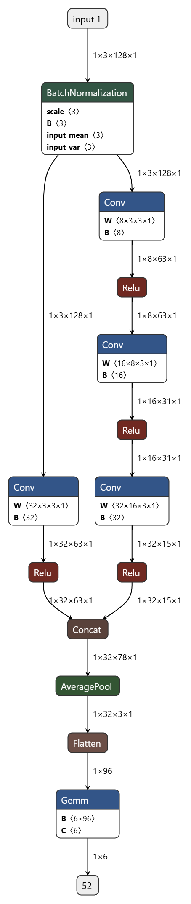

# WIreless Sensor Data Mining Dataset : Focus on configuring branched model parameters
### -Tushar Sharma, Adithya Thonse, Fasna Sharaf
<hr>

## Overview

The WISDM (WIreless Sensor Data Mining) dataset is a publicly available dataset that consists of accelerometer and gyroscope sensor data collected from smartphones. It is widely used in the field of activity recognition and human motion analysis. The dataset includes various activities such as walking, jogging, sitting, standing, upstairs and downstairs for different users. Researchers and developers can utilize this dataset to train machine learning models for activity recognition tasks.

For more information about the WISDM dataset, please refer to the official website. [(LINK)](https://www.cis.fordham.edu/wisdm/dataset.php)

# Script wisdm.py

This script is designed to download, extract, clean, and process the WISDM (Wireless Sensor Data Mining) dataset. You can run the file directly using 
```sh 
python wisdm.py
``` 
or import it and follow the steps provided below.

## Setup Constants

- `CREATED_ZIP_FILE_NAME`: The name of the zip file to be created after processing.
- `NUM_SPLITS`: Number of files to be created for each class

## Usage
```python
from wisdm import *
# import and configure 
NUM_SPLITS = 5          #3 #4
CREATED_ZIP_FILE_NAME = "wisdm_dataset.zip"

# Download and preprocess
download_data()         # Downloads the dataset from the specified URL and saves it as a zip file.
extract_data()          # Extracts the downloaded zip file, removes description files, and saves the raw data file.

# Load and store in modelmaker readable format
df = load_data()        # Clean the raw data file and create pandas data frame
store_datafiles(df)     # Form folders for different classes and split each class in NUM_SPLITS

# Form compressed zip and cleanup
zip_files()             # Store the folders in a compressed zip file readable for modelmaker
cleanup()               # Remove the folders and downloaded zip file
```

## Dependencies

- `os`: For interacting with the operating system.
- `requests`: For downloading the dataset.
- `pandas`: For data manipulation and cleaning.

Make sure to install the required packages using:
```sh
pip install requests pandas
```

# Motivation for the Example

The `config_timeseries_classification_wisdm.yaml` file is used to configure the parameters for data_processing_feature_extraction, training, testing, compilation of a timeseries classification model on the WISDM dataset.

The following example of wisdm dataset is provided to 
- **Showcase the support for residual connections in ml model**
    - tinyml-tinyverse/tinyml_tinyverse/common/models/generic_models.py: `RES_CAT_CNN_TS_GEN_BASE_3K`
    - RES_CAT_CNN_TS_GEN_BASE_3K is the class name present in generic_models.py and can be called using the model_name Res_Cat_TimeSeries_Generic_3k_t in yaml configuration.
- **Using model_config to change model parameters**
    - model_config: 'examples/branched_model_parameters/residual_network_config.yaml'
    - It can be used to configure parameters related to model

## Model & Configuration

### Res_Cat_TimeSeries_Generic_3k_t Model
<p align="center">  
    
</p>

The model architecture includes input batch normalization and two branches with customizable channel convolution layers. The outputs of the two branches are concatenated and passed through a pooling function. The resulting layer is then flattened and fed into a fully connected layer to produce the final output.

The initial branch consists of three convolution layers with (input_channel, out_channel_layer1), (out_channel_layer1, out_channel_layer2), and (out_channel_layer2, out_channel_layer3) as the input and output channels, respectively. On the other hand, the second branch has a single convolution layer with (input_channel, out_channel_layer3) as the input and output channels. The values of out_channel_layer1, out_channel_layer2, and out_channel_layer3 can be customized. input_channel is the number of variables present in dataset i.e. (Acc_X, Acc_Y, Acc_Z).

### Configurable Model Params

- `model_name`: Select the ml model to be used during training
    - model_name = [ `TimeSeries_Generic_1k_t`, `Res_Cat_TimeSeries_Generic_3k_t`, `TimeSeries_Generic_13k_t` ]
- `model_config`: Configure the model parameters for `Res_Cat_TimeSeries_Generic_3k_t` using the yaml file `residual_network_config.yaml`
    - `out_channel_layer1`: out features of the first convolution layer 
    - `out_channel_layer2`: out features of the second convolution layer
    - `out_channel_layer3`: out features of the third convolution layer

To run this example for device: `F28P55`:
```sh
cd tinyml-modelmaker

run_tinyml_modelmaker.sh F28P55 examples/branched_model_parameters/config_timeseries_classification_wisdm.yaml
```
## Comparison of models

| model_name                        | # Parameters  | Accuracy  | AUC-ROC-Score |
| :---                              | :----------:  | :----:    | :-----------: |
| TimeSeries_Generic_1k_t           | 1,316         | 94.92%    |    0.995      |
| Res_Cat_TimeSeries_Generic_3k_t   | 3,132         | 93.84%    |    0.965      |
| TimeSeries_Generic_13k_t          | 14,124        | 94.45%    |    0.987      |

** The purpose of this example is to demonstrate the support for residual connections and not to showcase that the Res_Cat_TimeSeries_Generic_3k_t model is better than the rest.


<hr>

### Version History:

[28th Feb 2025]: Compatible with v1.0 of Tiny ML Modelmaker
[10th June 2025]: Compatible with v1.0 of Tiny ML Modelmaker