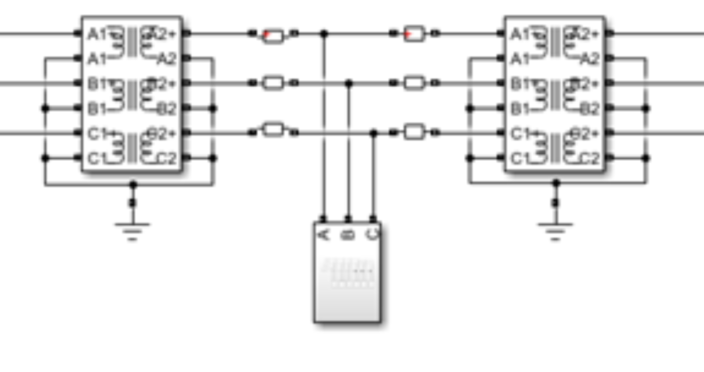

# Electrical Fault Detection and Classification: Focus on solving multicollinearity problem
### -Tushar Sharma, Adithya Thonse, Fasna S 
<hr>

## Overview

The Electrical Fault Dataset is a multivariate time series dataset. It is obtained by modelling a 3 phase - transmission line of power system on MATLAB Simulink. The dataset is designed to find faults in transmission line and classify the type of fault using the line voltage and current.

<p align="center">  
    
</p>

There are 6 measurable parameters/variables - **(Va, Vb, Vc, Ia, Ib, Ic)** i.e the voltage and current of three phases. 

There are two dataset files present in the compressed zip: [electrical_fault.zip](https://software-dl.ti.com/C2000/esd/mcu_ai/01_02_00/datasets/electrical_fault.zip)

- `detect_dataset.xlsx` : which finds if there is a fault or not. Target = [Output (S)]
    - There is one target only i.e. Output (S) which has two unique values (0, 1) denoting fault and no fault.
- `classData.csv` : which classifies the type of fault Target = [G, C, B, A]
    - There are 4 target variables i.e G (Ground), C (Node C), B (Node B), A (NodeA). The value of each target is either 0 or 1.
    - Examples [G, C, B, A]:
        - [0, 0, 0, 0] means No Fault
        - [1, 0, 0, 1] means LG Fault btw Ground and Node A
        - [0, 0, 1, 1] means LL Fault btw Node A and Node B
        - [1, 0, 1, 1] means LLG Fault btw Node A, Node B and Ground
        - [0, 1, 1, 1] means LLL Fault btw all Nodes
        - [1, 1, 1, 1] means LLLG Fault btw all Nodes and Ground

For this example we will be using `detect_dataset.xlsx` to detect whether there is electrical fault or not.

## Downloading dataset

Prepare the zipped dataset by running the electrical_fault python file. The script will create zipped dataset as `electrical_fault_dataset.zip`. 
```bash
cd examples/electrical_fault
python electrical_fault.py
```
The path of this zipped dataset file is already mentioned in [configuration](config.yaml) yaml, make sure it is same.

```yaml
dataset:
    input_data_path: 'examples/electrical_fault/electrical_fault_dataset.zip'
```

## Usage in TinyML ModelMaker

This zipped dataset is designed to work with TinyML ModelMaker. Run the modelmaker with the yaml [configuration](config.yaml) using the below code.

```bash
run_tinyml_modelmaker.sh examples/electrical_fault/config.yaml
```

1. `run_tinyml_modelmaker.sh` is the script to run modelmaker. It take two required arguments.
2. `F28P55` is the name of target device present in the config.yaml.
3. `examples/electrical_fault/config.yaml` path of the yaml configuration to run

Running this configuration file with modelmaker will show an error to train the model properly with good hyper parameters. (This is due to *multicollinearity*)


The users can configure the yaml [configuration](config.yaml) to change parameters related to **data preprocessing feature extraction**, training, testing, model and model compilation. In this example, we will configure the parameters of feature extraction. 

## What if Multicollinearity in your dataset ?

[Multicollinearity](https://en.wikipedia.org/wiki/Multicollinearity) is a condition when independent variable posses a linear relationship with one or more than one independent variable. This gives rise to poor prediction of weights during training.

In this electrical fault dataset, the independent variables are current and voltages of Phase A, B, C. If we check the collinearity between these variables. We find that Multicollinearity exists between independent variables.


| Independent Variable |  Ia  |  Ib  |  Ic  |     Va    |     Vb    |    Vc     |
|      :----:          | :--: | :--: | :--: |    :--:   |    :--:   |   :--:    |
|        Ia            | 1.00 |-0.49 |-0.45 |    0.23   |    0.69   | **-0.94** |
|        Ib            |-0.49 | 1.00 |-0.54 | **-0.95** |    0.26   |   0.72    |
|        Ic            |-0.45 |-0.54 | 1.00 |    0.74   | **-0.94** |   0.17    |
|        Va            | 0.23 |-0.95 | 0.74 |    1.00   |   -0.52   |  -0.51    |
|        Vb            | 0.69 | 0.26 |-0.94 |   -0.52   |    1.00   |  -0.46    |
|        Vc            |-0.94 | 0.72 | 0.17 |   -0.51   |   -0.46   |   1.00    |


To solve the problem of Multicollinearity, we can do one or more of the following:
- Remove the highly correlated features
- Perform feature extraction to do dimensionality reduction of features

## Feature Extraction is the solution

In this example we will explore the method to do dimensionality reduction using `FFT` and `Binning` of features. The **data preprocessing feature extraction** section of yaml [configuration](config.yaml) can be used to configure it.

```yaml
data_processing_feature_extraction:
   feature_extraction_name: Custom_Default
   feat_ext_transform: []
```

We have to add FFT and BIN and few more transforms in this `transform` variable.

```yaml
data_processing_feature_extraction:
    feat_ext_transform: ['FFT_FE', 'FFT_POS_HALF', 'DC_REMOVE', 'ABS', 'BINNING', 'LOG_DB', 'CONCAT']
```
- FFT related options: FFT_FE, FFT_POS_HALF, DC_REMOVE, ABS
    1. `FFT_FE` is used to perform fft on frame
    2. `FFT_POS_HALF` takes the 1st half of the fft which is symmetrical from middle
    3. `DC_REMOVE` removes the DC component of the FFT
    4. `ABS` takes the magnitude of the real and imaginary values of FFT
- Binning related options: BINNING
    1. `BINNING` performs the binning of magnitude of fft values
- Other options: LOG_DB, CONCAT
    1. `LOG_DB` takes the log of binned values
    2. `CONCAT` does concatenation of current features with features from previous frames

Next we will define our features shape.
```yaml
data_processing_feature_extraction:
    feat_ext_transform: ['FFT_FE', 'FFT_POS_HALF', 'DC_REMOVE', 'ABS', 'BINNING', 'LOG_DB', 'CONCAT']
    
    frame_size: 192
    feature_size_per_frame: 48
    num_frame_concat: 4
```

1. `frame_size`: slices frame from the dataset of size frame_size
2. `feature_size_per_frame`: size of binned features from one frame
3. `num_frame_concat`: number of frames used for concatenating features

After doing the above changes in yaml [configuration](config.yaml) file. Run the modelmaker again for this dataset.

```bash
run_tinyml_modelmaker.sh examples/electrical_fault/config.yaml
```

Another feature extraction is to just perform `FFT` without Binning. For this, we need to remove `Binning` from transforms. The feature size for each frame would become half of the frame size. So, yaml configuration would look like.

```yaml
data_processing_feature_extraction:
    feat_ext_transform: ['FFT_FE', 'FFT_POS_HALF', 'DC_REMOVE', 'ABS', 'LOG_DB', 'CONCAT']
    
    frame_size: 192
    feature_size_per_frame: 96
    num_frame_concat: 4
```
This will resolve the error of to train the model properly with good hyper parameters.
<hr>
Update history:
[12th Mar 2025]: Compatible with v1.0 of Tiny ML Modelmaker
