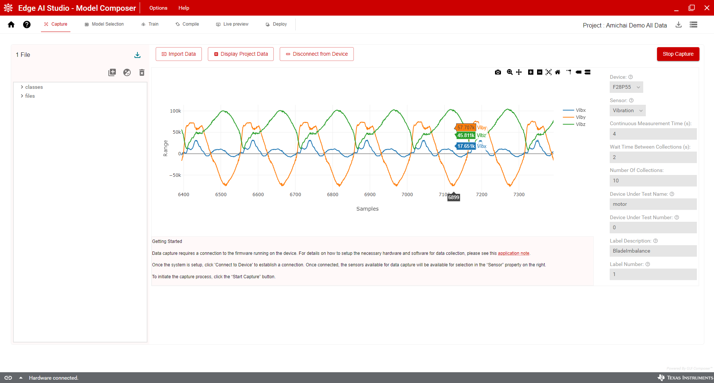
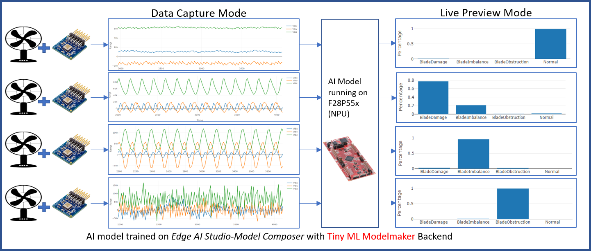
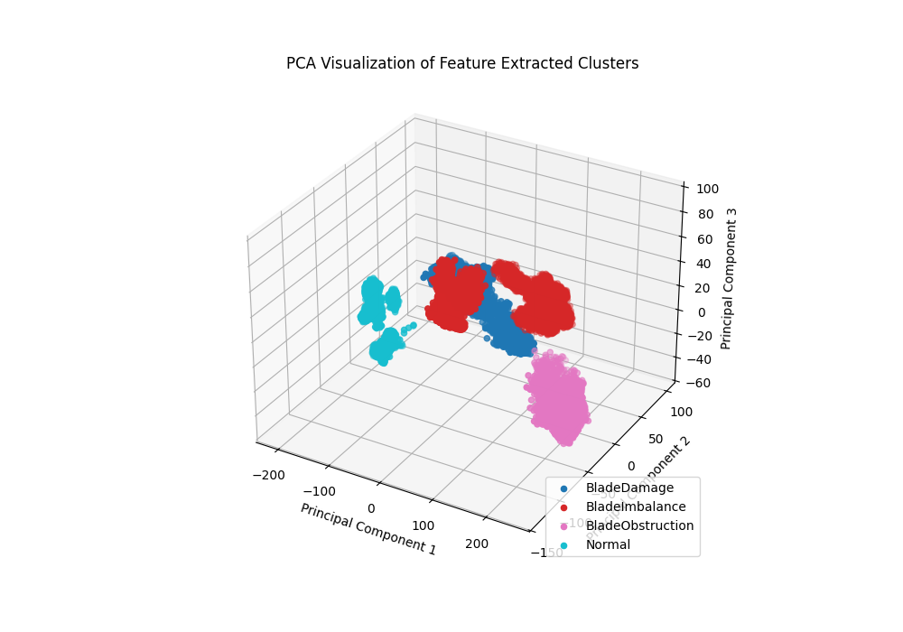
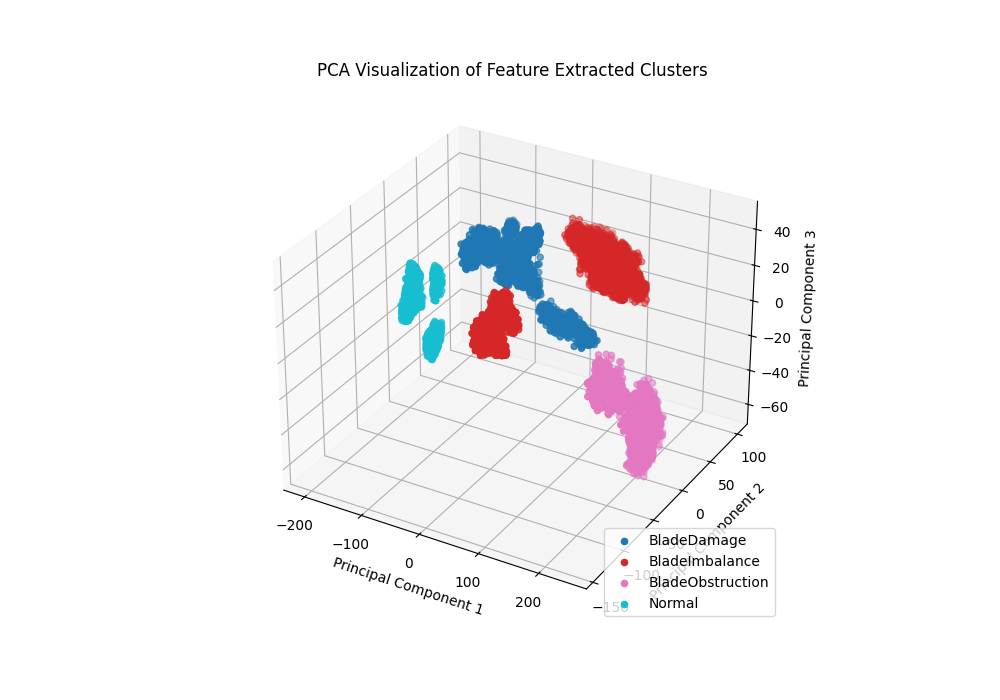
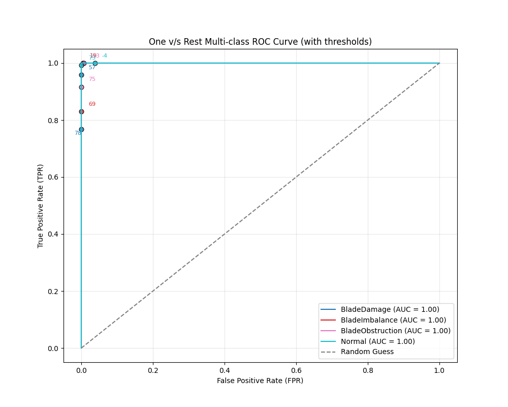

# Fan Blade Fault Classification

## From collecting a dataset to deploying the model on a C2000 device
### -Adithya Thonse, Shamik Basak, Tushar Sharma, Fasna Sharaf

Example showcasing 4 different Fan Blade faults (Blade Damage, Blade Imbalance, Blade Obstruction, Normal)

Involves using TI toolchains to collect the data and train the model and preview it live.

This application example showcases the following story:
* [Loading your F28P55x device with a Live Data Capture Code](#capturing-data)
* [Collecting a dataset on Model Composer](#collected-dataset)
* [Training an AI Model and Compiling it:](training-the-model)
  * on Edge AI Studio - Model Composer
  * on Tiny ML Modelmaker
* [Deploying the model on F28P55x device and visualising it in Live Preview Mode](#live-preview)
* [Other Tiny ML Modelmaker Features](#other-tiny-ml-modelmaker-features)
* [Release History](#release-history)

## Capturing Data
* This example showcases connecting the F28P55x launchpad with ADXL355-PMDZ Accelerometer
  * 7 connections need to happen from the sensor to the launchpad
  * Accelerometer Pinout 
  * 
  * F28P55 LaunchPad Pinout 
  * 
  * Connections: 

| Accelerometer Sensor | F28P55 Launchpad |
|----------------------|------------------|
| Pin 1 (Chip Select)  | IO.27(J6:59)     |
| Pin 2 (MOSI)         | IO.61(J6:54)     |
| Pin 3 (MISO)         | IO.60(J6:55)     |
| Pin 4 (SCLK)         | IO.24(J5:47)     |
| Pin 10 (Data Ready)  | IO.16(J6:51)     |
| Pin 11 (D GND)       | Any Ground Pin   |
| Pin 12  (D VDD)      | Any 3p3 V Pin    |

* Extract and load [eAI_data_acq_dap_f28p55x.zip](assets/eAI_data_acq_dap_f28p55x.zip) from CCS Studio onto the F28P55x Launchpad.
  * This enables the device to communicate with the Edge AI Studio - Model Composer GUI
  * Go to the TI's Edge AI Studio Model Composer and start your new project (Desktop/Web version are both okay)
  * On the top: `Options` --> `Serial Port Settings` --> Click on the appropriate COM port where the launchpad is connected
    * Once selected, a small dialog at the bottom should say "Hardware Connected"
  * In the `Capture` section
    * `Capture & Display Live Data` --> Drop down `Sensor:` --> `Vibration`
    * Choose the other options as per preference. The default sampling frequency is 4kHz
    * Click on `Start Capture`
    * The data captured should look like this:
    * 
  
* In this manner, you can collect data for all your cases.
* This example has 4 classes: Normal, Blade Damage, Blade Imbalance, Blade Obstruction

  
  
  
  
    
* The entire demo setup looks somewhat like this:
* 

## Dataset

* The dataset collected with this setup at TI can be found [here](http://software-dl.ti.com/C2000/esd/mcu_ai/01_01_00/datasets/fan_blade_fault_dsi.zip)

## Training the Model

* You can use the Model Composer GUI or Tiny ML Modelmaker to train your model and compile it.
* In Model Composer, you can play with different settings that can get your model to accuracy suited to you
* For TinyML Modelmaker, you can use [this](config.yaml) config file and run it as follows from the `tinyml-modelmaker` directory
  * `run_tinyml_modelmaker.sh F28P55 fan_blade_fault_classification/config.yaml`
* This configuration file should give you a 100% accuracy

## Live Preview

* This should give you a compiled model in the `tinyml-modelmaker/data/projects/fan_blade_fault_dsi/run/<time_stamp>/<model_name>/compilation/artifacts`
* And few feature extraction related artifacts are a part of: `tinyml-modelmaker/data/projects/fan_blade_fault_dsi/run/<time_stamp>/<model_name>/training/quantization/golden_vectors`
* This model is ready to be deployed into the CCS project with the application code of your choice.
* You can refer to [this](https://dev.ti.com/tirex/explore/node?node=A__AYjCIAmJIjRiZJ7OuRmv0w__motor_control_c2000ware_sdk_software_package__0.jXikd__LATEST) for how to plug and play these artifacts.
* To run in Live Preview Mode, as shown in the TIREX above, a sample project with just 1 sensor is attached here: [eAI_mfd_eval_f28p55x.zip](assets/eAI_mfd_eval_f28p55x.zip)

* You should be able to see in the Live Preview Mode in this manner: 
* 

## Other Tiny ML Modelmaker Features

* PCA graphs for feature extraction on Train and Val data: Clear cluster separation shows that the dataset classes are classifiable pretty well with the feature extraction method chosen in the config
* 
* 
* 

* Post Training AUC-ROC Curve indicates a perfect score (1.00) --> indicates model is doing excellently well at classification!
  * 
* Histogram of class scores between each class combination shows good separability --> meaning that the AI model trained is able to distinguish between classes very clearly
  * 

### Release History: 
[26-Mar-2025]: Compatible with v1.0 of TinyML Modelmaker
