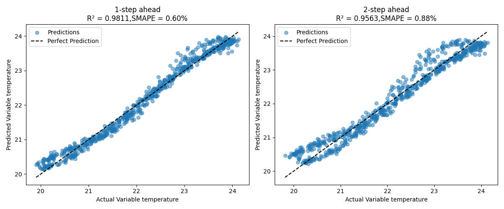
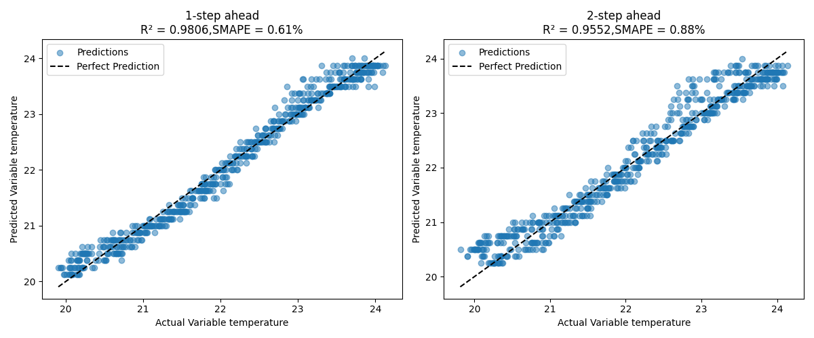

# Generic Timeseries Forecasting: Hello World Example
### -Fasna Sharaf, Adithya Thonse, Tushar Sharma, Abhijeeth Pal, Jaswanth Kumar
<hr>

## Overview

### TimeSeries Forecasting

Time series forecasting is about predicting future values based on past observations. It's widely used in industrial, appliance, and automotive sectors such as estimating energy consumption patterns, forecasting temperature variations in a cooling system, etc. In **ModelMaker**, we support time series forecasting so you can train, evaluate, and deploy models that learn patterns from sequential data and make accurate future predictions.

This example serves as a **"Hello World" introduction** to time series forecasting using the TinyML ModelMaker toolchain. While not directly industry-specific, this example demonstrates how to use **any generic time series forecasting task** with our toolchain. If you're new to time series forecasting or want to understand how to configure and run forecasting models on TinyML ModelMaker, this is the perfect starting point.

The core idea is simple: **provide your dataset in the expected format, configure a YAML file with your training parameters, and ModelMaker handles the rest** — from data processing to model training, quantization, and compilation for deployment on embedded devices.

### The Simulated Thermostat Dataset

To demonstrate time series forecasting, we use a **simulated thermostat dataset**. This dataset models a room temperature controlled by an ON/OFF heater with hysteresis:

- **Heater turns ON** when temperature drops below 20°C (lower threshold)
- **Heater turns OFF** when temperature rises above 24°C (upper threshold)
- Temperature changes gradually due to thermal inertia

This creates an oscillating temperature pattern that is ideal for learning time series forecasting. You can download the complete dataset here: [`generic_timeseries_forecasting.zip`](https://software-dl.ti.com/C2000/esd/mcu_ai/01_03_00/datasets/generic_timeseries_forecasting.zip)

This example will walk you through:
- How the dataset should be structured
- How to configure the YAML file for forecasting tasks
- Running the complete pipeline from training to compilation

## About the Dataset

The dataset consists of simulated thermostat data containing the following columns:

| Column Name | Description |
|-------------|-------------|
| `timestamp` | Time index |
| `temperature` | Room temperature (°C) |

**Dataset split:**
- Training: 10 files (thermostat_01.csv to thermostat_10.csv)
- Validation: 2 files (thermostat_11.csv, thermostat_12.csv)
- Test: 3 files (thermostat_13.csv, thermostat_14.csv, thermostat_15.csv)

Each file contains 1000 timesteps of simulated temperature data. You can download the dataset here: [`generic_timeseries_forecasting.zip`](https://software-dl.ti.com/C2000/esd/mcu_ai/01_03_00/datasets/generic_timeseries_forecasting.zip)

## Preparing the Dataset

For forecasting tasks, **ModelMaker** expects the dataset to be packaged in a specific folder structure inside a **.zip** file like this:

```
{dataset_name}.zip/
    |
    |--files/
    |     |-- {file1}.csv
    |     |-- {file2}.csv
    |     |-- and_so_on/
    |     |-- {fileN}.csv
    |
    |--annotations/
          |--file_list.txt                   # List of all the files in the dataset
          |--instances_train_list.txt        # List of all the files in the train set
          |--instances_val_list.txt          # List of all the files in the validation set
          |--instances_test_list.txt         # List of all the files in the test set
```

**Note:**

Unlike classification tasks, forecasting **always requires annotation files**. These tell the tool which files belong to training, validation, and testing sets. The data directory is automatically named 'files' for forecasting and regression tasks.

For this example, we have already prepared the dataset in the required format. You can find the zipped dataset at: [`generic_timeseries_forecasting.zip`](https://software-dl.ti.com/C2000/esd/mcu_ai/01_03_00/datasets/generic_timeseries_forecasting.zip)

## Usage in Tiny ML ModelMaker

You can run this example directly in **TinyML ModelMaker** using the following command:

```bash
./run_tinyml_modelzoo.sh examples/generic_timeseries_forecasting/config.yaml 
```

The model pipeline is configured using a YAML file, where you can enable or disable different stages such as dataset loading, data processing, feature extraction, training, testing, and compilation depending on your needs.

## Configuring the YAML file

The YAML configuration file is where you define all the parameters for your forecasting pipeline. By simply modifying this file, you can control dataset loading, data processing, model architecture, training hyperparameters, and compilation settings.

### `common` section

In the `common` section, you must specify:
- **task_type**: Must be set to `generic_timeseries_forecasting` for forecasting tasks
- **target_device**: The target hardware device for deployment

**Supported Target Devices:**

| Device Family | Supported Devices |
|---------------|-------------------|
| C2000 (C28) | F280013, F280015, F28003, F28004, F2837, F28P55, F28P65 |
| C2000 (C29) | F29H85, F29P58, F29P32 |
| MSPM33 | MSPM33C32 |
| AM26x | AM263, AM263P, AM261 |

Here we will be compiling for F28P55 device:

```yaml
common:
    task_type: generic_timeseries_forecasting
    target_device: F28P55
```

### `dataset` section

Defines dataset details:
- **dataset_name**: Name for your dataset (appears in logs)
- **input_data_path**: Path to the dataset

Here is how we configured `dataset` section for our thermostat dataset example:

```yaml
dataset:
    dataset_name: generic_timeseries_forecasting
    input_data_path: https://software-dl.ti.com/C2000/esd/mcu_ai/01_03_00/datasets/generic_timeseries_forecasting.zip
```

### `data_processing_feature_extraction` section

<b>Under `data_processing_feature_extraction` section, you have to specify the following parameters mandatorily</b>:

- `variables`: Takes the first `variables` columns of the data files (after the time columns) as input to predict the target variables.
- `target_variables`: Specifies which variables to predict. Can be specified in any of these formats:

| Format | Example | Description |
|--------|---------|-------------|
| Empty list | `[]` | Predict all columns |
| List of indices | `[0]` or `[0, 1, 2]` | Column indices (0-indexed, after time column) |
| List of names | `['temperature']` or `['temp', 'humidity']` | Column names from header |
| Single index | `0` | Single column index (converted to `[0]`) |
| Single name | `temperature` | Single column name (converted to `['temperature']`) |
| Comma-separated names | `temp,humidity` | Multiple column names as string |

> **Note:** When using indices, column 0 refers to the first non-time column in your data file.

We can use data processing transforms such as SimpleWindow (which is mandatory to use for forecasting problems) and Downsampling (which is optional to use) before training the dataset. Let's see how to configure those:

**1. SimpleWindow (Mandatory)**

In forecasting, it is mandatory to include `SimpleWindow` in `data_proc_transforms`.

As part of specifying SimpleWindow in `data_proc_transforms`, you have to specify the following:

- `frame_size` (mandatory): Number of timestamps in a frame. It is mandatory to specify frame_size in forecasting problems.
- `stride_size` (optional): This parameter defines the amount of overlap between consecutive frames. It is calculated as a fraction of the `frame_size`. (Default value: 0.01)
- `forecast_horizon` (optional): Number of future timesteps to be predicted in forecasting. (Default value: 1)

**Note: Feature Extraction is currently not supported for forecasting problems.**

Here is an example on how to configure `data_processing_feature_extraction` in YAML file:

```yaml
data_processing_feature_extraction:
    data_proc_transforms:
    - SimpleWindow  # 'SimpleWindow' must be specified for forecasting tasks
    frame_size: 32
    stride_size: 0.1
    forecast_horizon: 2  # Number of future timesteps to be predicted
    variables: 1  # Only temperature column (after timestamp)
    target_variables:  # Predict temperature
    - 0  # Column index 0 = temperature (first column after timestamp)
```

### `training` section

You can configure training parameters here like `model_name`, `training_epochs`, `optimizer` etc. **It is mandatory to set `output_int` to `false` for forecasting problems.**

Here we are using a generic model for forecasting (`FCST_LSTM10`), which is a single layer LSTM with hidden size of 10. This lightweight model has only **542 trainable parameters**, making it ideal for resource-constrained embedded devices.

```yaml
training:
    model_name: FCST_LSTM10
    model_config: ''
    batch_size: 32
    training_epochs: 50
    num_gpus: 1
    quantization: 1
    optimizer: adam
    output_int: false
```

### `compile` and `test` section

You can enable or disable compilation and testing as needed:

```yaml
testing: {}

compilation:
    keep_libc_files: true
```

## Results

This section explains how we evaluate the forecasting model.

### Scoring Metrics

We mainly use two metrics for evaluation:

**1. SMAPE (Symmetric Mean Absolute Percentage Error)**

Measures the percentage error between predicted and actual values, normalized to avoid bias for large or small values.

    - Range: 0% to 200%.
    - Ideal value: 0% (lower is better).


**2. R² Score (Coefficient of Determination)**

Indicates how well predictions match the actual values.

    - Range: (-∞, 1].
    - Ideal value: 1 (higher is better).

A score close to 1 means the model explains most of the variation in the data.

### How the Best Epoch is Chosen?

The model can predict multiple future timesteps for multiple target variables. For each epoch, SMAPE is computed across all target variables and across all predicted timesteps. The epoch with the lowest average SMAPE is selected as the best epoch. For the best epoch, both R² and SMAPE are reported for each predicted timestep of each target variable. Similar scores are reported during testing as well.

### Viewing Detailed Results

#### Float Train Best Epoch Results

Results can be found at:
`tinyml-modelmaker/data/projects/{dataset_name}/run/{date-time}/{model_name}/training/base/best_epoch_{best_epoch_num}_results`

**Example Results (Best Epoch 48):**

| Variable | Metric | Timestep 1 | Timestep 2 | Overall |
|----------|--------|------------|------------|---------|
| temperature | SMAPE | 0.60% | 0.88% | 0.74% |
| temperature | R² | 0.9811 | 0.9563 | 0.9687 |

#### Quantized Train Best Epoch Results

Results can be found at:
`tinyml-modelmaker/data/projects/{dataset_name}/run/{date-time}/{model_name}/training/quantization/best_epoch_{best_epoch_num}_results`

**Example Results (Best Epoch 1):**

| Variable | Metric | Timestep 1 | Timestep 2 | Overall |
|----------|--------|------------|------------|---------|
| temperature | SMAPE | 0.61% | 0.88% | 0.74% |
| temperature | R² | 0.9806 | 0.9552 | 0.9679 |

#### Test Results

Results can be found at:
`tinyml-modelmaker/data/projects/{dataset_name}/run/{date-time}/{model_name}/training/quantization/test_results`

**Example Results:**

| Variable | Metric | Timestep 1 | Timestep 2 | Overall |
|----------|--------|------------|------------|---------|
| temperature | SMAPE | 0.66% | 0.95% | 0.80% |
| temperature | R² | 0.9763 | 0.9517 | 0.9640 |

In each of these directories, you will find:

**1. Prediction Plots**

They are located under `prediction_plots` folder. For each target variable, you will see one plot which consists of `forecast_horizon` number of subplots (e.g., plot for 1 step ahead, 2 step ahead, etc.). Each subplot compares predicted vs actual (ground truth) values for that particular timestep of that target variable. A black dotted line (x = y) represents perfect prediction. Points close to this line indicate accurate forecasting.

**Float Training Prediction Plot:**



**Quantized Training Prediction Plot:**



**Test Prediction Plot:**


**2. CSV Files**

They are located under the `predictions_csv` folder. It will contain separate CSV files for each target variable. Each file contains predicted and actual values for each timestep forecasted.

Also you can see the compiled model at: `tinyml-modelmaker/data/projects/{dataset_name}/run/{date-time}/{model_name}/compilation`

## Running on Device

After successfully running ModelMaker, you will get the compiled model artifacts:

1. **Artifacts**:
   - `mod.a` and `tvmgen_default.h` are generated and stored in:
     ```
     tinyml-modelmaker/data/projects/{dataset_name}/run/{date-time}/{model_name}/compilation/artifacts
     ```

2. **Golden Vectors**:
   - `user_input_config.h` and `test_vector.c` are stored in:
     ```
     tinyml-modelmaker/data/projects/{dataset_name}/run/{date-time}/{model_name}/training/base/golden_vectors
     ```

Steps to run this example on-device can be found by following this guide: [Deploying Forecasting Models from ModelMaker to Device](../../docs/deploying_forecasting_models_from_modelmaker_to_device/readme.md)

<hr>

This example demonstrates the fundamentals of time series forecasting with TinyML ModelMaker. Once you understand this example, you can apply the same concepts to more complex, industry-specific forecasting problems like the [PMSM Temperature Forecasting](../forecasting_pmsm_rotor/readme.md) or [HVAC Indoor Temperature Forecasting](../hvac_indoor_temp_forecast/readme.md) examples.

<hr>

**Update history:**

[28th Jan 2026]: Compatible with v1.3 of Tiny ML ModelMaker