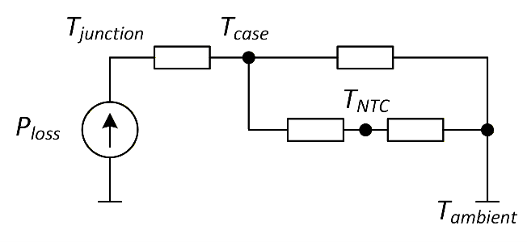
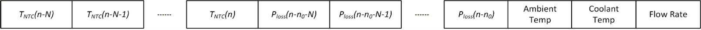

# Accurate MOSFET junction temperature prediction
### -Lei Ding, Bhanu Vankayalapati, Adithya Thonse
<hr>

## Overview

High voltage switches are used widely in power conversion and motor drive applications. Accurate temperature prediction of these switches is critical for protecting the switching devices while delivering the best system efficiency. However, direct measurement of the switch temperature is often difficult and expensive. 

In this example, we provide a generic approach for predicting switch temperature based on the power loss of a switch and indirect temperature measurement from a temperature sensor in the vicinity of the switch. 

## Simplified Switch Temperature Thermal Models

Figure 1 presents a simplified thermal model of a high voltage switch. The power loss in the switching device includes both conduction loss and switching loss. If multiple devices are packaged in the same module, the power loss includes the loss from all devices.  For example, for an IGBT module, this may include the power loss of both the IGBT devices and the diodes. 

<p align="center">  
    
</p>

The heat generated from the power loss raises junction temperature, propagates to the device surface and finally to the ambient environment through an air- or water-cooled heat sink. The thermal impedances in the diagram are shown as lumped elements between nodes. However, each of them may be a high order RC ladder that captures multiple thermal constants. They may also vary with factors such as case temperature, coolant temperature, coolant flow rate, and ambient temperature.

The negative temperature coefficient (NTC) temperature sensor in the diagram provides an observation point of the device temperature. However, its reading may be significantly different from the case temperature even if it is placed next to the device on the board.  

## Temperature Prediction using Linear + AI Models
In Figure 1, the thermal model from T_junction to T_case is typically provided by the device manufacturer. In this section, we focus on the problem of predicting T_case given measurements of P_loss  and T_(NTC.) The approach developed here is generic and can be applied to other use cases. 

The thermal coupling between T_case and T_NTC depends on the mechanical and cooling design of the system. The coupling also varies with operation parameters, such as coolant temperature, coolant flow rate, and ambient temperature. 

<p align="center">  
    
</p>

To obtain a more accurate prediction, we propose a linear + AI modeling approach shown in Figure 2. This model has two main components:
- Linear model: a linear autoregressive-moving-average (ARMA) model is used to describe the linear thermal behavior from Ploss to the difference between T_case and T_NTC. 
- AI model: an AI model, such as a multi-layer perceptron (MLP) model, is deployed to model the residue error between the linear model prediction and true measurement. This residue error can be highly nonlinear with respect to Ploss and TNTC. 
Both the linear and AI model can also take additional input parameters, such as coolant flow rate, coolant temperature, ambient temperature, if they are available in the system. 

The combination of a linear and an AI model has the following benefits:
	More accurate models due to the ability of AI models describing highly nonlinear thermal behavior.
	More constraints on AI model since most of the system behavior is captured by the linear model and the AI model is only used for residue error correction. 
	More robust overall prediction model.

## Dataset

In this example, the edge AI model does not directly predict the case temperature of the switch. Instead, the difference of the expected temp and the linear model output is used.

<p align="center">  
    
</p>

The dataset contains temperature data for various ambient temperatures, coolant temperatures, and coolant flow rates configurations. Corresponding to every predicted case temperature value, the dataset consists of a dataframe that includes 20 points of past NTC temperature data, 20 points of power data, 3 additional points of The meta information related to ambient temperature, coolant temperature, and coolant flow rate are assumed to be fixed for each file.

`Target`

- **T_case - T_linear**

## Usage in Tiny ML ModelMaker

The datset for this project is `mosfet_temp_prediction_dataset.zip`. The path of this zipped dataset file is already mentioned in [configuration](config.yaml) yaml, make sure it is same.

```yaml
dataset:
    input_data_path: 'https://software-dl.ti.com/C2000/esd/mcu_ai/01_03_00/datasets/mosfet_temp_prediction.zip'
```

This zipped dataset is designed to work with Tiny ML ModelMaker. Run the modelmaker with the yaml [configuration](config.yaml) using the below code.

```bash
run_tinyml_modelzoo.sh examples/mosfet_temp_prediction/config.yaml
```

1. `run_tinyml_modelzoo.sh` is the script to run Tiny ML Modelzoo. 
2. `examples/mosfet_temp_prediction/config.yaml` path of the yaml configuration to run

The users can configure the yaml [configuration](config.yaml) to change parameters related to **data preprocessing, feature extraction**, training, testing, model and model compilation. In this example, we will configure the parameters of feature extraction. In this example we will be using REGR_1k model.

REGR_3k is a regression model designed with MLP architecture. You can use any of the other models as well. There are plenty other Regression models (starting with REGR*) as mentioned in the main [readme](../../README.md)


## How to run on device

We will need [CCS Studio](https://www.ti.com/tool/CCSTUDIO), [F29H85x](https://www.ti.com/tool/LAUNCHXL-F29H85X) Microcontroller and its corresponding SDK [F29-SDK](https://www.ti.com/tool/F29-SDK).

### CCS Studio

Code Composer Studio (CCS) is a free integrated development environment (IDE) provided by Texas Instruments (TI) for developing and debugging applications for TI's micro-controllers and processors. It offers various examples for users to get started with their problem statement. One of the application is generic_timeseries_regression. We will use this example to run on device.

### Requirements

The CCS example *generic_timeseries_regression* requires 4 files from modelmaker. We will copy the files from modelmaker run to the CCS example project. 

1. f29h85x-sdk 1.03.00.00
2. Location of example: *C:\ti\f29h85x-sdk_1_03_00_00\examples\ai\generic_timeseries_regression\f29h85x*

## Running for Target Device

Run the modelmaker from command line. After the run is finished. Copy the 4 files (path present below) from Modelmaker to CCS Project. Build the CCS Project, flash the program and start debugging the application. Check for the variable *test_result* for different sets of test cases preset in test_vector.c.

### Compiled model files

- mod.a: The compiled model is present in this file. 
  - Path Modelmaker: *tinyml-modelmaker/data/projects/mosfet_temp_prediction/run/{date-time}/{model}/compilation/artifacts/mod.a*
  - Path CCS Project: *generic_timeseries_regression/artifacts/mod.a*
- tvmgen_default.h: Header file to access the model inference APIs from mod.a 
  - Path Modelmaker: *tinyml-modelmaker/data/projects/mosfet_temp_prediction/run/{date-time}/{model}/compilation/artifacts/tvmgen_default.h*
  - Path CCS Project: *generic_timeseries_regression/artifacts/tvmgen_default.h*

Steps to run this example on-device can be found by following this guide: [Deploying Regression Models from ModelMaker to Device](../../docs/deploying_regression_models_from_modelmaker_to_device/readme.md).

<hr>
Update history:

[6th Jan 2026]: Compatible with v1.3.0 of Tiny ML Modelmaker
