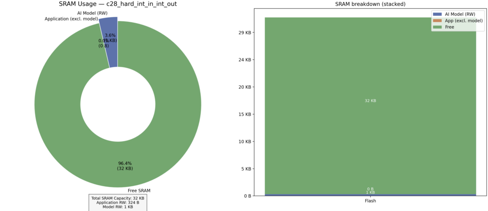

# Non-Intrusive Load Monitoring (NILM): Time Series Classification for Appliance Detection
### -Fasna Sharaf, Adithya Thonse, Tushar Sharma
<hr>

## Overview  

Non-Intrusive Load Monitoring (NILM) is an advanced application of machine learning that focuses on identifying and monitoring the usage of individual electrical appliances in a system without requiring separate sensors for each device. Instead, NILM relies on analyzing the overall power consumption data collected from a single point, such as a smart meter.

By processing this **time series data**, NILM can determine which appliances were active at any given time. For example, it can identify whether a washing machine, refrigerator, or air conditioner was running, based solely on the patterns in the power consumption data.

NILM has practical applications in areas like monitoring energy usage in factories to optimize costs, tracking power distribution in electric vehicles, and analyzing appliance usage patterns in households to promote energy efficiency. It plays a vital role in reducing energy consumption, lowering electricity bills, and contributing to sustainability by minimizing carbon footprints.

## About Dataset

We used an open-source dataset from Kaggle, which was part of the [**ESDA Non-Intrusive Load Monitoring (NILM) Competition 2021**](https://www.kaggle.com/competitions/esda-nilm-2021). The goal of the competition was to predict the appliances that were active based on the provided dataset.

For this example, we used the `vw_train.csv` file from that dataset. Upon inspection, the file contained 30 columns:

`id, activePower, activePowerDelta, reactivePower, apparentPower, current, voltage, phase, hertz, transient1, transient2, transient3, transient4, transient5, transient6, transient7, transient8, transient9, transient10, harmonicDelta1, harmonicDelta2, harmonicDelta3, harmonicDelta4, harmonicDelta5, harmonicDelta6, harmonicDelta7, harmonicDelta8, harmonicDelta9, timestamp, appliances`

By analyzing the unique values in the `appliances` column, we identified a total of **28 classes**. Below is the class distribution:

### **Class Distribution**
| **Class**                                             | **Count** |
|-------------------------------------------------------|-----------|
| +fridge                                               | 28,575    |
| +fridge+shower                                        | 593       |
| +fridge+microwave                                     | 1,969     |
| +fridge+washing_machine+washer_dryer                  | 31,183    |
| +fridge+washer_dryer                                  | 3,328     |
| +fridge+tumble_dryer+washer_dryer                     | 15,475    |
| +fridge+tumble_dryer+washer_dryer+microwave           | 570       |
| +fridge+kettle                                        | 405       |
| +fridge+washing_machine+washer_dryer+microwave        | 1,172     |
| +fridge+kettle+microwave                              | 9         |
| +fridge+vacuum                                        | 24        |
| +fridge+kettle+washing_machine+washer_dryer           | 225       |
| nan                                                   | 23        |
| +washer_dryer                                         | 5         |
| +fridge+kettle+washer_dryer                           | 60        |
| +fridge+shower+washer_dryer                           | 34        |
| +fridge+kettle+tumble_dryer+washer_dryer+microwave    | 2         |
| +fridge+shower+washing_machine+washer_dryer           | 90        |
| +fridge+shower+kettle                                 | 3         |
| +tumble_dryer+washer_dryer                            | 43        |
| +fridge+shower+tumble_dryer+washer_dryer              | 48        |
| +fridge+washer_dryer+microwave                        | 148       |
| +fridge+vacuum+washing_machine+washer_dryer           | 7         |
| +fridge+kettle+tumble_dryer+washer_dryer              | 75        |
| +fridge+vacuum+tumble_dryer+washer_dryer              | 11        |
| +fridge+vacuum+washer_dryer                           | 1         |
| +shower                                               | 1         |
| +kettle                                               | 1         |

The numbers indicate how many times each combination of appliances was active in the dataset.

### Refining the Dataset

Due to the limited data available for many classes, we had to eliminate certain classes to ensure sufficient data for training, validation, and testing. After careful consideration, we selected the following **4 classes** for our example:

1. **+fridge**  
2. **+fridge+tumble_dryer+washer_dryer**  
3. **+fridge+washer_dryer**  
4. **+fridge+washing_machine+washer_dryer**

Additionally, we reduced the number of variables from the original 30 to just 5 variables to focus only on those that are easy to measure directly. The selected variables are:  

- **Active Power**  
- **Voltage**  
- **Current**  
- **Reactive Power**  
- **Phase**

From these selected classes, we created the **train**, **validation**, and **test** datasets and structured the data to make it compatible with **TinyML ModelMaker** for classification tasks. You can access the refined dataset as a ZIP file [here](https://software-dl.ti.com/C2000/esd/mcu_ai/01_03_00/datasets/esda_nilm_2021_5_variable_4_class_dataset.zip).

## Usage in TinyML ModelMaker

Here is the command to use the refined dataset we produced earlier with TinyML ModelMaker:

```bash
./run_tinyml_modelmaker.sh examples/nilm_appliance_usage_classification/config.yaml
```

Users can configure the model pipeline using a YAML configuration file (like shown in the command above), where different stages (dataset loading, data processing and feature extraction, training, testing, and compilation) can be enabled or disabled based on requirements.

## Configuring the YAML File

The YAML file is the core configuration file used in TinyML ModelMaker to define the pipeline for tasks such as dataset loading, model training, testing, and compilation. In this configuration, we have enabled dataset loading and correctly set the `input_data_path`. For feature extraction, we applied several transformations to process the data effectively: the dataset is split into smaller windows of size `frame_size` (set to 32) using **WINDOWING**, followed by **FFT_FE** to convert the time-domain data into the frequency domain. The data is then normalized using **NORMALIZE**, and reduced in size with **BINNING**, which groups adjacent data points into bins. **FFT_POS_HALF** selects the DC component and specific FFT samples, while **ABS** computes the absolute value of the signal. The amplitude is converted to a logarithmic scale using **LOG_DB**, and finally, the features are concatenated into a single vector using **CONCAT**, with `num_frame_concat` set to 8. This feature extracted data is then trained using `CLS_13k_NPU` model and `quantization` is set to 2 which means we use TI NPU quantization. Here we are compiling the model using TI NPU hardware acceleration with full INT8 quantization pipeline. This is the default preset in our toolchain and hence we don't have to specify it in YAML file. The compilation uses skip_normalize=true and output_int=true. flags, meaning the hardware accelerator expects pre quantized INT8 inputs and produces quantized INT8 outputs. All operations, weights, activations, and intermediate tensors are processed in INT8 format on the NPU hardware. 

## Results

On running the YAML file, the following accuracies were observed:

### **I. Float Train**
- **Best Epoch**: 14  
- **Accuracy**: 100%  
- **F1-Score**: 1.000  
- **AUC ROC Score**: 1.000  


**Confusion Matrix**:

| Ground Truth                          | Predicted: +fridge | Predicted: +fridge+tumble_dryer+washer_dryer | Predicted: +fridge+washer_dryer | Predicted: +fridge+washing_machine+washer_dryer |
|---------------------------------------|--------------------|---------------------------------------------|---------------------------------|-----------------------------------------------|
| **+fridge**                           | 83                 | 0                                           | 0                               | 0                                             |
| **+fridge+tumble_dryer+washer_dryer** | 0                  | 41                                          | 0                               | 0                                             |
| **+fridge+washer_dryer**              | 0                  | 0                                           | 3                               | 0                                             |
| **+fridge+washing_machine+washer_dryer** | 0                | 0                                           | 0                               | 91                                            |

---

### **II. Quant Train**
- **Best Epoch**: 9  
- **Accuracy**: 100%  
- **F1-Score**: 1.000  
- **AUC ROC Score**: 1.000  


**Confusion Matrix**:

| Ground Truth                          | Predicted: +fridge | Predicted: +fridge+tumble_dryer+washer_dryer | Predicted: +fridge+washer_dryer | Predicted: +fridge+washing_machine+washer_dryer |
|---------------------------------------|--------------------|---------------------------------------------|---------------------------------|-----------------------------------------------|
| **+fridge**                           | 83                 | 0                                           | 0                               | 0                                             |
| **+fridge+tumble_dryer+washer_dryer** | 0                  | 41                                          | 0                               | 0                                             |
| **+fridge+washer_dryer**              | 0                  | 0                                           | 3                               | 0                                             |
| **+fridge+washing_machine+washer_dryer** | 0                | 0                                           | 0                               | 91                                            |

---

### **III. Test Data**
- **Evaluation Accuracy**: 95.95%  
- **AUC ROC Score**: 0.992 


**Confusion Matrix**:

| Ground Truth                          | Predicted: +fridge | Predicted: +fridge+tumble_dryer+washer_dryer | Predicted: +fridge+washer_dryer | Predicted: +fridge+washing_machine+washer_dryer |
|---------------------------------------|--------------------|---------------------------------------------|---------------------------------|-----------------------------------------------|
| **+fridge**                           | 83                 | 0                                           | 0                               | 0                                             |
| **+fridge+tumble_dryer+washer_dryer** | 0                  | 39                                          | 0                               | 4                                             |
| **+fridge+washer_dryer**              | 0                  | 1                                           | 4                               | 0                                             |
| **+fridge+washing_machine+washer_dryer** | 0                | 4                                           | 0                               | 87 											  |


You can find the compiled model at: tinyml-modelmaker/data/projects/{dataset_name}/run/{date-time}/{model_name}/compilation


## Running on Device

After successfully running Modelmaker, you will get four main files:

1. **Artifacts**:
   - `mod.a` and `tvmgen_default.h` are generated and stored in:
     ```
     data/projects/{dataset_name}/run/{date-time}/{model_name}/compilation/artifacts
     ```

2. **Golden Vectors**:
   - `user_input_config.h` and `test_vector.c` are stored in:
     ```
     data/projects/{dataset_name}/run/{date-time}/{model_name}/training/quantization/golden_vectors
     ```

These four files will be needed while running on device and are attached here in this same directory.

In this example, we will use the following setup:

- **Device**: LAUNCHXL-F28P55X
- **C2000Ware Version**: 6.00
- **Code Composer Studio (CCS)**: Version 20.3.0

Steps to run this example on-device can be found by following this example readme: [Run compiled model on a TI MCU with NPU](https://github.com/TexasInstruments/tinyml-tensorlab/blob/main/tinyml-modelmaker/docs/running_model_on_device/readme.md)

Upon flashing and running the project we can see the model output matches the golden vectors.

<p align="center">
    
</p>
<hr>

## Performance Metrics

Here are the key performance metrics for the model running on the device:

| Metric               | Value       |
|----------------------|-------------|
| **Device Name**      | f28p55x     |
| **AI Model Cycles**  | 165629      |
| **Inference Time**   | 1104.19 µs  |
| **Results Match**    | TRUE        |
| **Model Size**       | 13187 bytes |
| **Model Flash**      | 11967 bytes |
| **Model SRAM**       | 1220 bytes  |
| **Application Size** | 1300 bytes  |
| **Application FLASH**| 976 bytes   |
| **Application SRAM** | 324 bytes   |

<table align="center">
  <tr>
    <td align="center">
      
      <br>Flash Usage
    </td>
    <td align="center">
      
      <br>SRAM Usage
    </td>
  </tr>
</table>
<hr>
Update history:
[24th Nov 2025]: Compatible with v1.3 of Tiny ML Modelmaker