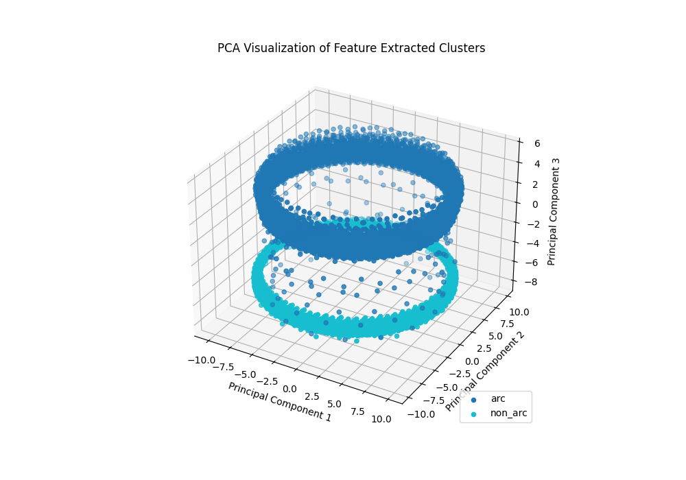
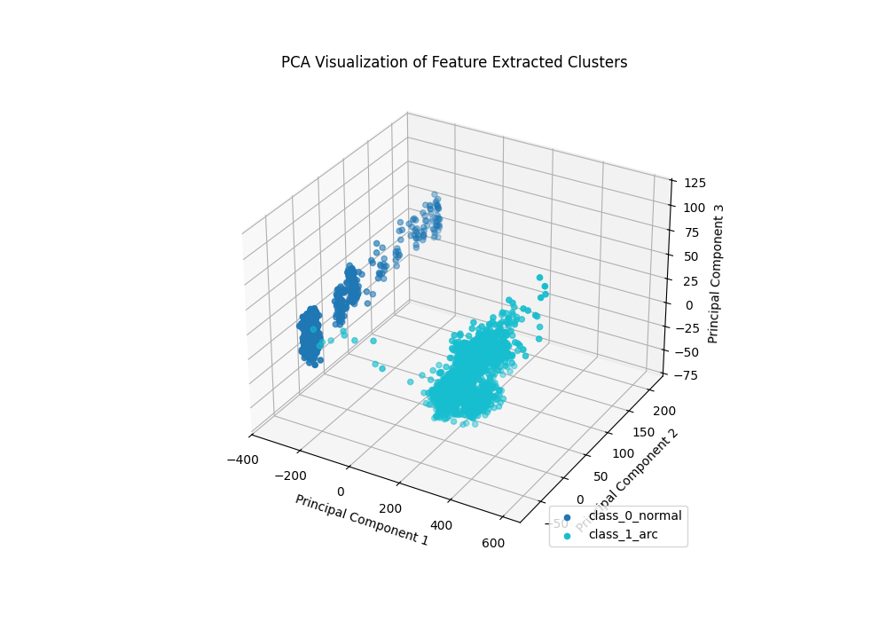

# How Good is your Feature Extraction?
### - Adithya Thonse, Tushar Sharma, Fasna Sharaf

Tiny ML Modelmaker allows a lot of ways for you to play with input data before feeding it to the model. That is, to say, you could choose to do:
* Feed raw time domain data by just windowing into frames
* Downsample the raw time domain data
* Perform several feature extraction techniques (one or more) and then feed it to the model on the data such as:
    * FFT
    * Binning
    * Log
    * Frame Concatenation
    * Magnitude 
    * ... and so on

Now, although you may perform, one or more of the above, your feature extraction may or not be great. As a thumb rule to denote to the user on how good their effort has been, Tiny ML Modelmaker generates graphs on the data (post processing, if applicable) that is going to be fed to the model training.

**Note: Although the graphs are plotted for train and val datasets, in this article we shall only focus on train subset for the sake of brevity.**

Let us have a look at some of these graphs:

## Timeseries Classification 

The key idea here is that, if the graphs are visually separable (for classification), then it is going to be a relatively easier job for the AI model to do its job. PCA plots are plotted for classification tasks.

* Each point on the graph corresponds to a sequence (of n data rows)

Let us look at some datasets. (These were random runs with some set of inputs, and is not a hardline indicator of the dataset):

 1. Arc Fault Classification Dataset (dsi) 

* Data Processing: DownSampling (100x), Simple Windowing (Window Size: 256)
* Feature Extraction: None
* We can see from the graph below that although 2 distinct clusters are present, there are significant outliers flying around. It would be safe to say that although the timeseries data is pretty clearly separable, some points in the input have enough noise that can cause your model to have a harder time classifying.
* 

  2. Arc Fault Classification Dataset (dsk) 
 

* Data Processing: None
* Feature Extraction: FFT (1024 point) + Positive Half Only + WINDOWING + Binning (1024-->256) + NORMALIZE + Absolute + 10log base e
* We can see that the two clusters are distinctly separable, and this is a strong indication that chosen feature extraction works well. <1% of points are 
* 

  3. Motor Bearing Fault Classification Dataset 
 
* Since this is a relatively complex dataset, Let us explore the 4 feature extraction mechnaisms that Tiny ML Modelmaker provides OOB for the Motor Bearing Fault Detection. This is present even in the below file:

[config.yaml](../../examples/motor_bearing_fault/config.yaml)

  * feature_extraction_name: Input256_FFTBIN_16Feature_8Frame_3InputChannel_removeDC_1D
  * feature_extraction_name: Input256_FFTBIN_16Feature_8Frame_3InputChannel_removeDC_2D1
  * feature_extraction_name: Input256_FFT_128Feature_1Frame_3InputChannel_removeDC_2D1
  * feature_extraction_name: Input128_RAW_128Feature_1Frame_3InputChannel_removeDC_2D1

#### Input256_FFTBIN_16Feature_8Frame_3InputChannel_removeDC_1D
* 
#### Input256_FFTBIN_16Feature_8Frame_3InputChannel_removeDC_2D1
* 

#### Input256_FFT_128Feature_1Frame_3InputChannel_removeDC_2D1
* 
#### Input128_RAW_128Feature_1Frame_3InputChannel_removeDC_2D1
* 

#### Conclusion:
We can clearly see that using FFTBIN has worked better than FFT which has worked better than RAW(pure time domain) feature extraction for this dataset. 
While we fed each of the 4 inputs to the same model with the same training hyperparameters, we found that the accuracy (fp32, 10epochs) was in the order of 100%, 96%, 92% for FFTBIN, FFT, RAW respectively. While this shows that the model has a harder time to understand the input data when it is not clearly separable, this doesn't mean that it will always be the case for every dataset. It is purely an indication that different datasets respond differently to different feature extraction methods.

## Timeseries Regression 

Interesting things coming soon

## Timeseries Anomaly Detection 

Interesting things coming soon

Update history:

[14th Mar 2025]: Compatible with v1.0 of Tiny ML Modelmaker
