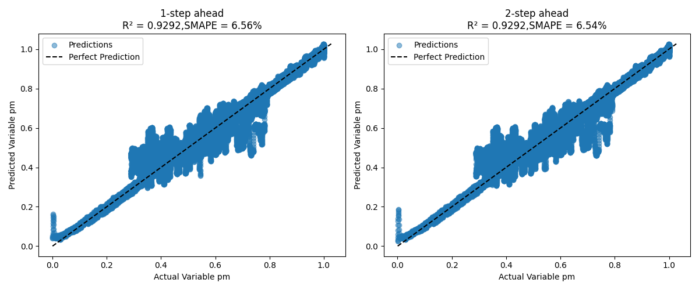
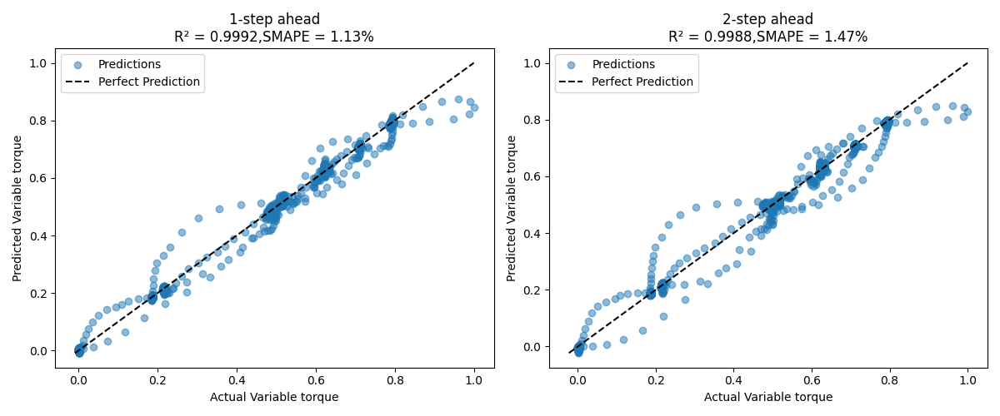
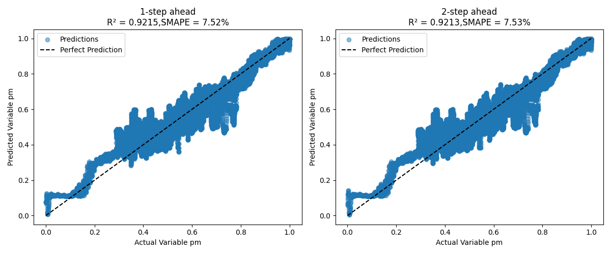
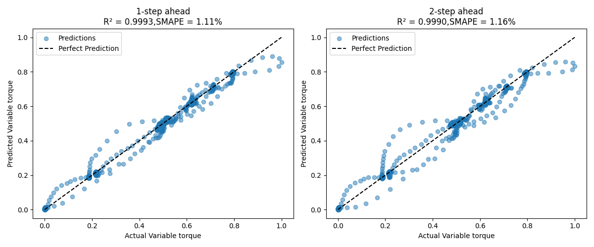
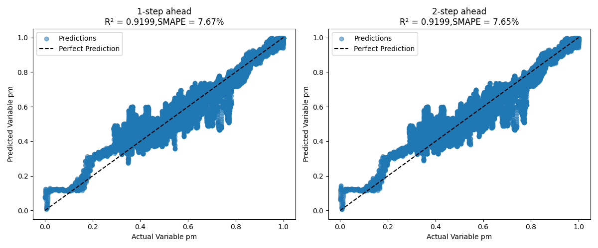
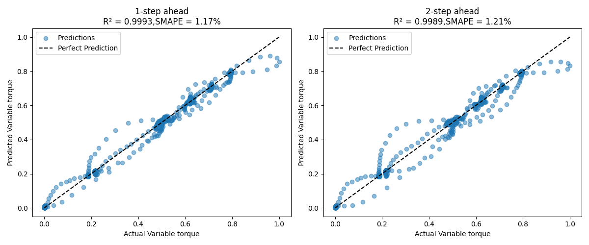

# Permanent Magnet Synchronous Motor (PMSM) Parameter Prediction: Time Series Forecasting
### -Fasna Sharaf, Adithya Thonse, Tushar Sharma
<hr>

## Overview

Time series forecasting is about predicting future values based on past observations. It’s widely used in industrial, appliance, and automotive sectors such as estimating energy consumption patterns, forecasting temperature variations in a cooling system etc. In **ModelMaker**, we support time series forecasting so you can train, evaluate, and deploy models that learn patterns from sequential data and make accurate future predictions.  

To make the setup easy to understand, we’ll walk through an example using a **Permanent Magnet Synchronous Motor (PMSM) Temperature Dataset**.

## About the Dataset

This dataset contains sensor measurements collected from a **Permanent Magnet Synchronous Motor (PMSM)** running on a controlled test bench. The motor is a prototype model from a German OEM, and the measurements were collected by the **LEA department at Paderborn University**. All signals are sampled at **2 Hz** (two samples per second).  

You can find the original dataset and its full description here:  [Electric Motor Temperature (Kaggle)](https://www.kaggle.com/wkirgsn/electric-motor-temperature)

For our example, we use a subset of the dataset containing measurements for a **single profile_id (6)**.

**Sensor attributes in the dataset:**

| Column Name | Description |
|------------------|-------------|
| `i_d` | Current d-component (active component) |
| `i_q` | Current q-component (reactive component) |
| `u_d` | Voltage d-component (active component) |
| `u_q` | Voltage q-component (reactive component) |
| `motor_speed` | Motor speed |
| `ambient` | Ambient temperature |
| `coolant` | Coolant temperature |
| `pm` | Permanent magnet surface temperature |
| `stator_winding` | Stator winding temperature |
| `stator_tooth` | Stator tooth temperature |
| `stator_yoke` | Stator yoke temperature |
| `torque` | Torque induced by current |

In our forecasting example we’ll use `i_d, i_q, u_d, u_q, motor_speed, ambient, coolant` as **input features** to predict two **target variables**:  **Temperature of thepermanent magnet (`pm`) and Motor torque (`torque`)**

## Preparing the Dataset

For forecasting tasks, **ModelMaker** expects the dataset to be packaged in a specific folder structure inside a **.zip** file like this:-

```
 {dataset_name}.zip/
     |
     |--`{data_dir}`/
     |     |-- {file1}/                          
     |     |-- {file2}/                        
     |     |-- and_so_on/
     |     |-- {fileN}/                        
     |
     |--annotations/
           |--file_list.txt                   # List of all the files in the dataset
           |--instances_train_list.txt        # List of all the files in the train set (subset of file_list.txt)
           |--instances_val_list.txt          # List of all the files in the validation set (subset of file_list.txt) 
           |--instances_test_list.txt         # List of all the files in the test set (subset of file_list.txt)
```
**Note:** 

Unlike classification tasks, forecasting **always requires annotation files**. These tell the tool which files belong to training, validation, and testing sets.

For this example, we have already prepared the dataset in the required format. You can find the zipped dataset in the same directory as this README.

## Usage in TinyML ModelMaker

You can run this example directly in **TinyML ModelMaker** using the following command:

```bash
./run_tinyml_modelmaker.sh examples/forecasting_pmsm_rotor/config.yaml
```

The model pipeline is configured using a YAML file, where you can enable or disable different stages such as dataset loading, data processing, feature extraction, training, testing, and compilation depending on your needs.

## Configuring the YAML file

### `common` section

Set the task type to `generic_timeseries_forecasting` along with other basic parameters as shown below:-

```yaml
common:
    target_module: 'timeseries'
    task_type: 'generic_timeseries_forecasting'
    target_device: 'F28P55'
    run_name: '{date-time}/{model_name}'
```

### `dataset` section

Defines dataset details:-
- **enable**: True/False to enable or disable dataset loading
- **data_dir**: directory containing all data files (here in our example they are in `files` directory)
- **dataset_name**: Name for your dataset (appears in logs)
- **input_data_path**: Path to the dataset

Here is how we configured `dataset` section for our pmsm dataset example case:

```yaml
dataset:
    enable: True
    data_dir: 'files'
    dataset_name: pmsm_rotor_temp_prediction_dataset
    input_data_path: https://software-dl.ti.com/C2000/esd/mcu_ai/01_02_00/datasets/pmsm_rotor_temp.zip
```

### `data_processing_feature_extraction` section

<b> Under `data_processing_feature_extraction` section, you have to specify the following parameters mandatorily </b>:-

- `variables`: takes the first `variables` columns of the data files (after the time columns) as input to predict the target variables.
- `target_variables`: Represents variables to be predicted which can be specified in any of these formats:
    - Column indices: `Eg: [7, 8, 9, 10, 11]`

    - Column names: `Eg: ['pm', 'stator_winding', 'stator_tooth', 'stator_yoke', 'torque']`

    - Column indices as strings: `Eg: ['7', '8', '9', '10', '11']`

    **If numbers which represent indices, are provided in list, assign column number 0 to the first non time column and continue numbering from there.**

We can use data processing transforms such as Simple Window (which is mandatory to use for forecasting problems) and Downsampling (which is optional to use) before training the dataset. Let's see how to configure those:-

**1. SimpleWindow (Mandatory)**

In forecasting, it is mandatory to include `SimpleWindow` in `data_proc_transforms`.

As part of specifying SimpleWindow in `data_proc_transforms`, you have to specify the following:-

- `frame_size` (mandatory): Number of timestamps in a frame. It is mandatory to specify frame_size in forecasting problems. 
- `stride_size` (optional): This parameter defines the amount of overlap between consecutive frames. It is calculated as a fraction of the `frame_size`. (Default value: 0.01)
- `forecast_horizon` (optional): Number of future timesteps to be predicted in forecasting. (Default value: 1)

**2. Downsampling (Optional)**

Performing downsampling is optional. If you wish to perform downsampling, include `Downsample` in `data_proc_transforms` and specify the following parameters:-

- `sampling_rate`: The original sampling rate of the dataset.
- `new_sr`: The new sampling rate after downsampling.

**Note: Feature Extraction is currently not supported for forecasting problems.**

Here is an example on how to configure `data_processing_feature_extraction` in YAML file:-

```yaml

data_processing_feature_extraction: # One or more can be cascaded in the list
    # transforms: 'Downsample SimpleWindow'
    data_proc_transforms: ['SimpleWindow'] # 'SimpleWindow' must be specified for forecasting tasks
    # Downsample
    #sampling_rate: 5
    #new_sr: 2
    # SimpleWindow
    frame_size: 10
    stride_size: 0.1 
    forecast_horizon: 2 # Number of future timesteps to be predicted
    variables: 7 # takes the first 'variables' columns after the time columns as input to predict the target variables
    target_variables: [7,11] # Other format for `target_variables` specification: ['pm','torque'] or  [7,11] or ['7','11',]. If numbers which represent indices, are provided in list, assign column number 0 to the first non time column and continue numbering from there

```

## `training` section

You can configure training paramters here like `model_name`,`training_epochs`,`optimizer` etc. **It is important to note that for forecasting problems, `output_dequantize` must be set to `True`.**

Here is what we configured for our example:

```yaml
training:
    # enable/disable training
    enable: True #False
    with_input_batchnorm: False
    # F28x generic timeseries model names: TimeSeries_Generic_1k_t, TimeSeries_Generic_4k_t, TimeSeries_Generic_6k_t, TimeSeries_Generic_13k_t
    # GUI only model names: ArcFault_model_200_t, ArcFault_model_300_t, ArcFault_model_700_t
    model_name: 'TimeSeries_Generic_Forecasting_13k_t'
    # model_spec: '../tinyml-mlbackend/proprietary_models/cnn_af_3l.py'
    model_config: ''
    batch_size: 256
    training_epochs: 15
    num_gpus: 0
    quantization: 1
    optimizer: adam
    learning_rate: 0.01
    output_dequantize: True
```

## `compile` and `test` section

You can enable or disable compilation and testing as needed:-

```yaml
testing:
    enable: True #False

compilation:
    # enable/disable compilation
    enable: True #False
    keep_libc_files: False
    compile_preset_name: forced_soft_npu_preset
```

## Results

This section explains how we evaluate the forecasting model.

### Scoring Metrics 

We mainly use two metrics for evaluation:

**1. SMAPE (Symmetric Mean Absolute Percentage Error)**

Measures the percentage error between predicted and actual values, normalized to avoid bias for large or small values.
    
    - Range: 0% to 200%.

    - Ideal value: 0% (lower is better).


**2. R² Score (Coefficient of Determination)**

Indicates how well predictions match the actual values.

    - Range: (-∞, 1].

    - Ideal value: 1 (higher is better).

A score close to 1 means the model explains most of the variation in the data.

### How the Best Epoch is Chosen?

The model can predict multiple future timesteps for multiple target variables. For each epoch, SMAPE is computed across all target variables and across all predicted timesteps. The epoch with the lowest average SMAPE is selected as the best epoch. For the best epoch, both R² and SMAPE are reported for each predicted timestep of each target variable. Similar scores are reported during testing as well. Let's have a look at the results we got here:-

Float train best epoch:-

```
   INFO: root.main.FloatTrain.BestEpoch: Printing statistics of best epoch:
   INFO: root.main.FloatTrain.BestEpoch: Best epoch:15
   INFO: root.main.FloatTrain.BestEpoch: Overall SMAPE across all variables: 3.92%
   INFO: root.main.FloatTrain.BestEpoch: Per-Variable Metrics:
   INFO: root.main.FloatTrain.BestEpoch:   Variable pm:
   INFO: root.main.FloatTrain.BestEpoch:       SMAPE of pm across all predicted timesteps: 6.55%
   INFO: root.main.FloatTrain.BestEpoch:       R² of pm across all predicted timesteps: 0.9292
   INFO: root.main.FloatTrain.BestEpoch:       Timestep 1:
   INFO: root.main.FloatTrain.BestEpoch:           SMAPE: 6.56%
   INFO: root.main.FloatTrain.BestEpoch:           R²: 0.9292
   INFO: root.main.FloatTrain.BestEpoch:       Timestep 2:
   INFO: root.main.FloatTrain.BestEpoch:           SMAPE: 6.54%
   INFO: root.main.FloatTrain.BestEpoch:           R²: 0.9292
   INFO: root.main.FloatTrain.BestEpoch:   Variable torque:
   INFO: root.main.FloatTrain.BestEpoch:       SMAPE of torque across all predicted timesteps: 1.30%
   INFO: root.main.FloatTrain.BestEpoch:       R² of torque across all predicted timesteps: 0.9990
   INFO: root.main.FloatTrain.BestEpoch:       Timestep 1:
   INFO: root.main.FloatTrain.BestEpoch:           SMAPE: 1.13%
   INFO: root.main.FloatTrain.BestEpoch:           R²: 0.9992
   INFO: root.main.FloatTrain.BestEpoch:       Timestep 2:
   INFO: root.main.FloatTrain.BestEpoch:           SMAPE: 1.47%
   INFO: root.main.FloatTrain.BestEpoch:           R²: 0.9988
```

Quant train best epoch:-

```
   INFO: root.main.QuantTrain.BestEpoch: Printing statistics of best epoch:
   INFO: root.main.QuantTrain.BestEpoch: Best epoch:9
   INFO: root.main.QuantTrain.BestEpoch: Overall SMAPE across all variables: 4.33%
   INFO: root.main.QuantTrain.BestEpoch: Per-Variable Metrics:
   INFO: root.main.QuantTrain.BestEpoch:   Variable pm:
   INFO: root.main.QuantTrain.BestEpoch:       SMAPE of pm across all predicted timesteps: 7.53%
   INFO: root.main.QuantTrain.BestEpoch:       R² of pm across all predicted timesteps: 0.9214
   INFO: root.main.QuantTrain.BestEpoch:       Timestep 1:
   INFO: root.main.QuantTrain.BestEpoch:           SMAPE: 7.52%
   INFO: root.main.QuantTrain.BestEpoch:           R²: 0.9215
   INFO: root.main.QuantTrain.BestEpoch:       Timestep 2:
   INFO: root.main.QuantTrain.BestEpoch:           SMAPE: 7.53%
   INFO: root.main.QuantTrain.BestEpoch:           R²: 0.9213
   INFO: root.main.QuantTrain.BestEpoch:   Variable torque:
   INFO: root.main.QuantTrain.BestEpoch:       SMAPE of torque across all predicted timesteps: 1.13%
   INFO: root.main.QuantTrain.BestEpoch:       R² of torque across all predicted timesteps: 0.9991
   INFO: root.main.QuantTrain.BestEpoch:       Timestep 1:
   INFO: root.main.QuantTrain.BestEpoch:           SMAPE: 1.11%
   INFO: root.main.QuantTrain.BestEpoch:           R²: 0.9993
   INFO: root.main.QuantTrain.BestEpoch:       Timestep 2:
   INFO: root.main.QuantTrain.BestEpoch:           SMAPE: 1.16%
   INFO: root.main.QuantTrain.BestEpoch:           R²: 0.9990
```
Test results:-

```
INFO: root.main.test_data : Variable pm:
   INFO: root.main.test_data :   SMAPE of pm across all predicted timesteps: 7.66%
   INFO: root.main.test_data :   R² of pm across all predicted timesteps: 0.9199
   INFO: root.main.test_data :   Timestep 1:
   INFO: root.main.test_data :       SMAPE: 7.67%
   INFO: root.main.test_data :       R²: 0.9199
   INFO: root.main.test_data :   Timestep 2:
   INFO: root.main.test_data :       SMAPE: 7.65%
   INFO: root.main.test_data :       R²: 0.9199
   INFO: root.main.test_data : Variable torque:
   INFO: root.main.test_data :   SMAPE of torque across all predicted timesteps: 1.19%
   INFO: root.main.test_data :   R² of torque across all predicted timesteps: 0.9991
   INFO: root.main.test_data :   Timestep 1:
   INFO: root.main.test_data :       SMAPE: 1.17%
   INFO: root.main.test_data :       R²: 0.9993
   INFO: root.main.test_data :   Timestep 2:
   INFO: root.main.test_data :       SMAPE: 1.21%
   INFO: root.main.test_data :       R²: 0.9989
```

### Viewing Detailed Results

- Float train best epoch results can be found at:-
`data/projects/{dataset_name}/run/{date-time}/{model_name}/training/base/best_epoch_{best_epoch_num}_results`

- Quantized train best epoch results can be found at:-
`data/projects/{dataset_name}/run/{date-time}/{model_name}/training/quantization/best_epoch_{best_epoch_num}_results`

- Test results can be found at:-
`data/projects/{dataset_name}/run/{date-time}/{model_name}/training/quantization/test_results`

In each of these directories, you will find:

**1. Prediction Plots**

They are located under `predictions_plots` folder. For each target variable, you will see one plot which consists of forecast_horizon number of subplots (eg, plot for 1 step ahead, 2 step ahead, etc.). Each subplot compares predicted vs actual (ground truth) values for that particular timestep of that target variable. A black dotted line (x = y) represents perfect prediction. Points close to this line indicate accurate forecasting.

Let's see the results for this example:-

**Float train results**:-
<p align='center'>


</p>

**Quant train results**:-
<p align='center'>


</p>

**Test results**:-
<p align='center'>


</p>

**2. CSV Files**

They are located under the `predictions_csv` folder. It will conatin separate CSV files for each target variable. Each file contains predicted and actual values for each timestep forecasted.

Also you can see the compiled mode at: `data/projects/{dataset_name}/run/{date-time}/{model_name}/compilation`


## Running on Device

To run the model on a device, we will use **quantization 0**, which means the model is trained in floating-point precision (no quantization). After successfully running Modelmaker, you will get four main files:

1. **Artifacts**:
   - `mod.a` and `tvmgen_default.h` are generated and stored in:
     ```
     data/projects/{dataset_name}/run/{date-time}/{model_name}/compilation/artifacts
     ```

2. **Golden Vectors**:
   - `user_input_config.h` and `test_vector.c` are stored in:
     ```
     data/projects/{dataset_name}/run/{date-time}/{model_name}/training/base/golden_vectors
     ```

In this example, we will use the following setup:

- **Device**: LAUNCHXL-F28P55X
- **C2000Ware Version**: 6.00
- **Code Composer Studio (CCS)**: Version 20.2.0

<hr>

### Steps to Run on Device

1. **Extract the Example Project**:
   - Download the zip file [ex_pmsm_forecasting_f28p55x](https://software-dl.ti.com/C2000/esd/mcu_ai/01_02_00/misc/ex_pmsm_forecasting_f28p55x.zip).
   - Extract the zip file.
   - Copy the extracted folder to the following directory in your C2000Ware installation:
     ```
     {C2000Ware_Installation_Path}/libraries/ai/feature_extract/c28/examples/
     ```

2.  Launch Code Composer Studio (CCS), go to the **File** tab, and select **Import Projects**.

3. Browse to the folder `ex_pmsm_forecasting_f28p55x`, click **Select Folder**, and then click **Finish** to import the project.

4. Go to the **Project** tab and select **Build Project**.

5. Change the active target device from `TMS320F28P550SJ9.ccxml` to `TMS320F28P550SJ9_LaunchPad.ccxml`.

6. Connect the LAUNCHXL-F28P55X to your system.

7. Go to the **Run** tab and select **Flash Project**.

8. After flashing, the debug screen will appear. Click the debug icon to start debugging.

We can see that golden vectors match the float output values.

<hr>

## Performance Metrics

Here are the key performance metrics for the model running on the device:

| Metric               | Value       |
|----------------------|-------------|
| **Cycles**           | 633583      |
| **Inference Time**   | 4223.887 µs |
| **Results Match**    | TRUE        |
| **Code Size**        | 1473 bytes  |
| **RO Data**          | 18960 bytes |
| **RW Data**          | 2576 bytes  |
| **Total Size**       | 23009 bytes |
| **Flash Usage**      | 20433 bytes |
| **SRAM Usage**       | 2576 bytes  |

<hr>
Update history:
[14th Oct 2025]: Compatible with v1.2 of Tiny ML Modelmaker


