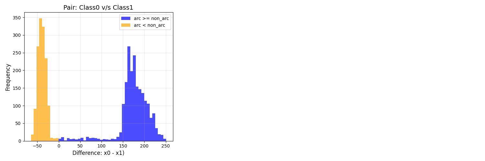
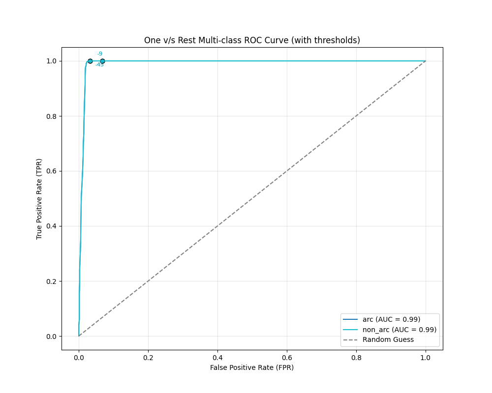
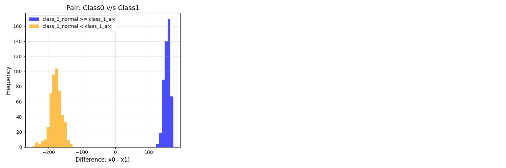
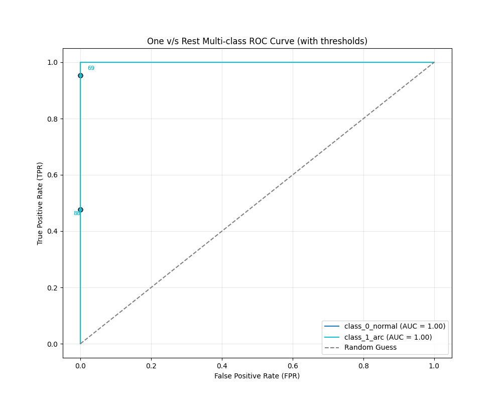
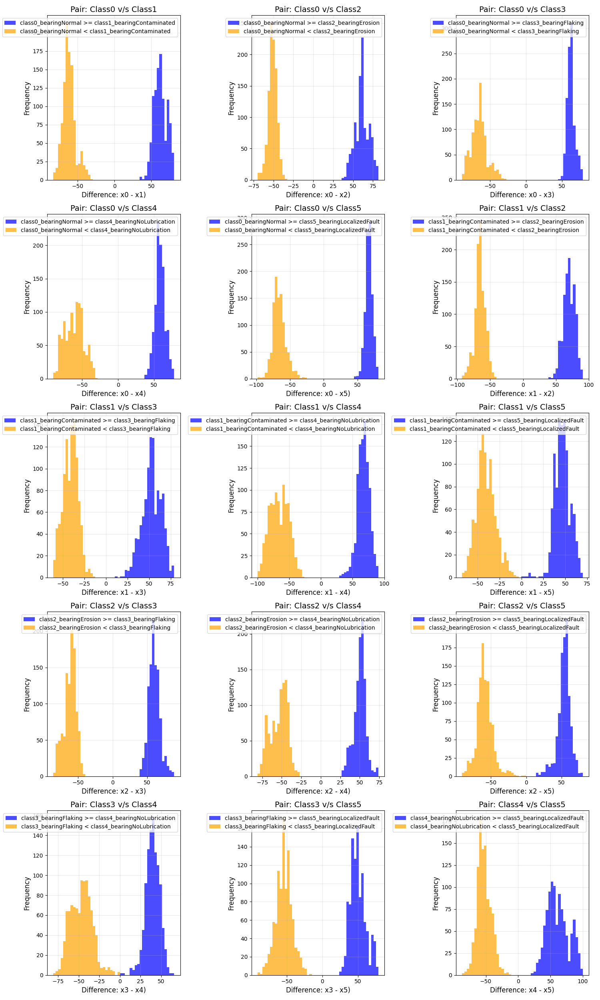
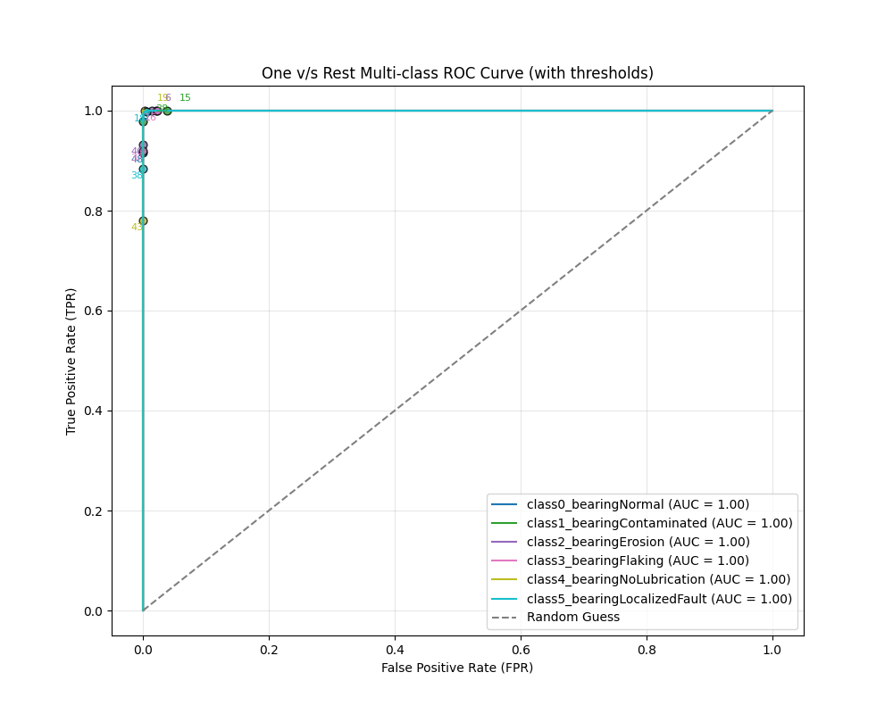

# Post Training Analysis Graphs
### -Adithya Thonse, Tushar Sharma, Fasna Sharaf
<hr>


* Tiny ML Modelmaker generates a few graphs post training to give insights to the user about the model that they have trained.
* This analysis is done on the test set.
* By default, the script `test_onnx.py` in `tinyml_tinyverse` in the corresponding module `(classification/regression/anomaly_detection)` does this.
<hr>

Let us look at the different modalities that we have:
## Timeseries Classification 
<details open>

* Tiny ML Modelmaker for Timeseries Classification tasks generates
  * One v/s Rest Multiclass ROC
  * Pairwise Differenced Class Scores
  * FPR_TPR_Threshold CSV Table

### 1. One vs Rest MultiClass ROC Curve
The One vs Rest MultiClass ROC Curve is used to evaluate the performance of a multiclass classification model. For each class, it plots the ROC curve considering that class as the positive class and all other classes as the negative class. This helps in understanding the model's ability to distinguish each class from the rest. The area under the curve (AUC) is a measure of the model's performance, with a higher AUC indicating better performance.

#### Interpreting the ROC Curve
- **True Positive Rate (TPR)**: Also known as sensitivity or recall, it is the ratio of correctly predicted positive observations to all actual positives. TPR = TP / (TP + FN).
- **False Positive Rate (FPR)**: It is the ratio of incorrectly predicted positive observations to all actual negatives. FPR = FP / (FP + TN).

The ROC curve is a plot of the TPR against the FPR at various threshold settings. Here are some key points for interpretation:
- **Diagonal Line (Random Classifier)**: A ROC curve along the diagonal line (from bottom-left to top-right) represents a random classifier, which has no discrimination capability between positive and negative classes.
- **Above the Diagonal (Good Classifier)**: A ROC curve above the diagonal line indicates a good classification performance. The closer the curve follows the left-hand border and then the top border of the ROC space, the better the performance.
- **Area Under the Curve (AUC)**: The AUC is a single scalar value that summarizes the performance of the classifier. An AUC of 1.0 represents a perfect classifier, while an AUC of 0.5 represents a random classifier.


### 2. Pairwise Differenced Class Scores
This graph shows the differences between the prediction scores of different classes for each test sample. For example, let us consider a 2 class classification problem.

For an input X in the test set, if the model outputs class probabilities as (41, -30) , then we notedown a point at 71 (i.e, 41-(-30)=71).  Now when we account for all the inputs in the test set, we create a histogram of all the plots as seen later.
We plot (Class1-Class0) scores on the test set when Class1>Class0 and vice-versa.

 It helps in understanding how well the model distinguishes between different classes. A higher difference indicates a clearer distinction between classes, while a lower difference suggests that the model finds it challenging to differentiate between those classes.

 Therefore, distributions on the extremities of the histogram indicates clearer distintions between the graphs and as we see points around 0, indicate certain input samples were very hard for the model to classify into one of the classes.

### 3. Understanding the CSV File

The CSV file contains three columns: False Positive Rate (FPR), True Positive Rate (TPR), and thresholds. Each row represents a triad of these values. This information is crucial for understanding the performance of a classification model at different threshold settings.

#### Columns:
- **FPR (False Positive Rate)**: The ratio of incorrectly predicted positive observations to all actual negatives. It is calculated as FPR = FP / (FP + TN).
- **TPR (True Positive Rate)**: Also known as sensitivity or recall, it is the ratio of correctly predicted positive observations to all actual positives. It is calculated as TPR = TP / (TP + FN).
- **Thresholds**: The decision threshold used to classify a sample as positive or negative. By adjusting this threshold, you can control the trade-off between FPR and TPR.

#### Using the CSV File to Set Sensitivity Thresholds

The CSV file allows users to manually set a sensitivity threshold to reduce false alarms for a particular class. Here's how you can use this information:

1. **Identify the Desired TPR and FPR**:
   - Determine the acceptable levels of TPR and FPR for your application. For example, if you want a high sensitivity (high TPR) but can tolerate a certain level of false positives (FPR), you can look for rows in the CSV that meet these criteria.

2. **Select the Appropriate Threshold**:
   - Once you have identified the desired TPR and FPR, find the corresponding threshold value in the CSV file. This threshold will be used to classify samples as positive or negative.

3. **Adjust the Model's Decision Threshold**:
   - Use the selected threshold to adjust the model's decision-making process. By setting the threshold to the chosen value, you can control the sensitivity and specificity of the model.

#### Example

Let's consider an example from the CSV file:

```csv
,fpr,tpr,thresholds
0,0.0,0.0,inf
1,0.0,0.000749063670411985,34.0
2,0.0,0.0022471910112359553,32.0
3,0.0,0.0044943820224719105,31.0
4,0.0,0.012734082397003745,30.0
...
34,0.022933588150979456,0.9940074906367041,0.0
...
```


### Datasets and Graphs

Let us look at some datasets. (These were random runs with some set of inputs, and is not a hardline indicator of the dataset):
<details>
<summary> 1. Arc Fault Classification Dataset (dsi) </summary>

* [fpr_tpr_thresholds.csv](arc_fault_dsi/fpr_tpr_thresholds.csv)
* 
* 

</details>

<hr>

<details>
<summary> 2. Arc Fault Classification Dataset (dsk) </summary>

* [fpr_tpr_thresholds.csv](arc_fault_dsk/fpr_tpr_thresholds.csv)
* 
* 
</details>

<hr>

<details>
<summary> 3. Motor Bearing Fault Classification Dataset </summary>

* [fpr_tpr_thresholds.csv](motor_bearing_fault_dsk/fpr_tpr_thresholds.csv)
* 
* 

</details>

<hr>

</details>

## Timeseries Regression 
<details>
Interesting things coming soon
</details>

## Timeseries Anomaly Detection 
<details>
Interesting things coming soon
</details>


<hr>
Update history:

[28th Feb 2025]: Compatible with v1.0 of Tiny ML Modelmaker