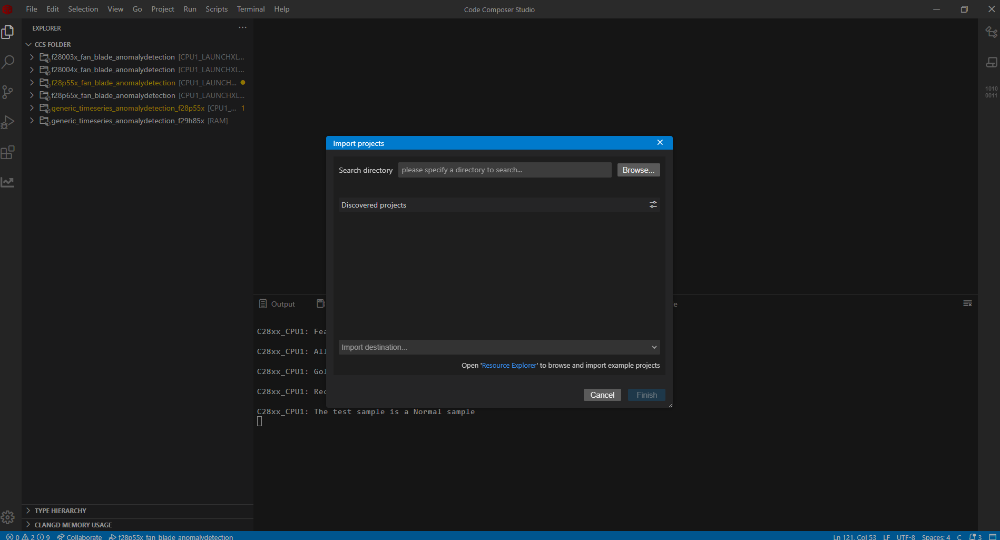
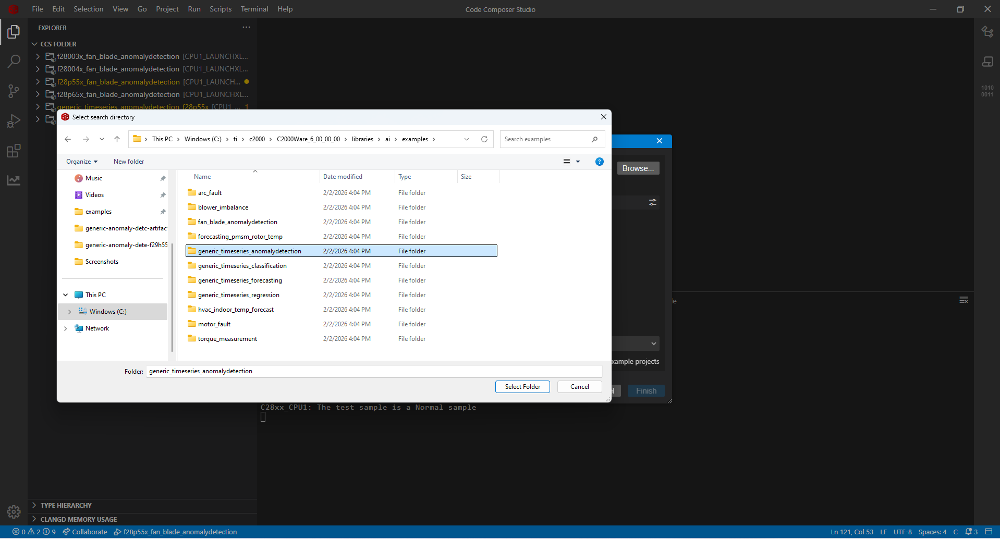
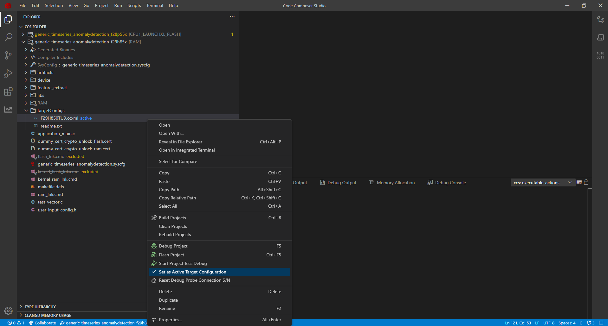
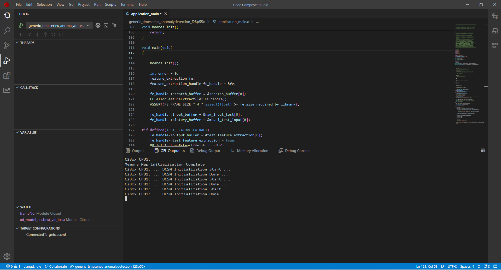

# Deploying Anomaly Detection Models from ModelZoo to Device
###  Jaswanth Jadda, Adithya Thonse, Tushar Sharma, Abhijeet Pal, Fasna Sharaf

<hr>

## Table of Contents
1. [Overview](#overview)
2. [Prerequisites](#prerequisites)
3. [Deployment Steps](#deployment-steps)
4. [Verify Your Model](#verify-your-model)
---

## Overview

This guide walks you through the process of taking a time series anomaly detection model trained in **TinyML ModelZoo** and running it **on a Texas Instruments (TI) microcontroller**. Anomaly detection identifies unusual patterns or deviations from expected behavior in time series data, enabling predictive maintenance and fault detection.

To learn more about running anomaly detection examples on ModelZoo, refer to the [Generic Anomaly Detection Example](../../examples/generic_timeseries_anomalydetection/readme.md), which demonstrates how to run anomaly detection using a synthetic sinusoidal dataset. By the end of this guide, you will understand how to use files generated by ModelZoo to deploy the model on an MCU of your choice.

---

## Prerequisites

Before starting, ensure you have the following:

### Hardware

Ensure you have a TI LaunchPad for your target device. The following devices are currently supported:

| Device Family | Device |
|---------------|--------|
| C2000 (F28x) | F28003x, F28004x, F28P55x, F28P65x |
| C2000 (F29x) | F29H85x |
| MSPM0 | MSPM33C321Ax |
| Sitara | AM13E2x |
| Sitara MCU | AM263x |

---

### Software

1. **TinyML ModelZoo**: Latest version from [TinyML Tensorlab GitHub Repository](https://github.com/TexasInstruments/tinyml-tensorlab) Current version: 1.3.0.

After running an anomaly detection example, ModelZoo generates the following files required for deploying the model on MCUs (Refer to the [Generic Anomaly Detection Example](../../examples/generic_timeseries_anomalydetection/readme.md) to learn how to run anomaly detection applications on ModelZoo ):

| File | Description |
|------|-------------|
| **mod.a** | Compiled model library |
| **tvmgen_default.h** | Header file for model inference APIs |
| **test_vector.c** | Test data to verify model correctness |
| **user_input_config.h** | Configuration parameters for the model |

These files are located in the following directory structure:

```
tinyml-modelmaker/
└── data/
    └── projects/
        └── {dataset_name}/
            └── run/
                └── {date-time}/
                    └── {model_name}/
                        ├── compilation/
                        │   └── artifacts/
                        │       ├── mod.a                     <-- Compiled model
                        │       └── tvmgen_default.h          <-- Model API header
                        │
                        └── training/
                            ├── base/                         <-- For float (non-quantized) models
                            │   └── golden_vectors/
                            │       ├── test_vector.c
                            │       └── user_input_config.h
                            │
                            └── quantization/                 <-- For quantized models
                                └── golden_vectors/
                                    ├── test_vector.c
                                    └── user_input_config.h
```

**Note:** Choose the golden vectors based on the model type you compiled in ModelZoo:
- **Float model (non-quantized):** Use golden vectors from `training/base/golden_vectors/`
- **Quantized model:** Use golden vectors from `training/quantization/golden_vectors/`

### Exact File Locations

| File | Float Model Location | Quantized Model Location |
|------|---------------------|--------------------------|
| **mod.a** | `compilation/artifacts/mod.a` | `compilation/artifacts/mod.a` |
| **tvmgen_default.h** | `compilation/artifacts/tvmgen_default.h` | `compilation/artifacts/tvmgen_default.h` |
| **test_vector.c** | `training/base/golden_vectors/test_vector.c` | `training/quantization/golden_vectors/test_vector.c` |
| **user_input_config.h** | `training/base/golden_vectors/user_input_config.h` | `training/quantization/golden_vectors/user_input_config.h` |

2. **Code Composer Studio (CCS)**: TI's integrated development environment. Download CCS from [TI's website](https://www.ti.com/tool/CCSTUDIO). Version used in this guide: 20.2.0.

3. **Device-specific SDK**: After installing CCS, install the appropriate SDK for your device.

#### Supported Devices and SDK Requirements

### C2000 Family (F28x)

These devices use **C2000Ware SDK**.

| Device | LaunchPad/EVM | Product Page | SDK Download |
|--------|---------------|--------------|--------------|
| **F28003x** | [LAUNCHXL-F280039C](https://www.ti.com/tool/LAUNCHXL-F280039C) | [TMS320F280039C](https://www.ti.com/product/TMS320F280039C) | [C2000Ware](https://www.ti.com/tool/C2000WARE) |
| **F28004x** | [LAUNCHXL-F280049C](https://www.ti.com/tool/LAUNCHXL-F280049C) | [TMS320F280049C](https://www.ti.com/product/TMS320F280049C) | [C2000Ware](https://www.ti.com/tool/C2000WARE) |
| **F28P55x** | [LAUNCHXL-F28P55X](https://www.ti.com/tool/LAUNCHXL-F28P55X) | [TMS320F28P550SJ](https://www.ti.com/product/TMS320F28P550SJ) | [C2000Ware](https://www.ti.com/tool/C2000WARE) |
| **F28P65x** | [LAUNCHXL-F28P65X](https://www.ti.com/tool/LAUNCHXL-F28P65X) | [TMS320F28P650DK](https://www.ti.com/product/TMS320F28P650DK) | [C2000Ware](https://www.ti.com/tool/C2000WARE) |

**SDK Version**: 6.1.0 (Release: 6_01_00_00)

### C2000 Family (F29x)

These devices use **F29H85x SDK**.

| Device | LaunchPad/EVM | Product Page | SDK Download |
|--------|---------------|--------------|--------------|
| **F29H85x** | [F29H85X-SOM-EVM](https://www.ti.com/tool/F29H85X-SOM-EVM) | [F29H850TU](https://www.ti.com/product/F29H850TU) | [F29H85X-SDK](https://www.ti.com/tool/download/F29H85X-SDK/) |

**SDK Version**: 1.4.0 (Release: 01_04_00_00)

### MSPM33 Family

These devices use **MSPM33 SDK**.

| Device | LaunchPad/EVM | Product Page | SDK Download |
|--------|---------------|--------------|--------------|
| **MSPM33C321Ax** | [LP-MSPM33C321A](https://www.ti.com/tool/LP-MSPM33C321A) | [MSPM33C321A](https://www.ti.com/product/MSPM33C321A) | [MSPM33-SDK](https://www.ti.com/tool/download/MSPM33-SDK) |

**SDK Version**: 1.03.00.00 (Release: 1_03_00_00)

### Sitara MCU Family (AM13x)

These devices use **MCU SDK** (shared SDK).

| Device | Product Page | SDK Download |
|--------|--------------|--------------|
| **AM13E2x** | [AM13E2](https://www.ti.com/product/AM13E2) | [MCU-SDK](https://www.ti.com/tool/download/MCU-SDK-AM13E2X) |

**SDK Version**: 1.00.00.00 (Release: 1_00_00_00)

### Sitara MCU Family (AM26x)

These devices use **MCU-PLUS-SDK**.

| Device | LaunchPad/EVM | Product Page | SDK Download |
|--------|---------------|--------------|--------------|
| **AM263x** | [LP-AM263](https://www.ti.com/tool/LP-AM263) | [AM2634](https://www.ti.com/product/AM2634) | [MCU-PLUS-SDK-AM263X](https://www.ti.com/tool/MCU-PLUS-SDK-AM263X) |

**SDK Version**: 11.02.00.00 (Release: 11_02_00_00)

---

## Deployment Steps

Once all prerequisites are met, follow these steps to deploy the model on your device.

**1. Open Code Composer Studio**

**2. Import the Project**

- Go to **File** > **Import Projects**
- A dialog box will appear. Click **Browse** to select the project folder.

- Select the `generic_timeseries_anomalydetection` folder

   The project location depends on your target device:

   - **For F29H85x devices**: Navigate to your F29H85X SDK installation directory:
     ```
     {F29H85X_SDK_INSTALL_PATH}/examples/rtlibs/ai/examples/generic_timeseries_anomalydetection
     ```
     

   - **For C2000 F28x devices** (F28003x, F28004x, F28P55x, F28P65x): Navigate to your C2000Ware installation directory:
     ```
     {C2000WARE_INSTALL_PATH}/libraries/ai/examples/generic_timeseries_anomalydetection
     ```
     

**3. Open the folder and select the example for the device you are using and click finish**

**4. Verify Project Import**

After importing, the project should appear in the **Project Explorer** panel on the left side of CCS.

*Project Explorer showing anomaly detection project:*


**5. Copy Artifacts and Golden Vectors**

Copy the following 4 files from ModelZoo to your CCS project:

- Copy the artifacts (`mod.a`, `tvmgen_default.h`) to `{CCS_project}/artifacts/` (replace existing files)
- Copy the golden vectors (`user_input_config.h`, `test_vector.c`) to `{CCS_project}/` (replace existing files)

**6. Select the Target Configuration**

1. In the Project Explorer, expand your project
2. Find the **targetConfigs** folder
3. Right-click on the LaunchPad configuration file (e.g., `TMS320F28P550SJ9_LaunchPad.ccxml`)
4. Select **Set as Active Target Configuration**

    Target Configuration for F28P55x:

    

    Target Configuration for F29H85x:

    

**7. Build the Project**

Right-click on the target configuration > **Build Project**

Wait for the build to complete. Check the **Console** panel for any errors.

**8. Connect Your LaunchPad**

Connect your TI LaunchPad to your computer using a USB cable.

**9. Flash the Project**

Right click on target config > **Flash Project**


---

## Verify Your Model

### Start Debug Session

After flashing, the debug perspective should open automatically and click the Green resume button on top left corner. If not, go to **Run** > **Debug**.


### Run the Program

Click the **Resume** button (Blue play button on the top left).

### Check the Results

The on-device application will:
1. **Load test input** from `test_vector.c`
2. **Run inference** using the autoencoder model
3. **Calculate reconstruction error** (MSE between input and reconstructed output)
4. **Compare to threshold** to determine if the sample is normal or anomalous
5. **Display results** in the console


**Understanding the Results:**
- **Reconstruction Error**: Mean Squared Error between input and autoencoder output
- **Threshold**: The decision boundary (typically mean + k×std from normal training data)
- **Result**: 
  - `NORMAL` if reconstruction error < threshold
  - `ANOMALY` if reconstruction error > threshold

### Test Multiple Cases

The `test_vector.c` file contains multiple test cases. To test different cases:

1. Open `test_vector.c` in the editor
2. Comment out the current test set (SET 0)
3. Uncomment another test set
4. Rebuild and reflash the project
5. Verify the results

--- 


### Understanding Threshold Configuration

The threshold value is critical for anomaly detection performance:

**In `user_input_config.h`, you'll find:**
```c
#define ANOMALY_THRESHOLD 0.014  // Threshold for k=4.5
```

This threshold was calculated during ModelZoo training as:
```
threshold = mean_normal_error + k × std_normal_error
```

**Adjusting the threshold:**
- **Increase threshold** (higher k): Fewer false alarms, but might miss subtle anomalies
- **Decrease threshold** (lower k): Catches more anomalies, but more false alarms

Refer to the `threshold_performance.csv` file from ModelZoo to choose the optimal k value for your application.

### Build Your Own Anomaly Detection Application

With this workflow, you can create your own generic time series anomaly detection applications using the same process:

1. **Collect normal operation data** from your system
2. **Train autoencoder** in ModelZoo using only normal data
3. **Evaluate threshold** options from `threshold_performance.csv`
4. **Select optimal threshold** based on acceptable false alarm rate
5. **Deploy to MCU** following this guide

#### Explore Other Anomaly Detection Examples

To explore more anomaly detection use cases, refer to the following examples:

- [Fan Blade Anomaly Detection](../../examples/fan_blade_fault_classification/readme_anomaly_detection.md) - Detecting fan blade faults using vibration analysis
- [Motor Vibration Monitoring](../../examples/motor_bearing_fault/readme_anomaly_detection.md) - Identifying motor anomalies from accelerometer data


<hr>

**Update History:**
- [2nd Feb 2026]: Compatible with TinyML ModelZoo v1.3