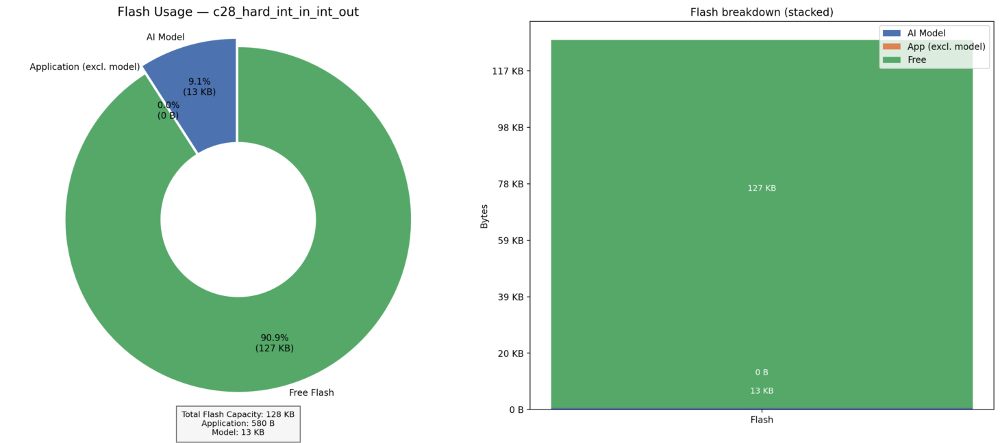

# Non-Intrusive Load Monitoring (NILM) with the PLAID Dataset: Time Series Classification for Appliance Detection
### -Fasna Sharaf, Adithya Thonse, Tushar Sharma, Abhijeeth Pal, Jaswanth Jadda
<hr>

## Overview  

Non-Intrusive Load Monitoring (NILM) is a smart machine learning technique used to identify and monitor the usage of individual electrical appliances without the need for separate sensors on each device. Instead, NILM analyzes the overall power consumption data collected from a single point, such as a smart meter.

**By studying patterns in this time series data, NILM can detect which appliances are active at any given time**. For example, it can determine if a washing machine, refrigerator, or air conditioner is running—just by analyzing the power usage patterns.

This sensorless approach has wide-ranging **applications**:

1. **Factories**: Monitor energy usage to **optimize costs** and **improve efficiency**.
2. **Electric Vehicles**: **Track power distribution across components**.
3. **Households**: Analyze appliance usage to **reduce electricity bills** and promote energy efficiency.

NILM is a powerful tool for sustainability, helping reduce energy consumption and carbon footprints, all while relying on easily measurable data, without the need for expensive or intrusive sensors.

## About Dataset

The **PLAID dataset** is a publicly available dataset designed for appliance identification tasks. It **contains voltage and current measurements** sampled at **30 kHz** from 11 different appliance types commonly found in households.

The classes here correspond to **11 different appliance types**: 

1.  **Air Conditioner**
2.  **Compact Flourescent Lamp**
3.  **Fan**
4.  **Fridge**
5.  **Hairdryer**
6.  **Heater**
7.  **Incandescent Light Bulb**
8.  **Laptop**
9.  **Microwave**
10. **Vacuum**
11. **Washing Machine**

In this dataset, each class directory contains files corresponding to the voltage and current measurements when only that appliance class is turned on. While the dataset is extensive, we have taken a subset of it to use with ModelMaker. You can find the dataset subset here: [PLAID_submetered_dataset](https://software-dl.ti.com/C2000/esd/mcu_ai/01_03_00/datasets/plaid_nilm_submetered_dataset.zip)

## Usage in Tiny ML ModelMaker

Here is the command to run the yaml file with TinyML ModelMaker:

```bash
./run_tinyml_modelmaker.sh examples/PLAID_nilm_classification/config.yaml
```

Users can configure the model pipeline using a YAML configuration file (like shown in the command above), where different stages (dataset loading, data processing and feature extraction, training, testing, and compilation) can be enabled or disabled based on requirements.

## Configuring the YAML File

## common and dataset section

```yaml
common:
    target_module: 'timeseries'
    task_type: 'generic_timeseries_classification'
    target_device: 'F28P55'
    run_name: '{date-time}/{model_name}'
dataset:
    enable: True
    dataset_name: plaid_submetered
    input_data_path: https://software-dl.ti.com/C2000/esd/mcu_ai/01_03_00/datasets/plaid_nilm_submetered_dataset.zip
```

The important parameters here are: task type `generic_timeseries_classification` has been selected. The target device is set to `F28P55`, ensuring that ModelMaker generates a compiled output that runs on this device. Dataset loading is enabled, and the correct dataset path to the zip folder is provided.

## data_processing_feature_extraction section

We have configured to include feature extraction before training so that the model can better predict the correct appliance.

```yaml
data_processing_feature_extraction: 
    feat_ext_transform: ['FFT_FE', 'FFT_POS_HALF', 'WINDOWING', 'BINNING', 'NORMALIZE', 'ABS','LOG_DB', 'CONCAT',]
    frame_size: 32
    feature_size_per_frame: 8
    num_frame_concat: 8                                                            
    variables: 2
```

### training, testing and compilation section

```yaml
training:
    enable: True
    model_name: 'CLS_13k_NPU'
    model_config: ''
    batch_size: 256
    training_epochs: 30
    num_gpus: 0
    quantization: 2
    learning_rate: 0.04

testing:
    enable: True

compilation:
    enable: True
    keep_libc_files: True
```

In this configuration, we have used the `CLS_13k_NPU` model, which is a generic classification model available in our model zoo with approximately 13k parameters. This model consists of 6 Conv+BatchNorm+ReLU layers followed by a Linear layer.

We have configured other training parameters, such as an appropriate learning rate (0.04), batch size (256), and the number of training epochs (30). The quantization is set to 2, which means the model uses TI-NPU quantized operations for efficient inference on TI hardware.

Both testing and compilation are enabled. We are compiling this example using the ti-npu hard preset, which runs on the TI-NPU with full quantization.

## Results

On running the YAML file, the following accuracies were observed:

### **I. Float Train**
- **Best Epoch**: 29  
- **Accuracy**: 98.521%  
- **F1-Score**: 0.985  
- **AUC ROC Score**: 0.985  


**Confusion Matrix**:

| **Ground Truth \ Predicted As**       | **Air Conditioner** | **Compact Fluorescent Lamp** | **Fan** | **Fridge** | **Hairdryer** | **Heater** | **Incandescent Light Bulb** | **Laptop** | **Microwave** | **Vacuum** | **Washing Machine** |
|---------------------------------------|---------------------|-----------------------------|---------|------------|--------------|-----------|-----------------------------|------------|--------------|-----------|---------------------|
| **Air Conditioner**                   | 3222                | 1                           | 39      | 0          | 0            | 13        | 11                          | 14         | 0            | 0         | 0                   |
| **Compact Fluorescent Lamp**          | 0                   | 3218                        | 1       | 0          | 13           | 6         | 10                          | 27         | 5            | 20        | 0                   |
| **Fan**                               | 35                  | 0                           | 3250    | 0          | 0            | 0         | 12                          | 3          | 0            | 0         | 0                   |
| **Fridge**                            | 1                   | 4                           | 4       | 3226       | 24           | 13        | 1                           | 3          | 2            | 12        | 10                  |
| **Hairdryer**                         | 0                   | 9                           | 9       | 0          | 3255         | 1         | 14                          | 9          | 0            | 0         | 3                   |
| **Heater**                            | 1                   | 5                           | 12      | 0          | 0            | 3275      | 0                           | 7          | 0            | 0         | 0                   |
| **Incandescent Light Bulb**           | 2                   | 0                           | 4       | 1          | 4            | 1         | 3286                        | 1          | 0            | 0         | 1                   |
| **Laptop**                            | 0                   | 16                          | 3       | 0          | 2            | 0         | 7                           | 3268       | 0            | 1         | 3                   |
| **Microwave**                         | 0                   | 2                           | 0       | 0          | 7            | 0         | 0                           | 0          | 3288         | 3         | 0                   |
| **Vacuum**                            | 0                   | 5                           | 11      | 18         | 1            | 0         | 1                           | 0          | 1            | 3263      | 0                   |
| **Washing Machine**                   | 0                   | 4                           | 7       | 62         | 4            | 0         | 0                           | 8          | 1            | 2         | 3212                |

---

### **II. Quant Train**
- **Best Epoch**: 2  
- **Accuracy**: 98.518%  
- **F1-Score**: 0.985 
- **AUC ROC Score**: 0.985  


**Confusion Matrix**:

| **Ground Truth \ Predicted As**       | **Air Conditioner** | **Compact Fluorescent Lamp** | **Fan** | **Fridge** | **Hairdryer** | **Heater** | **Incandescent Light Bulb** | **Laptop** | **Microwave** | **Vacuum** | **Washing Machine** |
|---------------------------------------|---------------------|-----------------------------|---------|------------|--------------|-----------|-----------------------------|------------|--------------|-----------|---------------------|
| **Air Conditioner**                   | 3198                | 1                           | 63      | 0          | 0            | 12        | 15                          | 11         | 0            | 0         | 0                   |
| **Compact Fluorescent Lamp**          | 0                   | 3228                        | 1       | 0          | 13           | 8         | 10                          | 17         | 4            | 19        | 0                   |
| **Fan**                               | 8                   | 1                           | 3283    | 0          | 0            | 0         | 4                           | 4          | 0            | 0         | 0                   |
| **Fridge**                            | 0                   | 5                           | 4       | 3225       | 25           | 13        | 1                           | 1          | 2            | 12        | 12                  |
| **Hairdryer**                         | 0                   | 15                          | 11      | 0          | 3246         | 2         | 15                          | 7          | 0            | 0         | 4                   |
| **Heater**                            | 2                   | 9                           | 14      | 0          | 0            | 3271      | 0                           | 4          | 0            | 0         | 0                   |
| **Incandescent Light Bulb**           | 0                   | 1                           | 9       | 1          | 5            | 0         | 3283                        | 1          | 0            | 0         | 0                   |
| **Laptop**                            | 0                   | 18                          | 2       | 0          | 1            | 0         | 10                          | 3265       | 0            | 1         | 3                   |
| **Microwave**                         | 0                   | 2                           | 0       | 0          | 6            | 0         | 0                           | 0          | 3288         | 4         | 0                   |
| **Vacuum**                            | 0                   | 7                           | 11      | 19         | 0            | 0         | 0                           | 0          | 0            | 3263      | 0                   |
| **Washing Machine**                   | 0                   | 4                           | 5       | 66         | 6            | 2         | 0                           | 6          | 1            | 4         | 3206                |

---

### **III. Test Data**
- **Evaluation Accuracy**: 97.72%  
- **AUC ROC Score**: 0.996


**Confusion Matrix**:

| **Ground Truth \ Predicted As**       | **Air Conditioner** | **Compact Fluorescent Lamp** | **Fan** | **Fridge** | **Hairdryer** | **Heater** | **Incandescent Light Bulb** | **Laptop** | **Microwave** | **Vacuum** | **Washing Machine** |
|---------------------------------------|---------------------|-----------------------------|---------|------------|--------------|-----------|-----------------------------|------------|--------------|-----------|---------------------|
| **Air Conditioner**                   | 1076                | 0                           | 23      | 0          | 0            | 0         | 1                           | 0          | 0            | 0         | 0                   |
| **Compact Fluorescent Lamp**          | 0                   | 1074                        | 0       | 0          | 3            | 0         | 1                           | 20         | 0            | 1         | 1                   |
| **Fan**                               | 27                  | 5                           | 1064    | 0          | 0            | 0         | 4                           | 0          | 0            | 0         | 0                   |
| **Fridge**                            | 0                   | 0                           | 0       | 1099       | 0            | 0         | 1                           | 0          | 0            | 0         | 0                   |
| **Hairdryer**                         | 0                   | 0                           | 0       | 0          | 1100         | 0         | 0                           | 0          | 0            | 0         | 0                   |
| **Heater**                            | 5                   | 0                           | 0       | 0          | 0            | 1090      | 2                           | 3          | 0            | 0         | 0                   |
| **Incandescent Light Bulb**           | 0                   | 6                           | 0       | 0          | 55           | 5         | 1016                        | 2          | 0            | 15        | 1                   |
| **Laptop**                            | 0                   | 10                          | 5       | 0          | 7            | 7         | 23                          | 1047       | 0            | 0         | 1                   |
| **Microwave**                         | 1                   | 2                           | 6       | 0          | 0            | 0         | 1                           | 8          | 1068         | 8         | 6                   |
| **Vacuum**                            | 0                   | 0                           | 0       | 0          | 1            | 0         | 0                           | 9          | 0            | 1090      | 0                   |
| **Washing Machine**                   | 0                   | 0                           | 0       | 0          | 0            | 0         | 0                           | 0          | 0            | 0         | 1100                |


You can find the compiled model at: tinyml-modelmaker/data/projects/{dataset_name}/run/{date-time}/{model_name}/compilation


## Running on Device

After successfully running Modelmaker, you will get four main files:

1. **Artifacts**:
   - `mod.a` and `tvmgen_default.h` are generated and stored in:
     ```
     data/projects/{dataset_name}/run/{date-time}/{model_name}/compilation/artifacts
     ```

2. **Golden Vectors**:
   - `user_input_config.h` and `test_vector.c` are stored in:
     ```
     data/projects/{dataset_name}/run/{date-time}/{model_name}/training/quantization/golden_vectors
     ```

These four files will be needed while running on device and are attached here in this same directory.

In this example, we will use the following setup:

- **Device**: LAUNCHXL-F28P55X
- **C2000Ware Version**: 6.00
- **Code Composer Studio (CCS)**: Version 20.3.0

Steps to run this example on-device can be found by following this guide: [Deploying Classification Models from ModelMaker to Device](../../docs/deploying_classification_models_from_modelmaker_to_device/readme.md)

Upon flashing and running the project we can see the model output matches the golden vectors.

<p align="center">
    
</p>
<hr>

## Performance Metrics

Here are the key performance metrics for the model running on the device:

| Metric               | Value       |
|----------------------|-------------|
| **Device Name**      | f28p55x     |
| **AI Model Cycles**  | 190571      |
| **Inference Time**   | 1270.47 µs  |
| **Results Match**    | TRUE        |
| **Model Size**       | 14036 bytes |
| **Model Flash**      | 13032 bytes |
| **Model SRAM**       | 1004 bytes  |
| **Application Size** | 719 bytes   |
| **Application FLASH**| 580 bytes   |
| **Application SRAM** | 139 bytes   |

<table align="center">
  <tr>
    <td align="center">
      
      <br>Flash Usage
    </td>
    <td align="center">
      
      <br>SRAM Usage
    </td>
  </tr>
</table>
<hr>
Update history:
[23rd Dec 2025]: Compatible with v1.3 of Tiny ML Modelmaker