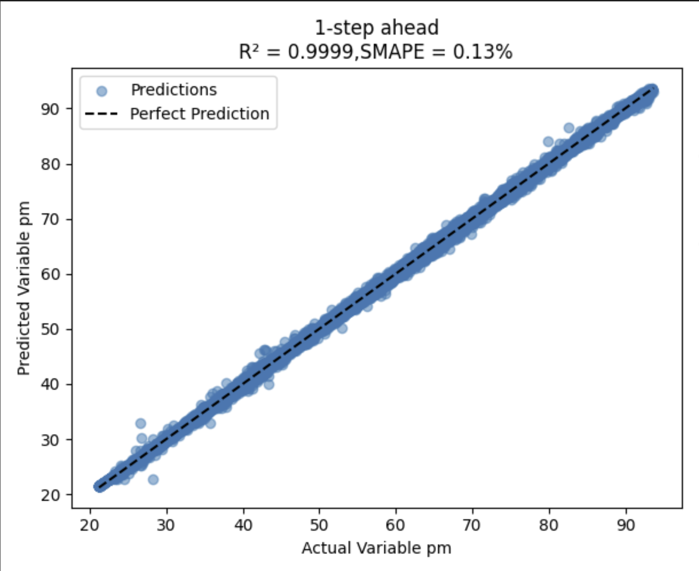

# PMSM Temperature Time Series Forecasting: Keeping Motors Safe and Efficient
### -Fasna Sharaf, Adithya Thonse, Tushar Sharma
<hr>

## Overview 

### TimeSeries Forecasting

Time series forecasting is about predicting future values based on past observations. It’s widely used in industrial, appliance, and automotive sectors such as estimating energy consumption patterns, forecasting temperature variations in a cooling system etc. In **ModelMaker**, we support time series forecasting so you can train, evaluate, and deploy models that learn patterns from sequential data and make accurate future predictions.  

To make the setup easy to understand, we’ll walk through an example dataset which forecast temperature of Permanent Magnet Synchronous Motor (PMSM) .

### Why We Need to Predict Motor Temperatures?

Electric motors are everywhere - from electric cars to factory machines and wind turbines. The Permanent Magnet Synchronous Motor (PMSM) is one of the best types available because it's efficient and powerful. But these motors have a big challenge: they can get too hot.

When a motor overheats, several bad things happen. The permanent magnets inside can lose their magnetic strength forever if they get too hot (typically above 150°C). The motor becomes less efficient, wasting energy. And the motor's life gets much shorter - for every 10°C too hot, the motor might last only half as long as it should.

The problem is that measuring temperatures inside a running motor is really difficult. Putting temperature sensors deep inside motors is expensive and the sensors often break. This is why we need a better way to know what's happening with temperatures inside the motor.

## About the Dataset

The original dataset we took contains sensor measurements collected from a **Permanent Magnet Synchronous Motor (PMSM)** running on a controlled test bench. The motor is a prototype model from a German OEM, and the measurements were collected by the **LEA department at Paderborn University**. All signals are sampled at **2 Hz** (two samples per second).  

You can find the original dataset and its full description here:  [Electric Motor Temperature (Kaggle)](https://www.kaggle.com/wkirgsn/electric-motor-temperature)

**Sensor attributes in the original PMSM dataset:**

| Column Name | Description |
|------------------|-------------|
| `i_d` | Current d-component (active component) |
| `i_q` | Current q-component (reactive component) |
| `u_d` | Voltage d-component (active component) |
| `u_q` | Voltage q-component (reactive component) |
| `motor_speed` | Motor speed |
| `ambient` | Ambient temperature |
| `coolant` | Coolant temperature |
| `pm` | Permanent magnet surface temperature |
| `stator_winding` | Stator winding temperature |
| `stator_tooth` | Stator tooth temperature |
| `stator_yoke` | Stator yoke temperature |
| `torque` | Torque induced by current |

After studying the problem, we discovered that we only need to measure a few things that are already easy to get: **Ambient temperature (`ambient`), Coolant temperature (`coolant`), Voltage components (`u_d`,`u_q`), Phase current Magnitude `i_a` ($i_{a} = \sqrt{i_d^2 + i_q^2}$)**. Based on past timestep values of these parameters and past timestep values of Permanent magnet surface temperature (`pm`), we will forecast the `pm` value for the next timestep.

## Preparing the Dataset

For forecasting tasks, **ModelMaker** expects the dataset to be packaged in a specific folder structure inside a **.zip** file like this:-

```
 {dataset_name}.zip/
     |
     |--files/
     |     |-- {file1}/
     |     |-- {file2}/
     |     |-- and_so_on/
     |     |-- {fileN}/
     |
     |--annotations/
           |--file_list.txt                   # List of all the files in the dataset
           |--instances_train_list.txt        # List of all the files in the train set (subset of file_list.txt)
           |--instances_val_list.txt          # List of all the files in the validation set (subset of file_list.txt)
           |--instances_test_list.txt         # List of all the files in the test set (subset of file_list.txt)
```
**Note:**

Unlike classification tasks, forecasting **always requires annotation files**. These tell the tool which files belong to training, validation, and testing sets. The data directory is automatically named 'files' for forecasting and regression tasks.

For this example, we have already prepared the dataset in the required format. You can find the zipped dataset [here.](https://software-dl.ti.com/C2000/esd/mcu_ai/01_03_00/datasets/pmsm_rotor_temp.zip)

## Usage in Tiny ML ModelZoo

You can run this example directly in **TinyML ModelMaker** using the following command:

```bash
./run_tinyml_modelzoo.sh examples/forecasting_pmsm_rotor_temp/config.yaml
```

The model pipeline is configured using a YAML file, where you can enable or disable different stages such as dataset loading, data processing, feature extraction, training, testing, and compilation depending on your needs.

## Configuring the YAML file

### `common` section

Set the task type to `generic_timeseries_forecasting` along with other basic parameters as shown below:-

```yaml
common:
    task_type: generic_timeseries_forecasting
    target_device: F28P55
```

### `dataset` section

Defines dataset details:-
- **enable**: True/False to enable or disable dataset loading
- **dataset_name**: Name for your dataset (appears in logs)
- **input_data_path**: Path to the dataset

**Note:** The data directory is automatically detected based on task type (forecasting tasks use 'files').

Here is how we configured `dataset` section for our pmsm dataset example case:

```yaml
dataset:
    dataset_name: forecasting_pmsm_rotor_temp
    input_data_path: https://software-dl.ti.com/C2000/esd/mcu_ai/01_03_00/datasets/pmsm_rotor_temp.zip
```

### `data_processing_feature_extraction` section

<b> Under `data_processing_feature_extraction` section, you have to specify the following parameters mandatorily </b>:-

- `variables`: Specifies which columns to use as input features. You can specify either an integer (to use the first N columns) or a list of column indices. In our case, we use `variables: 6` to take the first 6 columns as input features (`i_a`, `u_d`, `u_q`, `ambient`, `coolant`, `pm`).
- `target_variables`: Specifies which column(s) to predict. In our case, we predict column 5 (`pm` - permanent magnet temperature).

We can use data processing transforms such as Simple Window (which is mandatory to use for forecasting problems) and Downsampling (which is optional to use) before training the dataset. Let's see how to configure those:-

**1. SimpleWindow (Mandatory)**

In forecasting, it is mandatory to include `SimpleWindow` in `data_proc_transforms`.

As part of specifying SimpleWindow in `data_proc_transforms`, you have to specify the following:-

- `frame_size` (mandatory): Number of timestamps in a frame. It is mandatory to specify frame_size in forecasting problems. 
- `stride_size` (optional): This parameter defines the amount of overlap between consecutive frames. It is calculated as a fraction of the `frame_size`. (Default value: 0.01)
- `forecast_horizon` (optional): Number of future timesteps to be predicted in forecasting. (Default value: 1)

**2. Downsampling (Optional)**

Performing downsampling is optional. If you wish to perform downsampling, include `Downsample` in `data_proc_transforms` and specify the following parameters:-

- `sampling_rate`: The original sampling rate of the dataset.
- `new_sr`: The new sampling rate after downsampling.

**Note: Feature Extraction is currently not supported for forecasting problems.**

Here is an example on how to configure `data_processing_feature_extraction` in YAML file:-

```yaml
data_processing_feature_extraction:
    data_proc_transforms:
    - SimpleWindow  # 'SimpleWindow' must be specified for forecasting tasks
    frame_size: 3
    stride_size: 0.4
    forecast_horizon: 1  # Number of future timesteps to be predicted
    variables: 6  # takes the first 6 columns as input features
    target_variables:
    - 5
```

## `training` section

You can configure training parameters here like `model_name`,`training_epochs`,`optimizer` etc. **It is important to note that for forecasting problems, `output_int` must be set to `False`.**

Here we are using an LSTM model with just 393 parameters.

```yaml
training:
    model_name: FCST_LSTM8
    model_config: ''
    batch_size: 256
    training_epochs: 20
    num_gpus: 0
    quantization: 1
    optimizer: adam
    learning_rate: 0.005
    output_int: false
```

## `testing` and `compilation` section

You can enable or disable compilation and testing as needed:-

```yaml
testing: {}

compilation: {}
```

## Results

This section explains how we evaluate the forecasting model.

### Scoring Metrics 

We mainly use two metrics for evaluation:

**1. SMAPE (Symmetric Mean Absolute Percentage Error)**

Measures the percentage error between predicted and actual values, normalized to avoid bias for large or small values.
    
    - Range: 0% to 200%.

    - Ideal value: 0% (lower is better).


**2. R² Score (Coefficient of Determination)**

Indicates how well predictions match the actual values.

    - Range: (-∞, 1].

    - Ideal value: 1 (higher is better).

A score close to 1 means the model explains most of the variation in the data.

### How the Best Epoch is Chosen?

The model can predict multiple future timesteps for multiple target variables. For each epoch, SMAPE is computed across all target variables and across all predicted timesteps. The epoch with the lowest average SMAPE is selected as the best epoch. For the best epoch, both R² and SMAPE are reported for each predicted timestep of each target variable. Similar scores are reported during testing as well. Let's have a look at the results we got here:-

Float train best epoch:-

```
   INFO: root.main.FloatTrain.BestEpoch: Printing statistics of best epoch:
   INFO: root.main.FloatTrain.BestEpoch: Best epoch:19
   INFO: root.main.FloatTrain.BestEpoch: Overall SMAPE across all variables: 0.09%
   INFO: root.main.FloatTrain.BestEpoch: Per-Variable Metrics:
   INFO: root.main.FloatTrain.BestEpoch:   Variable pm:
   INFO: root.main.FloatTrain.BestEpoch:       SMAPE of pm across all predicted timesteps: 0.09%
   INFO: root.main.FloatTrain.BestEpoch:       R² of pm across all predicted timesteps: 1.0000
   INFO: root.main.FloatTrain.BestEpoch:       Timestep 1:
   INFO: root.main.FloatTrain.BestEpoch:           SMAPE: 0.09%
   INFO: root.main.FloatTrain.BestEpoch:           R²: 1.0000
```

Quant train best epoch:-

```
   INFO: root.main.QuantTrain.BestEpoch: Printing statistics of best epoch:
   INFO: root.main.QuantTrain.BestEpoch: Best epoch:10
   INFO: root.main.QuantTrain.BestEpoch: Overall SMAPE across all variables: 0.26%
   INFO: root.main.QuantTrain.BestEpoch: Per-Variable Metrics:
   INFO: root.main.QuantTrain.BestEpoch:   Variable pm:
   INFO: root.main.QuantTrain.BestEpoch:       SMAPE of pm across all predicted timesteps: 0.26%
   INFO: root.main.QuantTrain.BestEpoch:       R² of pm across all predicted timesteps: 0.9999
   INFO: root.main.QuantTrain.BestEpoch:       Timestep 1:
   INFO: root.main.QuantTrain.BestEpoch:           SMAPE: 0.26%
   INFO: root.main.QuantTrain.BestEpoch:           R²: 0.9999
```
Test results:-

```
   INFO: root.main.test_data : Variable pm:
   INFO: root.main.test_data :   SMAPE of pm across all predicted timesteps: 0.25%
   INFO: root.main.test_data :   R² of pm across all predicted timesteps: 0.9998
   INFO: root.main.test_data :   Timestep 1:
   INFO: root.main.test_data :       SMAPE: 0.25%
   INFO: root.main.test_data :       R²: 0.9998
```

### Viewing Detailed Results

- Float train best epoch results can be found at:-
`tinyml-modelmaker/data/projects/{dataset_name}/run/{date-time}/{model_name}/training/base/best_epoch_{best_epoch_num}_results`

- Quantized train best epoch results can be found at:-
`tinyml-modelmaker/data/projects/{dataset_name}/run/{date-time}/{model_name}/training/quantization/best_epoch_{best_epoch_num}_results`

- Test results can be found at:-
`tinyml-modelmaker/data/projects/{dataset_name}/run/{date-time}/{model_name}/training/quantization/test_results`

In each of these directories, you will find:

**1. Prediction Plots**

They are located under `predictions_plots` folder. For each target variable, you will see one plot which consists of forecast_horizon number of subplots (eg, plot for 1 step ahead, 2 step ahead, etc.). Each subplot compares predicted vs actual (ground truth) values for that particular timestep of that target variable. A black dotted line (x = y) represents perfect prediction. Points close to this line indicate accurate forecasting.

Let's see the results for this example:-

**Float train results**:-
<p align='center'>

</p>

**Quant train results**:-
<p align='center'>

</p>

**Test results**:-
<p align='center'>

</p>

**2. CSV Files**

They are located under the `predictions_csv` folder. It will contain separate CSV files for each target variable. Each file contains predicted and actual values for each timestep forecasted.

Also you can see the compiled model at: `tinyml-modelmaker/data/projects/{dataset_name}/run/{date-time}/{model_name}/compilation`


## Running on Device

We have compiled this example using the ti-npu soft preset for F28P55x device, which means the software emulation of the TI-NPU with some optimized operations. After successfully running Modelmaker, you will get four main files:

1. **Artifacts**:
   - `mod.a` and `tvmgen_default.h` are generated and stored in:
     ```
     tinyml-modelmaker/data/projects/{dataset_name}/run/{date-time}/{model_name}/compilation/artifacts
     ```

2. **Golden Vectors**:
   - `user_input_config.h` and `test_vector.c` are stored in:
     ```
     tinyml-modelmaker/data/projects/{dataset_name}/run/{date-time}/{model_name}/training/quantization/golden_vectors
     ```

These four files will be needed while running on device.

In this example, we will use the following setup:

- **Device**: LAUNCHXL-F28P55X
- **C2000Ware Version**: 6.0.1
- **Code Composer Studio (CCS)**: Version 20.2.0

<hr>

Steps to run this example on-device can be found by following this guide: [Deploying Forecasting Models from ModelMaker to Device](../../docs/deploying_forecasting_models_from_modelmaker_to_device/readme.md)

Upon flashing and running the project we can see the model output matches the golden vectors.

<p align="center">
    
</p>
<hr>

## Performance Metrics

Here are the key performance metrics for the model running on the device:

| Metric               | Value       |
|----------------------|-------------|
| **Device Name**      | F28P55x     |
| **Cycles**           | 102307      |
| **Inference Time**   | 682.05 µs   |
| **Results Match**    | TRUE        |
| **Code Size**        | 4375 bytes  |
| **RO Data**          | 4227 bytes  |
| **RW Data**          | 148 bytes   |
| **Total Size**       | 201 bytes   |
| **Flash Usage**      | 199 bytes   |
| **SRAM Usage**       | 2 bytes     |

<p align="center">


</p>

<hr>
Update history:
[5th Feb 2026]: Compatible with v1.3 of Tiny ML Modelmaker


